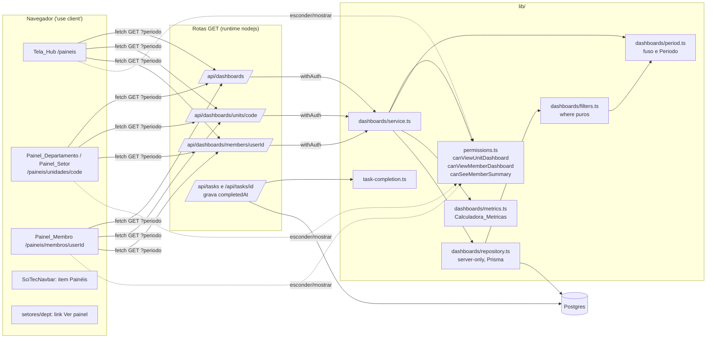

# Design Document — Painéis de departamento, setor e membro (Etapa 2)

## Overview

A Etapa 2 entrega três telas somente leitura (`/paineis`, `/paineis/unidades/[code]`, `/paineis/membros/[userId]`) apoiadas em três rotas GET (`/api/dashboards`, `/api/dashboards/units/[code]`, `/api/dashboards/members/[userId]`). Toda decisão de acesso usa `lib/permissions.ts`; toda definição de métrica (aberta, atrasada, concluída no período, conversão) fica em um módulo puro, `lib/dashboards/`, que também gera os filtros usados nas agregações do banco. A única escrita da etapa é a nova coluna `Task.completedAt`, mantida pela API_Tarefas.

Decisões centrais (as 12 decisões do requirements.md estão confirmadas):

| Tema | Decisão | Motivo |
|---|---|---|
| Rotas | Páginas novas em `app/paineis/**`; `setores/[dept]` ganha só o link "Ver painel" | Setores não têm página; `setores/[dept]/page.tsx` já tem 1.892 linhas (Req. 9) |
| Acesso | `canViewUnitDashboard`, `canViewMemberDashboard` e `canSeeMemberSummary` em `lib/permissions.ts`, compostas de `canViewUnit`, `isUnitCode` e `progressScope` (sem mudar regras existentes) | Matriz única, isomórfica (Req. 1, 7.3) |
| Regras de métrica | `lib/dashboards/period.ts` (dias e janelas em `America/Sao_Paulo`) + `lib/dashboards/metrics.ts` (Calculadora_Metricas pura) | Testável com PBT, sem Prisma e sem rede (Req. 3, 6, 7, 8, 12) |
| Agregação | `groupBy`/`count` no Postgres com filtros gerados por `lib/dashboards/filters.ts` a partir das mesmas fronteiras da calculadora; só listas "até 10 atrasadas" carregam linhas | Decisão 11: não carregar registros inteiros; uma propriedade garante que os filtros equivalem às regras puras |
| Dia do prazo | `dueDate` é lido pela parte de data em UTC (`YYYY-MM-DD`) | As telas atuais enviam `"AAAA-MM-DD"` e a API grava `new Date(...)` = meia-noite UTC; ler em São Paulo mudaria o dia (Req. 12.1) |
| Dia de referência | `Intl.DateTimeFormat('en-CA', { timeZone: 'America/Sao_Paulo' })` | Sem dependência nova; continua correto se o Brasil voltar a ter horário de verão |
| Conclusão | `Task.completedAt` + backfill `= updatedAt` para `DONE`; transição calculada por função pura usada em POST/PATCH | Decisão 3 (Req. 3.8–3.10) |
| Camadas testáveis | `service.ts` recebe um `DashboardRepository` (interface) e `now`; `repository.ts` implementa com Prisma | Regras de 400/403/404 e do filtro 7.3 testadas sem banco; o SQL é conferido em integração |
| Testes | Vitest 2.1.8 + fast-check 3.23.2 já instalados; `tests/setup/no-network.ts`; integração só com `RUN_DB_TESTS=1` | Mesmo padrão da Etapa 1 (Req. 12.5) |

Não há dependência nova de produção nem de desenvolvimento.

### Referências de pesquisa

- [MDN — `Intl.DateTimeFormat`, opção `timeZone`](https://developer.mozilla.org/docs/Web/JavaScript/Reference/Global_Objects/Intl/DateTimeFormat/DateTimeFormat#timezone): aceita nomes IANA; `formatToParts` permite extrair ano/mês/dia e a hora local para calcular o deslocamento do fuso sem biblioteca.
- [Prisma — Aggregation, grouping, and summarizing](https://www.prisma.io/docs/orm/prisma-client/queries/aggregation-grouping-summarizing): `groupBy` com `by`, `where` e `_count` executa `GROUP BY` no banco; `count` com `where` para totais simples.
- [Prisma — Customizing migrations](https://www.prisma.io/docs/orm/prisma-migrate/workflows/customizing-migrations): editar o SQL gerado antes de aplicar (usado para o `UPDATE` de backfill, como a Etapa 1 fez com o índice parcial).
- Decreto nº 9.772/2019: o horário de verão brasileiro foi extinto; São Paulo está em UTC−03:00 o ano todo desde então. O design não depende disso (usa o banco de fusos IANA do runtime).

Conteúdo das fontes foi resumido/parafraseado.

## Architecture



Fluxo de uma requisição de painel de unidade:

```mermaid
sequenceDiagram
  participant B as Navegador
  participant R as Rota units/[code]
  participant W as withAuth
  participant S as service
  participant Q as repository
  participant DB as Postgres
  B->>R: GET /api/dashboards/units/NEGOCIOS?periodo=30d
  R->>W: sessão + ator do banco (401/403 se sem sessão ou não ATIVO)
  W->>S: getUnitDashboard(repo, actor, code, periodo, now)
  S->>S: parsePeriodo (400) · isUnitCode (404) · canViewUnitDashboard (403)
  S->>S: ctx = buildMetricContext(now, periodo)
  S->>Q: unitAggregates(unitId, ctx) em paralelo
  Q->>DB: groupBy/count (tarefas, cards por fase, solicitações, leads)
  Q->>DB: findMany take 10 (atrasadas), membros ativos
  Q-->>S: linhas agregadas
  S->>S: Calculadora combina linhas; canSeeMemberSummary filtra Resumos_Membro
  S-->>B: 200 JSON (sem descrições, e-mails, contatos, valores de campos)
```

Pontos de arquitetura:

- **Ordem das verificações** em toda rota de painel: sessão/ATIVO (`withAuth`: 401 ou 403) → Periodo (400) → existência da unidade ou do Alvo (404) → permissão (403) → consultas. Nenhuma consulta de métrica acontece antes da permissão (Req. 2.1–2.6).
- **Somente leitura**: os arquivos de rota exportam apenas `GET` (o App Router responde 405 aos demais métodos) e o repositório usa apenas `findMany`, `findUnique`, `count` e `groupBy` (Req. 2.8).
- **`now` único por requisição**: a rota cria `new Date()` uma vez e passa ao serviço; Dia_Referencia, janela do Periodo e corte de atrasadas derivam desse instante (Req. 2.9).
- **Consistência**: as consultas de um painel rodam em `Promise.all` fora de transação. Em `READ COMMITTED` uma escrita concorrente pode aparecer em uma contagem e não em outra; para um painel de acompanhamento isso é aceitável e evita segurar conexões.
- **Interface**: as páginas usam `useProfile()` para esconder links (`canViewUnitDashboard`), mas o servidor decide; 403/404 da API viram as telas de acesso negado / "Painel não encontrado" (Req. 9.6, 9.7).

## Components and Interfaces

### Estrutura de arquivos

```
lib/
  permissions.ts                 (+ canViewUnitDashboard, canViewMemberDashboard, canSeeMemberSummary)
  task-completion.ts             completedAtUpdate (puro)
  dashboards/
    types.ts                     DTOs de resposta e fatos de entrada (isomórfico)
    period.ts                    Periodo, Dia_Referencia, janelas (puro)
    metrics.ts                   Calculadora_Metricas (puro)
    filters.ts                   where de Prisma gerados das fronteiras (puro; só `import type`)
    format.ts                    rótulos, datas DD/MM/AAAA, números pt-BR, busca (isomórfico)
    repository.ts                DashboardRepository com Prisma ('server-only')
    service.ts                   getHub / getUnitDashboard / getMemberDashboard
    client-api.ts                fetch das rotas para as telas
app/api/dashboards/
  route.ts                       GET hub
  units/[code]/route.ts          GET painel de unidade
  members/[userId]/route.ts      GET painel de membro
app/paineis/
  page.tsx                       Tela_Hub
  unidades/[code]/page.tsx       Painel_Departamento / Painel_Setor
  membros/[userId]/page.tsx      Painel_Membro
components/dashboards/
  useDashboard.ts                hook de carga (loading/ok/denied/notFound/error)
  DashboardShell.tsx             navbar, h1, seletor de período, estados
  PeriodSelector.tsx
  DashboardStates.tsx            Carregando / Acesso negado / Não encontrado / Erro
  TaskMetrics.tsx                3 números (abertas, atrasadas, concluídas no período)
  OverdueTaskList.tsx
  PipePhases.tsx                 funis com barras + número
  RequestsSummary.tsx            recebidas/enviadas por status + atrasadas
  LeadsSummary.tsx               por status, conversão, por responsável
  MemberSummaryTable.tsx         Resumos_Membro com link para o Painel_Membro
  MemberHeader.tsx               nome, avatar, título, status, aviso de escopo
  MemberSearchList.tsx           lista do hub com busca
```

### `lib/permissions.ts` (Req. 1, 7.3)

Acréscimos, sem alterar funções existentes:

```ts
/** Painel de unidade: mesmo critério de canViewUnit, restrito a códigos válidos (Req. 1.1). */
export function canViewUnitDashboard(p: Person | null | undefined, unitCode: string): boolean {
  return isUnitCode(unitCode) && canViewUnit(p, unitCode);
}

/** Painel de membro: existe algum Escopo_Progresso (Req. 1.2). */
export function canViewMemberDashboard(actor: Person | null | undefined, target: Person): boolean {
  return progressScope(actor, target) !== null;
}

/** Resumo_Membro de `target` no painel da unidade `unitCode` (Req. 7.3). */
export function canSeeMemberSummary(
  actor: Person | null | undefined,
  target: Person,
  unitCode: string
): boolean {
  const scope = progressScope(actor, target);
  if (scope === null) return false;
  return scope === 'ALL' || (scope as string[]).includes(unitCode);
}
```

Consequências verificadas contra o código atual:

- `isGlobal` e `isUnitMember` exigem `status === 'ATIVO'`, logo PENDENTE/INATIVO recebem falso em todas as funções (Req. 1.7); `withAuth` já devolve 403 antes.
- Gerente de Departamento não participa de setores por ser gerente: `canViewUnit(gd, 'TEC_SOFTWARE')` só é verdadeiro se ele estiver em `sectors` (Req. 1.5).
- `progressScope` já dá `'ALL'` para si mesmo, Presidência e Gerente de Departamento sobre o próprio departamento, e lista de setores gerenciados em comum para Gerente de Setor (Req. 1.6, decisão 8). No painel de departamento a lista de setores nunca contém o código do departamento, então o Gerente de Setor não vê linhas ali (decisão 7). O Assessor só tem `'ALL'` sobre si (Req. 7.4).

### `lib/dashboards/period.ts` (puro)

```ts
export const PERIODS = ['7d', '30d', '90d', 'tudo'] as const;
export type Periodo = (typeof PERIODS)[number];
export const DEFAULT_PERIODO: Periodo = '30d';
export const PERIOD_DAYS: Record<Exclude<Periodo, 'tudo'>, number> = { '7d': 7, '30d': 30, '90d': 90 };
export const TIME_ZONE = 'America/Sao_Paulo';

/** null/'' → '30d'; valor válido → ele; qualquer outro → null (rota responde 400). */
export function parsePeriodo(raw: string | null | undefined): Periodo | null;

/** Dia civil de um instante em São Paulo, 'AAAA-MM-DD' (Dia_Referencia). */
export function saoPauloDayKey(instant: Date): string;

/** Dia_Prazo: parte de data em UTC de `dueDate` ('AAAA-MM-DD'); a hora não altera o dia. */
export function dueDayKey(due: Date): string;

/** Soma dias a uma chave 'AAAA-MM-DD' (aritmética em UTC, sem fuso). */
export function addDays(dayKey: string, days: number): string;

/** Instante de 00:00 de `dayKey` em São Paulo (deslocamento lido via Intl.formatToParts). */
export function startOfSaoPauloDay(dayKey: string): Date;

export interface PeriodWindow { key: Periodo; from: Date | null; to: Date }

/** 'Nd': from = início do dia (N − 1) dias antes do Dia_Referencia; 'tudo': from = null; to = now. */
export function periodWindow(periodo: Periodo, now: Date): PeriodWindow;

export interface MetricContext {
  now: Date;
  todayKey: string;          // Dia_Referencia
  overdueCutoff: Date;       // new Date(`${todayKey}T00:00:00.000Z`): dueDate < corte ⇔ Dia_Prazo < hoje
  window: PeriodWindow;
}
export function buildMetricContext(now: Date, periodo: Periodo): MetricContext;

export function inWindow(instant: Date, w: PeriodWindow): boolean; // (from === null || from ≤ t) && t ≤ to
```

`startOfSaoPauloDay` calcula `guess = Date.UTC(a, m − 1, d)`, obtém o deslocamento do fuso nesse instante com `formatToParts` (hora local − hora UTC) e devolve `guess − deslocamento`; repete uma vez com o novo instante para cobrir fronteira de mudança de horário. Com o fuso atual (−03:00), `startOfSaoPauloDay('2026-10-05')` = `2026-10-05T03:00:00.000Z`.

### `lib/dashboards/metrics.ts` — Calculadora_Metricas (puro)

Fatos de entrada (formas mínimas, também usadas nos testes):

```ts
export type TaskStatus = 'TODO' | 'IN_PROGRESS' | 'DONE' | 'CANCELLED';
export interface TaskFact {
  status: string;                 // coluna é String; valores fora do enum não contam
  dueDate: Date | null;
  completedAt: Date | null;
  assigneeId: string | null;
  unitCode: string | null;
}
export interface TaskCounts { open: number; overdue: number; doneInPeriod: number }

export const OPEN_TASK_STATUSES = ['TODO', 'IN_PROGRESS'] as const;
export function isOpenTask(t: TaskFact): boolean;
export function isOverdueTask(t: TaskFact, ctx: MetricContext): boolean;   // aberta && dueDate && dueDayKey < todayKey
export function isDoneInPeriod(t: TaskFact, ctx: MetricContext): boolean;  // DONE && completedAt && inWindow
export function computeTaskCounts(tasks: TaskFact[], ctx: MetricContext): TaskCounts;

/** Escopo_Progresso aplicado a tarefas: 'ALL' mantém tudo; lista mantém unitCode ∈ lista. */
export type ProgressScope = 'ALL' | string[];
export function tasksInScope(tasks: TaskFact[], scope: ProgressScope): TaskFact[];

/** Linhas de groupBy por responsável → totais da unidade e Resumos por membro. */
export interface CountRow { key: string | null; count: number }
export function sumRows(rows: CountRow[]): number;
export function rowsToMap(rows: CountRow[]): Map<string, number>;   // ignora key null
export interface MemberTaskSummary { userId: string; open: number; overdue: number; doneInPeriod: number }
export function buildMemberSummaries(
  memberIds: string[],
  byAssignee: { open: CountRow[]; overdue: CountRow[]; doneInPeriod: CountRow[] }
): MemberTaskSummary[];                                             // zeros para quem não tem linha
export function summarizeTasksByMember(
  tasks: TaskFact[], memberIds: string[], ctx: MetricContext
): { total: TaskCounts; members: MemberTaskSummary[] };            // referência em memória

/** Fases na ordem de `order`, com zero para fases sem linha (Req. 4.2, 5.2). */
export interface PhaseInfo { id: string; name: string; order: number; isFinal: boolean }
export function phaseCounts(phases: PhaseInfo[], rows: CountRow[]): (PhaseInfo & { cards: number })[];

/** Solicitações (Req. 4.3, 4.4, 4.6). */
export const REQUEST_STATUSES = ['PENDING', 'APPROVED', 'REJECTED', 'IN_PROGRESS', 'COMPLETED'] as const;
export const OPEN_REQUEST_STATUSES = ['PENDING', 'APPROVED', 'IN_PROGRESS'] as const;
export interface RequestFact { status: string; fromDept: string; toDept: string; handlerId: string | null; dueDate: Date | null; updatedAt: Date }
export type RequestStatusCounts = Record<(typeof REQUEST_STATUSES)[number], number>;
export function countRequestsByStatus(reqs: RequestFact[], ctx: MetricContext): RequestStatusCounts; // COMPLETED só com updatedAt no Periodo
export function statusRowsToCounts(rows: CountRow[]): RequestStatusCounts;
export function isOverdueRequest(r: RequestFact, ctx: MetricContext): boolean;

/** Leads (Req. 6). */
export const LEAD_STATUSES = ['RAW', 'PENDING', 'IN_PROGRESS', 'CONVERTED_TO_PIPE', 'DISCARDED'] as const;
export type LeadStatus = (typeof LEAD_STATUSES)[number];
export interface LeadFact { status: LeadStatus; assignedTo: string | null; createdAt: Date }
export type LeadStatusCounts = Record<LeadStatus, number>;
export function countLeadsByStatus(leads: LeadFact[]): LeadStatusCounts;         // todas as chaves presentes
export interface Conversion { converted: number; total: number; percent: number | null }
export function conversionFromCounts(converted: number, total: number): Conversion;
export function computeConversion(leads: LeadFact[], ctx: MetricContext): Conversion; // coorte createdAt no Periodo, status ≠ RAW
export function leadsByAssignee(leads: LeadFact[]): { assignedTo: string | null; counts: LeadStatusCounts }[];
```

Regras exatas:

- `percent = total === 0 ? null : Math.floor((200 * converted + total) / (2 * total))` — arredondamento meio para cima só com inteiros (ex.: 1 de 8 = 12,5% → 13%). A tela mostra `null` como "—" (Req. 6.2, glossário Taxa_Conversao).
- `leadsByAssignee` devolve uma linha por responsável com ao menos um lead, ordenadas pelo nome na camada de serviço, e a linha `assignedTo: null` ("Sem responsável") por último quando houver leads sem responsável (Req. 6.3).
- `summarizeTasksByMember` e `computeConversion` são as **referências em memória**: a propriedade de equivalência de filtros (Property 7/8) garante que as consultas agregadas produzem os mesmos números.

### `lib/task-completion.ts` (puro — Req. 3.8, 3.9)

```ts
/**
 * Valor a gravar em completedAt.
 * - criação (prev = null): DONE → now; outro → null
 * - edição: entra em DONE vindo de outro status → now; sai de DONE → null;
 *   status ausente ou igual ao anterior → undefined (não altera)
 */
export function completedAtUpdate(
  prev: string | null,
  next: string | undefined,
  now: Date
): Date | null | undefined;
```

### `lib/dashboards/filters.ts` (puro — agregação no banco)

Só `import type { Prisma } from '@prisma/client'`; nenhum acesso a banco.

```ts
export function taskOpenWhere(): Prisma.TaskWhereInput;                           // { status: { in: ['TODO','IN_PROGRESS'] } }
export function taskOverdueWhere(ctx: MetricContext): Prisma.TaskWhereInput;      // aberta AND dueDate < overdueCutoff
export function taskDoneWhere(ctx: MetricContext): Prisma.TaskWhereInput;         // status DONE AND completedAt { gte: from?, lte: now }
export function taskScopeWhere(targetId: string, scope: ProgressScope): Prisma.TaskWhereInput;
                                                                                   // ALL: { assigneeId } ; setores: { assigneeId, unit: { code: { in } } }
export function requestStatusWhere(ctx: MetricContext): Prisma.CrossDeptRequestWhereInput;
                                                                                   // OR [ status ≠ COMPLETED , COMPLETED AND updatedAt na janela ]
export function requestOverdueWhere(ctx: MetricContext): Prisma.CrossDeptRequestWhereInput;
export function leadCohortWhere(ctx: MetricContext): Prisma.ProspectLeadWhereInput; // createdAt na janela AND status in (não RAW)
```

`dueDate < overdueCutoff` equivale a `dueDayKey(dueDate) < todayKey` porque `overdueCutoff` é a meia-noite UTC do Dia_Referencia e `dueDayKey` é a data UTC. `dueDate` nulo não satisfaz `lt` no Postgres, coerente com "sem prazo não é atrasada" (Req. 3.5).

### `lib/dashboards/repository.ts` (`import 'server-only'`)

```ts
export interface DashboardRepository {
  findUnit(code: UnitCode): Promise<{ id: string; code: UnitCode; name: string; type: 'DEPARTAMENTO' | 'SETOR' } | null>;
  findPerson(userId: string): Promise<(Person & { name: string; avatar: string | null; title: string }) | null>;
  activeUnitMembers(unit: { id: string; type: 'DEPARTAMENTO' | 'SETOR' }): Promise<(Person & { name: string; avatar: string | null })[]>;
  sectorManager(unitId: string): Promise<{ id: string; name: string; avatar: string | null } | null>;
  unitTaskRows(unitId: string, ctx: MetricContext): Promise<{ open: CountRow[]; overdue: CountRow[]; doneInPeriod: CountRow[] }>;
  scopedTaskCounts(targetId: string, scope: ProgressScope, ctx: MetricContext): Promise<TaskCounts>;
  overdueTasks(where: { unitId?: string; targetId?: string; scope?: ProgressScope }, ctx: MetricContext, take: number): Promise<OverdueTaskDTO[]>;
  unitPipes(unitId: string): Promise<{ id: string; name: string; phases: PhaseInfo[] }[]>;
  cardRowsByPhase(phaseIds: string[], assigneeId?: string): Promise<CountRow[]>;
  memberCardPhases(targetId: string, scope: ProgressScope): Promise<MemberCardGroupDTO[]>;
  requestRows(deptCode: string, ctx: MetricContext): Promise<{ received: CountRow[]; sent: CountRow[]; overdueReceived: number }>;
  handlerRequestCounts(targetId: string, ctx: MetricContext): Promise<{ open: number; overdue: number }>;
  leadRows(ctx: MetricContext): Promise<{ byAssigneeStatus: { assignedTo: string | null; status: string; count: number }[]; cohort: CountRow[] }>;
  memberLeadRows(targetId: string): Promise<CountRow[]>;
  usersBrief(ids: string[]): Promise<{ id: string; name: string; avatar: string | null }[]>;
  activePeople(): Promise<(Person & { name: string; avatar: string | null; title: string })[]>;
}
export function prismaDashboardRepository(db: PrismaClient): DashboardRepository;
```

Estratégia de consulta (todas somente leitura; `select` mínimo; nenhuma lê `description`, `CardFieldValue`, `contactInfo`/`contactName` ou `email`):

| Métrica | Consulta | Linhas carregadas |
|---|---|---|
| Tarefas da unidade (3 números + Resumos) | 3 × `task.groupBy({ by: ['assigneeId'], where: { unitId, …bucket }, _count: { _all: true } })` | 1 por responsável |
| Tarefas do Alvo | 3 × `task.count({ where: { AND: [taskScopeWhere, bucket] } })` | 0 |
| Até 10 atrasadas | `task.findMany({ where, orderBy: [{ dueDate: 'asc' }, { createdAt: 'asc' }, { id: 'asc' }], take: 10, select: { id, title, dueDate, assignee: { select: { id, name, avatar } }, unit: { select: { code: true } } } })` | ≤ 10 |
| Funis e fases | `pipe.findMany({ where: { unitId }, orderBy: { createdAt: 'asc' }, select: { id, name, phases: { select: { id, name, order, isFinal }, orderBy: { order: 'asc' } } } })` | funis/fases (dezenas) |
| Cards por fase | `card.groupBy({ by: ['phaseId'], where: { phaseId: { in } [, assigneeId] }, _count })` | 1 por fase |
| Cards do Alvo | `card.groupBy({ by: ['phaseId'], where: { assigneeId[, phase: { pipe: { unit: { code: { in: setores } } } }] } })` + `phase.findMany({ where: { id: { in } }, select: fase + pipe + unit })` | 1 por fase com card |
| Solicitações do departamento | 2 × `crossDeptRequest.groupBy({ by: ['status'], where: { toDept \| fromDept, …requestStatusWhere } })` + `count(requestOverdueWhere AND toDept)` | ≤ 5 |
| Solicitações do Alvo | 2 × `crossDeptRequest.count({ handlerId, … })` | 0 |
| Leads (Negócios) | `prospectLead.groupBy({ by: ['assignedTo', 'status'], where: { status: { in: LEAD_STATUSES } } })` + `prospectLead.groupBy({ by: ['status'], where: leadCohortWhere })` | ≤ 5 × responsáveis |
| Leads do Alvo | `prospectLead.groupBy({ by: ['status'], where: { assignedTo, status: { in } } })` | ≤ 5 |
| Membros ativos | depto: `user.findMany({ where: { status: 'ATIVO', departmentId }, include: userHierarchyInclude })`; setor: `…{ sectorMemberships: { some: { unitId } } }` | 1 por membro |

A classificação por status usa a lista explícita de valores (`in`), então valores de status fora do enum (a coluna é `String`) não entram em nenhuma contagem.

### `lib/dashboards/service.ts`

```ts
export async function getHub(repo: DashboardRepository, actor: Person): Promise<HubDTO>;
export async function getUnitDashboard(
  repo: DashboardRepository, actor: Person, rawCode: string, rawPeriodo: string | null, now: Date
): Promise<UnitDashboardDTO>;
export async function getMemberDashboard(
  repo: DashboardRepository, actor: Person, userId: string, rawPeriodo: string | null, now: Date
): Promise<MemberDashboardDTO>;
```

- Lança `badRequest('Parâmetro "periodo" inválido: use 7d, 30d, 90d ou tudo.')`, `notFound('Painel não encontrado.')` e `forbidden('Você não tem permissão para ver este painel.')` de `lib/api-error.ts` (sem depender de `@/auth`).
- `rawCode` é normalizado com `toUpperCase()`; código fora de `isUnitCode` → 404 antes de consultar o banco.
- Resumos_Membro: carrega membros ativos da unidade, mantém só `canSeeMemberSummary(actor, membro, code)`, ordena por nome (`localeCompare('pt-BR')`) e usa `buildMemberSummaries` sobre as linhas de `groupBy` (Req. 7.1–7.3). Os totais usam `sumRows` sobre todas as linhas (inclui sem responsável e inativos — Req. 7.6).
- Painel_Membro: `scope = progressScope(actor, alvo)`; `null` → 403. Com lista de setores, `requests` e `leads` saem como `null` e `scope.sectors` traz os nomes para o aviso (Req. 8.7). `leads` também é `null` quando o Alvo não tem leads (Req. 8.6).

### Rotas de API

Todas: `export const runtime = 'nodejs'; export const dynamic = 'force-dynamic';`, só `GET`, `withAuth` e `prismaDashboardRepository(prisma)`.

```ts
// app/api/dashboards/units/[code]/route.ts
export const GET = withAuth<{ code: string }>(async (req, { params, actor }) => {
  const periodo = new URL(req.url).searchParams.get('periodo');
  const dto = await getUnitDashboard(prismaDashboardRepository(prisma), actor, params.code, periodo, new Date());
  return NextResponse.json(dto);
});
```

#### `GET /api/dashboards` (Tela_Hub — Req. 9.1–9.3)

```json
{
  "me": { "id": "u-1" },
  "departments": [{ "code": "NEGOCIOS", "name": "Negócios" }],
  "sectors": [{ "code": "TEC_SOFTWARE", "name": "Tecnologia e Software" }],
  "members": [
    { "id": "u-2", "name": "Ana Souza", "avatar": "https://…", "title": "Assessor(a) de Negócios" }
  ]
}
```

`departments`/`sectors` são os `DEPARTMENTS`/`SECTORS` com `canViewUnitDashboard` verdadeiro. `members` é `null` quando o ator não é Presidência, Gerente de Departamento nem Gerente de Setor; caso contrário, usuários ATIVOS com `canViewMemberDashboard`, ordenados por nome, sem o próprio ator (que tem o atalho "Meu painel").

#### `GET /api/dashboards/units/[code]?periodo=7d|30d|90d|tudo` (Req. 4–7)

```json
{
  "unit": { "code": "NEGOCIOS", "name": "Negócios", "type": "DEPARTAMENTO" },
  "referenceDate": "2026-10-05",
  "period": { "key": "30d", "from": "2026-09-06T03:00:00.000Z", "to": "2026-10-05T15:04:05.123Z" },
  "tasks": { "open": 12, "overdue": 3, "doneInPeriod": 8 },
  "overdueTasks": [
    { "id": "t-1", "title": "Enviar proposta", "dueDate": "2026-10-01",
      "assignee": { "id": "u-2", "name": "Ana Souza", "avatar": null }, "unit": null }
  ],
  "pipes": [
    { "id": "p-1", "name": "Funil de Vendas",
      "phases": [{ "id": "ph-1", "name": "Prospecção", "order": 0, "isFinal": false, "cards": 4 }] }
  ],
  "requests": {
    "received": { "PENDING": 1, "APPROVED": 0, "REJECTED": 0, "IN_PROGRESS": 2, "COMPLETED": 5 },
    "sent": { "PENDING": 0, "APPROVED": 1, "REJECTED": 0, "IN_PROGRESS": 0, "COMPLETED": 2 },
    "overdueReceived": 1
  },
  "sector": null,
  "members": [
    { "user": { "id": "u-2", "name": "Ana Souza", "avatar": null }, "open": 4, "overdue": 1, "doneInPeriod": 3 }
  ],
  "leads": {
    "byStatus": { "RAW": 10, "PENDING": 6, "IN_PROGRESS": 3, "CONVERTED_TO_PIPE": 5, "DISCARDED": 6 },
    "conversion": { "converted": 5, "total": 20, "percent": 25 },
    "byAssignee": [
      { "assignee": { "id": "u-2", "name": "Ana Souza", "avatar": null },
        "counts": { "RAW": 0, "PENDING": 2, "IN_PROGRESS": 1, "CONVERTED_TO_PIPE": 3, "DISCARDED": 1 } },
      { "assignee": null, "counts": { "RAW": 10, "PENDING": 1, "IN_PROGRESS": 0, "CONVERTED_TO_PIPE": 0, "DISCARDED": 2 } }
    ]
  }
}
```

- `requests` só em departamento (`null` em setor — Req. 5.5). `sector` só em setor: `{ "manager": { "id", "name", "avatar" } | null, "activeMembers": 7 }` (Req. 5.4). `leads` só quando `code === 'NEGOCIOS'` (Req. 4.7).
- `dueDate` das listas é o Dia_Prazo (`'AAAA-MM-DD'`); a tela formata DD/MM/AAAA sem converter fuso.
- `members` contém somente Resumos autorizados (Req. 7.3); pode ser vazio.

#### `GET /api/dashboards/members/[userId]?periodo=…` (Req. 8)

```json
{
  "member": { "id": "u-2", "name": "Ana Souza", "avatar": null, "title": "Assessor(a) de Negócios", "status": "ATIVO" },
  "scope": { "kind": "SECTORS", "sectors": [{ "code": "TEC_SOFTWARE", "name": "Tecnologia e Software" }] },
  "referenceDate": "2026-10-05",
  "period": { "key": "30d", "from": "2026-09-06T03:00:00.000Z", "to": "2026-10-05T15:04:05.123Z" },
  "tasks": { "open": 2, "overdue": 1, "doneInPeriod": 1 },
  "overdueTasks": [
    { "id": "t-9", "title": "Revisar API", "dueDate": "2026-10-02", "assignee": null,
      "unit": { "code": "TEC_SOFTWARE", "name": "Tecnologia e Software" } }
  ],
  "cards": [
    { "pipe": { "id": "p-7", "name": "Projetos", "unit": { "code": "TEC_SOFTWARE", "name": "Tecnologia e Software" } },
      "phases": [{ "id": "ph-3", "name": "Em execução", "order": 1, "isFinal": false, "cards": 2 }] }
  ],
  "requests": null,
  "leads": null
}
```

- Com `scope.kind = "ALL"`: `scope` é `{ "kind": "ALL" }`, `requests` é `{ "open": n, "overdue": n }` e `leads` é `{ "byStatus": { … } }` ou `null` se o Alvo não tem leads (Req. 8.5, 8.6).
- `cards` lista só fases com pelo menos um card do Alvo, agrupadas por funil (Req. 8.3, 8.4). `unit: null` em uma tarefa atrasada significa "Geral" (Req. 8.8).
- `member.title` vem de `personTitle`; `status` permite a indicação "Conta desativada" (Req. 8.10).

### API_Tarefas (Req. 3.8, 3.9)

- `app/api/tasks/route.ts` (POST): `completedAt: completedAtUpdate(null, validated.status, new Date())`.
- `app/api/tasks/[id]/route.ts` (PATCH): `loadTask` passa a selecionar `status`; `const c = completedAtUpdate(current.status, validated.status, new Date()); if (c !== undefined) data.completedAt = c;`.
- `types/index.ts`: `Task.completedAt?: string | null`. `serializeTask` já repassa todas as colunas.
- Nenhuma outra escrita de `Task` existe no código (verificado: apenas essas duas rotas e `deleteMany` no seed).

### Telas e componentes

| Tela | Conteúdo | Requisitos |
|---|---|---|
| `/paineis` | `h1` "Painéis"; atalho "Meu painel"; `h2` "Departamentos" e "Setores" com cards-link; se `members !== null`, `h2` "Membros" com `MemberSearchList` (input com `<label>` "Buscar membro", filtro por `normalizeText` de `lib/leads/text.ts`) | 9.1–9.3 |
| `/paineis/unidades/[code]` | `DashboardShell` (`h1` = nome da unidade, `PeriodSelector`), `TaskMetrics`, `OverdueTaskList`, `PipePhases`, `RequestsSummary` (depto), bloco do setor (gerente + membros ativos), `LeadsSummary` (Negócios), `MemberSummaryTable` | 4, 5, 6, 7, 10 |
| `/paineis/membros/[userId]` | `MemberHeader` (avatar com `alt`, título, "Conta desativada"), aviso "Exibindo apenas atividades dos setores: {nomes}", `TaskMetrics`, `OverdueTaskList` (com Unidade/"Geral"), cards por funil/fase, solicitações e leads quando `ALL` | 8, 10 |

- `useDashboard(url)`: `fetch(url, { cache: 'no-store' })` → estados `loading` ("Carregando painel" em `role="status"`), `ok`, `denied` (403), `notFound` (404), `error` (demais, com botão "Tentar novamente" e `toast.error` do `sonner`) (Req. 9.6, 9.7, 11.3, 11.4).
- Na página de unidade, se `!canViewUnitDashboard(currentProfile, code)` a tela mostra acesso negado sem chamar a API; a API continua sendo a decisão final.
- `PeriodSelector`: `<label for>` "Período" + `<select>` nativo com "Últimos 7 dias", "Últimos 30 dias", "Últimos 90 dias", "Todo o período". Troca → `router.replace('?periodo=…')` e recarga. `periodo` inválido na URL → usa `30d` e corrige a URL sem chamar a API com o valor inválido (Req. 10.1–10.3).
- Métricas dependentes do período recebem o sufixo "no período" (concluídas, solicitações concluídas, conversão) (Req. 10.4).
- Barras (`PipePhases`, leads por status) são `aria-hidden`; o número e o nome do status ficam sempre em texto ao lado (Req. 11.6). Estados vazios por seção: "Nenhuma tarefa atrasada", "Nenhum funil nesta unidade", "Nenhuma solicitação", "Nenhum lead", "Nenhum membro para exibir" (Req. 11.5).
- Nomes em `MemberSummaryTable` são `<Link href="/paineis/membros/{id}">` (Enter nativo; foco visível `focus-visible:ring-2 ring-purple-500`) (Req. 7.5, 11.7).
- Estilo: `bg-slate-950`, cards `rounded-2xl border border-slate-800 bg-slate-900/60`, destaque `from-purple-600 to-indigo-600`, ícones `lucide-react` (`LayoutDashboard`, `CheckSquare`, `AlertTriangle`, `Kanban`, `Send`, `Users`, `Target`) (Req. 11.1, 11.8).
- `SciTecNavbar`: link "Painéis" (`LayoutDashboard`) no `nav` desktop e no grid móvel, ativo quando `pathname.startsWith('/paineis')` (Req. 9.4).
- `app/setores/[dept]/page.tsx`: no banner, `<Link href={`/paineis/unidades/${currentSector.code}`}>Ver painel</Link>` quando `canViewUnitDashboard(currentProfile, currentSector.code)` (Req. 9.5).

### `lib/dashboards/format.ts` (isomórfico)

```ts
export const REQUEST_STATUS_LABEL = { PENDING: 'Pendente', APPROVED: 'Aprovada', REJECTED: 'Recusada', IN_PROGRESS: 'Em andamento', COMPLETED: 'Concluída' };
export const LEAD_STATUS_LABEL = { RAW: 'Importado', PENDING: 'Pendente', IN_PROGRESS: 'Em andamento', CONVERTED_TO_PIPE: 'Convertido em card', DISCARDED: 'Descartado' };
export const PERIOD_LABEL = { '7d': 'Últimos 7 dias', '30d': 'Últimos 30 dias', '90d': 'Últimos 90 dias', tudo: 'Todo o período' };
export function formatDayKey(dayKey: string): string;           // '2026-10-01' → '01/10/2026'
export function formatInt(n: number): string;                   // Intl.NumberFormat('pt-BR')
export function formatConversion(c: Conversion): string;        // '25% (5 de 20)' ou '— (0 de 0)'
export function matchesMemberSearch(name: string, query: string): boolean; // normalizeText(name).includes(normalizeText(query))
```

## Data Models

### Alterações em `prisma/schema.prisma`

```prisma
model Task {
  // … campos existentes …
  completedAt DateTime? // Data_Conclusao: instante em que passou para DONE (Etapa 2)

  @@index([assigneeId])
  @@index([status])
  @@index([unitId])
  @@index([unitId, status])      // painéis de unidade
  @@index([completedAt])         // concluídas no período
}

model CrossDeptRequest {
  // … sem mudanças de colunas …
  @@index([toDept, status])
  @@index([fromDept])
  @@index([handlerId])           // painel do membro
}

model ProspectLead {
  // … sem mudanças de colunas …
  @@index([status])
  @@index([assignedTo])
  @@index([createdAt])           // coorte da conversão
}
```

`Card` já tem `@@index([phaseId])` e `@@index([assigneeId])`; `Pipe` tem `@@index([unitId])`. Nenhuma outra tabela muda.

### Migração `prisma/migrations/20261010000000_paineis/migration.sql`

Gerada com `npx prisma migrate diff --from-migrations prisma/migrations --to-schema-datamodel prisma/schema.prisma --script` e revisada (remover qualquer `DROP INDEX` dos índices parciais listados no topo do schema):

```sql
-- Etapa 2 — Painéis: data de conclusão das tarefas e índices de leitura.
ALTER TABLE "Task" ADD COLUMN "completedAt" TIMESTAMP(3);

-- Backfill (Req. 3.10): tarefas já concluídas recebem a última atualização como conclusão.
UPDATE "Task" SET "completedAt" = "updatedAt" WHERE "status" = 'DONE' AND "completedAt" IS NULL;

CREATE INDEX "Task_unitId_status_idx" ON "Task"("unitId", "status");
CREATE INDEX "Task_completedAt_idx" ON "Task"("completedAt");
CREATE INDEX "CrossDeptRequest_handlerId_idx" ON "CrossDeptRequest"("handlerId");
CREATE INDEX "ProspectLead_createdAt_idx" ON "ProspectLead"("createdAt");
```

O `UPDATE` não altera `updatedAt` (é SQL direto, fora do `@updatedAt` do Prisma), então o backfill é idempotente e preserva a data original.

### DTOs (`lib/dashboards/types.ts`)

```ts
export interface PersonBrief { id: string; name: string; avatar: string | null }
export interface UnitRef { code: string; name: string }
export interface PeriodDTO { key: Periodo; from: string | null; to: string }   // ISO 8601
export interface OverdueTaskDTO { id: string; title: string; dueDate: string; assignee: PersonBrief | null; unit: UnitRef | null }
export interface PhaseCountDTO { id: string; name: string; order: number; isFinal: boolean; cards: number }
export interface PipeCountDTO { id: string; name: string; phases: PhaseCountDTO[] }
export interface MemberCardGroupDTO { pipe: { id: string; name: string; unit: UnitRef }; phases: PhaseCountDTO[] }
export interface MemberSummaryDTO { user: PersonBrief; open: number; overdue: number; doneInPeriod: number }

export interface UnitDashboardDTO {
  unit: UnitRef & { type: 'DEPARTAMENTO' | 'SETOR' };
  referenceDate: string;
  period: PeriodDTO;
  tasks: TaskCounts;
  overdueTasks: OverdueTaskDTO[];
  pipes: PipeCountDTO[];
  requests: { received: RequestStatusCounts; sent: RequestStatusCounts; overdueReceived: number } | null;
  sector: { manager: PersonBrief | null; activeMembers: number } | null;
  members: MemberSummaryDTO[];
  leads: { byStatus: LeadStatusCounts; conversion: Conversion; byAssignee: { assignee: PersonBrief | null; counts: LeadStatusCounts }[] } | null;
}

export interface MemberDashboardDTO {
  member: PersonBrief & { title: string; status: 'PENDENTE' | 'ATIVO' | 'INATIVO' };
  scope: { kind: 'ALL' } | { kind: 'SECTORS'; sectors: UnitRef[] };
  referenceDate: string;
  period: PeriodDTO;
  tasks: TaskCounts;
  overdueTasks: OverdueTaskDTO[];
  cards: MemberCardGroupDTO[];
  requests: { open: number; overdue: number } | null;
  leads: { byStatus: LeadStatusCounts } | null;
}

export interface HubDTO {
  me: { id: string };
  departments: UnitRef[];
  sectors: UnitRef[];
  members: (PersonBrief & { title: string })[] | null;
}
```

Os DTOs só têm os campos da tabela do Req. 2.10; um teste percorre as respostas e falha se encontrar chaves `email`, `description`, `contactInfo`, `contactName`, `values` ou `notes`.

## Correctness Properties

*A property is a characteristic or behavior that should hold true across all valid executions of a system-essentially, a formal statement about what the system should do. Properties serve as the bridge between human-readable specifications and machine-verifiable correctness guarantees.*

Todas as propriedades rodam sobre funções puras (`lib/permissions.ts`, `lib/dashboards/{period,metrics,filters,format}.ts`, `lib/task-completion.ts`) ou sobre `service.ts` com um `DashboardRepository` falso em memória — sem Prisma e sem rede. As propriedades 7 e 8 usam um interpretador mínimo de `where` do Prisma (`tests/dashboards/support/where-eval.ts`, só os operadores gerados por `filters.ts`: `AND`, `OR`, `in`, `not`, `lt`, `gte`, `lte`, igualdade e a relação `unit.code`) para provar que as agregações no banco contam exatamente o que a Calculadora_Metricas conta. Ordenação/limite das listas "até 10 atrasadas", `groupBy` real e o backfill da migração ficam nos testes de integração.

Geradores compartilhados: `arbPerson` (status PENDENTE/ATIVO/INATIVO, `globalRole` opcional, departamento opcional, 0–5 vínculos de setor com papel GERENTE/MEMBRO, ids de um conjunto pequeno para gerar colisões), `arbNow` (instantes entre 2020 e 2035, com viés para 00:00–03:00 UTC, a faixa em que o dia UTC e o de São Paulo divergem), `arbTaskFact` (status do enum mais strings arbitrárias; `dueDate` nulo, ontem, hoje, amanhã e meia-noite UTC do Dia_Referencia; `completedAt` nas bordas da janela ±1 ms), `arbLeadFact`, `arbRequestFact`.

### Property 1: Acesso ao painel de unidade

*For any* pessoa `p` e *for any* string `code` (os 9 códigos válidos, variações de caixa e strings arbitrárias), `canViewUnitDashboard(p, code)` é igual a `isUnitCode(code) && canViewUnit(p, code)`; em particular, é verdadeiro para toda Presidência ativa e todo código válido, e falso para um setor em que `p` (inclusive Gerente de Departamento) não tem vínculo.

**Validates: Requirements 1.1, 1.3, 1.4, 1.5**

### Property 2: Acesso ao painel de membro e Escopo_Progresso

*For any* par de pessoas (ator, alvo), `canViewMemberDashboard(ator, alvo)` é igual a `progressScope(ator, alvo) !== null`; e, com ator ativo, o escopo é `'ALL'` quando o ator é Presidência, é o próprio alvo ou é Gerente de Departamento do departamento do alvo, e nos demais casos é `null` ou uma lista não vazia contida na interseção entre os setores gerenciados pelo ator e os setores do alvo.

**Validates: Requirements 1.2, 1.3, 1.6**

### Property 3: Conta não ativa não vê painel

*For any* ator com status PENDENTE ou INATIVO (com quaisquer cargos), *for any* alvo e *for any* código, `canViewUnitDashboard`, `canViewMemberDashboard` e `canSeeMemberSummary` retornam falso.

**Validates: Requirements 1.7**

### Property 4: Visibilidade do Resumo_Membro

*For any* ator, membro e código de Unidade, `canSeeMemberSummary(ator, membro, code)` é verdadeiro exatamente quando `progressScope(ator, membro)` é `'ALL'` ou uma lista que contém `code`; em particular, um Assessor ativo sem cargo de gerente (em departamento ou setor) só vê o próprio resumo, e um Gerente de Setor nunca vê resumos de outros membros em um código de departamento, a menos que também seja Gerente desse departamento.

**Validates: Requirements 7.3, 7.4**

### Property 5: Periodo e janela

*For any* string `raw` (ou ausência), `parsePeriodo(raw)` devolve `'30d'` para ausência/vazio, o próprio valor para `7d`, `30d`, `90d` e `tudo`, e `null` para qualquer outra string; e *for any* `now` e Periodo `Nd`, `periodWindow` produz `to = now`, `from = startOfSaoPauloDay(addDays(saoPauloDayKey(now), −(N − 1)))` e `from ≤ to`, enquanto `tudo` produz `from = null`.

**Validates: Requirements 2.6, 2.7, 10.3**

### Property 6: Dia de São Paulo (round-trip)

*For any* chave de dia `k` entre 2000-01-01 e 2099-12-31, `saoPauloDayKey(startOfSaoPauloDay(k)) = k` e `saoPauloDayKey(startOfSaoPauloDay(k) − 1 ms) = addDays(k, −1)`; e *for any* instante `d`, `dueDayKey(d)` é igual a `d.toISOString().slice(0, 10)` e `addDays(addDays(k, n), −n) = k`.

**Validates: Requirements 3.5, 12.1**

### Property 7: Filtros de tarefas equivalem à Calculadora_Metricas

*For any* `TaskFact` `t`, `now`, Periodo, alvo e Escopo_Progresso, avaliar em memória os `where` gerados por `filters.ts` dá o mesmo resultado que as funções puras: `taskOpenWhere` ⇔ `isOpenTask(t)`, `taskOverdueWhere(ctx)` ⇔ `isOverdueTask(t, ctx)`, `taskDoneWhere(ctx)` ⇔ `isDoneInPeriod(t, ctx)` e `taskScopeWhere(alvo, scope)` ⇔ (`t.assigneeId = alvo` e `t ∈ tasksInScope([t], scope)`).

**Validates: Requirements 3.1, 3.2, 3.3, 3.5, 4.1, 5.1, 8.1, 8.2**

### Property 8: Filtros de solicitações e leads equivalem à Calculadora_Metricas

*For any* `RequestFact` `r`, `LeadFact` `l`, `now` e Periodo, `requestStatusWhere(ctx)` aceita `r` exatamente quando `r` entra em `countRequestsByStatus([r], ctx)`, `requestOverdueWhere(ctx)` ⇔ `isOverdueRequest(r, ctx)`, e `leadCohortWhere(ctx)` aceita `l` exatamente quando `l` entra no denominador de `computeConversion([l], ctx)`.

**Validates: Requirements 4.4, 4.6, 6.2**

### Property 9: Classificação de tarefas segue o modelo

*For any* lista de `TaskFact`, `now` e Periodo, `computeTaskCounts` é igual a um modelo de referência escrito diretamente sobre as definições do glossário (aberta = TODO/IN_PROGRESS; atrasada = aberta com `dueDate` e Dia_Prazo < Dia_Referencia; concluída = DONE com `completedAt` em `[from, now]`); em particular, acrescentar tarefas CANCELLED ou com status fora do enum não altera nenhuma contagem, e `open`/`overdue` não dependem do Periodo.

**Validates: Requirements 3.1, 3.2, 3.3, 3.4, 3.5**

### Property 10: Atrasadas nunca excedem abertas

*For any* lista de `TaskFact`, `now` e Periodo, `computeTaskCounts(...).overdue ≤ computeTaskCounts(...).open`.

**Validates: Requirements 3.6**

### Property 11: Concluídas crescem com o Periodo

*For any* lista de `TaskFact` e `now`, as contagens `doneInPeriod` para `7d`, `30d`, `90d` e `tudo` formam uma sequência não decrescente.

**Validates: Requirements 3.7**

### Property 12: Resumos_Membro somam no máximo o total

*For any* lista de `TaskFact` de uma Unidade, lista de ids de membros ativos (que pode não cobrir todos os responsáveis e pode conter ids sem tarefas) e `now`, `buildMemberSummaries` aplicado às linhas agrupadas por responsável produz o mesmo resultado que `summarizeTasksByMember`, contém exatamente uma linha por id de membro (zeros quando não há tarefas) e, para cada uma das três contagens, a soma das linhas é ≤ o total da Unidade calculado por `sumRows`, com igualdade quando todo responsável é membro e nenhuma tarefa está sem responsável.

**Validates: Requirements 7.1, 7.2, 7.6**

### Property 13: Escopo de setores nunca amplia as contagens

*For any* alvo, lista de `TaskFact`, lista de códigos de setor, `now` e Periodo, cada contagem de `computeTaskCounts(tasksInScope(tarefasDoAlvo, setores), ctx)` é ≤ a mesma contagem com escopo `'ALL'`.

**Validates: Requirements 8.9, 8.1, 8.2**

### Property 14: Cards por fase

*For any* lista de fases (ordens arbitrárias, possivelmente fora de ordem) e linhas de contagem por `phaseId` (inclusive ids que não são dessas fases), `phaseCounts` devolve uma entrada por fase, ordenada por `order` crescente, com `cards` igual à linha correspondente ou 0 quando não há linha, ignorando linhas de fases desconhecidas.

**Validates: Requirements 4.2, 5.2**

### Property 15: Solicitações por status

*For any* lista de `RequestFact`, `now` e Periodo, `countRequestsByStatus` tem as 5 chaves de `REQUEST_STATUSES`, conta PENDING, APPROVED, REJECTED e IN_PROGRESS sobre todas as solicitações e COMPLETED somente com `updatedAt` na janela; e `statusRowsToCounts(rows)` preenche com 0 os status sem linha e ignora status fora do enum.

**Validates: Requirements 4.3, 4.6**

### Property 16: Leads por status somam o total

*For any* lista de `LeadFact`, `countLeadsByStatus` tem as 5 chaves de `LEAD_STATUSES` (zero incluído) e a soma dos valores é igual ao tamanho da lista.

**Validates: Requirements 6.1, 6.4**

### Property 17: Taxa_Conversao limitada e bem arredondada

*For any* lista de `LeadFact`, `now` e Periodo, `computeConversion` devolve `total = 0` com `percent = null`, ou `0 ≤ converted ≤ total` com `percent` inteiro em `[0, 100]` igual a `⌊100·converted/total + 0,5⌋` calculado em aritmética exata; e `formatConversion` produz `"{percent}% ({converted} de {total})"` ou `"— (0 de 0)"`.

**Validates: Requirements 6.2, 6.5**

### Property 18: Leads RAW não alteram a Taxa_Conversao

*For any* lista de `LeadFact`, `now`, Periodo e *for any* lista adicional de leads com status `RAW` (qualquer `createdAt` e responsável), `computeConversion` da lista concatenada é igual ao da lista original.

**Validates: Requirements 6.6**

### Property 19: Leads por responsável

*For any* lista de `LeadFact`, `leadsByAssignee` produz uma linha por responsável distinto com ao menos um lead, no máximo uma linha `assignedTo: null` e somente quando existe lead sem responsável (sempre a última), e a soma das contagens de todas as linhas, status a status, é igual a `countLeadsByStatus` da lista.

**Validates: Requirements 6.3**

### Property 20: Transições de Data_Conclusao

*For any* status anterior (ou criação), status novo (ou ausente) e `now`, `completedAtUpdate` devolve `now` quando o novo status é DONE e o anterior não era (inclusive criação com DONE), `null` quando o anterior era DONE e o novo é outro status, `null` na criação com status diferente de DONE, e `undefined` quando o status está ausente ou não muda.

**Validates: Requirements 3.8, 3.9**

### Property 21: Formatação de datas e números

*For any* chave `AAAA-MM-DD` válida, `formatDayKey` devolve `DD/MM/AAAA` com os mesmos componentes (a inversão devolve a chave original) sem depender do fuso do processo; e *for any* inteiro não negativo, `formatInt` é igual a `new Intl.NumberFormat('pt-BR').format(n)`.

**Validates: Requirements 4.5, 5.3, 8.8, 11.2**

### Property 22: Busca de membros sem caixa e acentos

*For any* nome e *for any* substring contígua dele, `matchesMemberSearch(nome, q)` é verdadeiro para `q` com caixa alterada e acentos removidos ou acrescentados; e é falso quando `normalizeText(q)` não é substring de `normalizeText(nome)`.

**Validates: Requirements 9.3**

### Property 23: Ordem das respostas de erro sem consultas

*For any* ator ativo, string de código, string de período e id de alvo, com um repositório falso que registra chamadas: período inválido → `ApiError` 400; senão código fora de `isUnitCode` (após `toUpperCase`) ou alvo inexistente → 404; senão sem `canViewUnitDashboard`/`canViewMemberDashboard` → 403 com "Você não tem permissão para ver este painel."; e, em todos esses casos, nenhum método de métrica do repositório (tarefas, cards, solicitações, leads, membros) é chamado.

**Validates: Requirements 2.1, 2.3, 2.4, 2.5, 2.6**

### Property 24: Resumos_Membro filtrados pelo servidor

*For any* ator com acesso, Unidade e conjunto de membros ativos com linhas de tarefas, `getUnitDashboard(...).members` contém exatamente os membros com `canSeeMemberSummary(ator, membro, code)`, ordenados por nome em `pt-BR`, enquanto `tasks` continua igual ao total de todas as linhas (autorizadas ou não).

**Validates: Requirements 7.1, 7.2, 7.3, 7.4, 7.6**

### Property 25: Forma do Painel_Membro segue o Escopo_Progresso

*For any* ator e alvo com `canViewMemberDashboard` verdadeiro e dados arbitrários no repositório falso, `getMemberDashboard` devolve `scope.kind = 'ALL'` com `requests` não nulo (e `leads` não nulo exatamente quando o alvo tem leads) quando o escopo é `'ALL'`, e `scope.kind = 'SECTORS'` com os nomes dos setores do escopo, `requests = null`, `leads = null` e o repositório chamado apenas com esses códigos de setor quando o escopo é uma lista.

**Validates: Requirements 8.2, 8.4, 8.5, 8.6, 8.7**

### Property 26: Respostas sem dados sensíveis

*For any* dados no repositório falso (inclusive objetos com `email`, `description`, `contactInfo`, `contactName`, `values` e `notes` extras), as respostas de `getHub`, `getUnitDashboard` e `getMemberDashboard` não contêm nenhuma dessas chaves em nenhum nível e incluem `referenceDate` = `saoPauloDayKey(now)` e `period` com os limites de `periodWindow`.

**Validates: Requirements 2.9, 2.10**

### Property 27: Hub lista só o que o ator pode abrir

*For any* ator ativo e conjunto de pessoas, `getHub` devolve em `departments`/`sectors` exatamente os `DEPARTMENTS`/`SECTORS` com `canViewUnitDashboard` verdadeiro (na ordem da matriz), e `members` é `null` quando o ator não é Presidência, Gerente de Departamento nem Gerente de Setor; caso contrário, contém exatamente as pessoas ATIVAS, diferentes do ator, com `canViewMemberDashboard` verdadeiro.

**Validates: Requirements 9.1, 9.3**

## Error Handling

### Princípios

- **Servidor decide.** Toda recusa vem de `ApiError` lançado em `service.ts` (ou por `withAuth`) e convertido por `errorResponse` em `{ error: string }` com mensagem em português, sem stack trace e sem métricas.
- **Validar antes de consultar.** Ordem fixa: sessão/ATIVO → período → existência → permissão → consultas (Property 23). A existência vem antes da permissão para que "Painel não encontrado" seja estável; um usuário sem acesso consegue distinguir "id existe" de "id não existe" no painel de membro, o que é aceitável porque ids são CUIDs internos e o nome não é revelado.
- **Somente leitura.** Falhas nunca deixam efeito parcial: as rotas não escrevem. A única escrita da etapa (`completedAt`) acontece dentro das operações já existentes da API_Tarefas, no mesmo `update`/`create`.

### Tabela de falhas

| Situação | Onde | Resposta | Tela |
|---|---|---|---|
| Sem sessão | `withAuth` | 401 "Não autenticado." | `middleware.ts` já redireciona para o login; se a API responder 401, estado de erro com "Tentar novamente" |
| Conta PENDENTE/INATIVO | `withAuth` | 403 com a mensagem existente | `useProfile` já leva à tela "Aguardando aprovação"; senão, acesso negado |
| `periodo` inválido | `parsePeriodo` → `badRequest` | 400 `Parâmetro "periodo" inválido: use 7d, 30d, 90d ou tudo.` | a tela nunca envia valor inválido: corrige a URL para `30d` antes do fetch (Req. 10.3) |
| Código de Unidade inválido | `isUnitCode` | 404 "Painel não encontrado." | "Painel não encontrado" + link "Voltar aos painéis" (`/paineis`) |
| `Unit` ausente no banco (seed incompleto) | `repo.findUnit` | 404 | idem |
| Alvo inexistente | `repo.findPerson` | 404 "Painel não encontrado." | idem |
| Sem permissão | `canViewUnitDashboard`/`canViewMemberDashboard` | 403 "Você não tem permissão para ver este painel." | `DashboardStates.Denied`: ícone `ShieldAlert`, texto "Você não tem acesso a este painel.", link para `/paineis`; nenhuma métrica renderizada (Req. 9.6) |
| Método diferente de GET | App Router | 405 | — |
| Falha de banco / exceção inesperada | `errorResponse` | 500 "Erro interno do servidor." (log `console.error('[api] …')`) | "Não foi possível carregar o painel." + botão "Tentar novamente" + `toast.error` (Req. 11.4) |
| Rede do navegador falha | `useDashboard` (`fetch` rejeita) | — | mesmo estado de erro com "Tentar novamente" |
| Resposta fora de ordem ao trocar período | `useDashboard` | — | `AbortController` cancela a requisição anterior; só a última atualiza o estado |
| Seção sem dados | componentes | 200 com listas vazias/zeros | mensagem de estado vazio da seção (Req. 11.5) |
| Alvo INATIVO | service | 200 normal | `MemberHeader` mostra "Conta desativada" (Req. 8.10, decisão 9) |
| Status de tarefa/solicitação/lead fora do enum (colunas `String`) | filtros com `in` explícito | não conta | — |
| `status` enviado ao PATCH de tarefa igual ao atual | `completedAtUpdate` → `undefined` | `completedAt` preservado | — |

### Estados da interface (`useDashboard`)

`loading` (indicador `role="status"` com texto "Carregando painel", Req. 11.3) → `ok` | `denied` (403) | `notFound` (404) | `error` (401, 500, rede). A página de unidade verifica `canViewUnitDashboard(currentProfile, code)` antes do fetch e vai direto para `denied` quando falso; `isUnitCode` falso vai direto para `notFound`.

### Segurança

- Todas as rotas novas exigem sessão (`withAuth`) e permissão no servidor; nenhuma aceita id de usuário do cliente além do Alvo, que é validado por `progressScope`.
- `select` mínimo em todas as consultas: descrições, valores de campos de cards, contatos de leads e e-mails nunca saem do banco para a rota (Property 26 e integração).
- Nenhum endpoint novo fica sem autenticação; nada é exposto fora do `middleware.ts`.

## Testing Strategy

### Ferramentas

Nada novo: `vitest@2.1.8`, `fast-check@3.23.2`, `@testing-library/react@16.3.0`, `@testing-library/dom@10.4.0` e `jsdom@25.0.1` já estão em `devDependencies`. `vitest.config.ts` já inclui `tests/**/*.test.ts(x)`, ambiente `node` por padrão e `setupFiles: ['tests/setup/no-network.ts']`, que bloqueia `net.Socket.connect`, `dns.lookup` e `fetch` — qualquer acesso à rede falha o teste (Req. 12.5). `npm test` = `vitest run`.

### Organização

```
tests/dashboards/
  support/
    arb-person.ts        arbPerson, arbActivePerson, arbUnitCodeish
    arb-facts.ts         arbNow, arbTaskFact, arbRequestFact, arbLeadFact, arbPeriodo
    where-eval.ts        interpretador mínimo de where (Properties 7 e 8)
    fake-repo.ts         DashboardRepository em memória que registra chamadas
  permissions.test.ts                 exemplos dos 5 tipos de pessoa (Req. 12.3)
  permissions.p{1..4}.property.test.ts
  period.test.ts                      bordas de fuso e janela (Req. 12.1)
  period.p{5,6}.property.test.ts
  filters.p{7,8}.property.test.ts
  metrics.test.ts                     exemplos do Req. 12.1
  metrics.p{9..19}.property.test.ts
  task-completion.p20.property.test.ts
  format.test.ts
  format.p{21,22}.property.test.ts
  service.test.ts                     401/403/404/400 e omissão de resumos (Req. 12.4)
  service.p{23..27}.property.test.ts
  routes.test.ts                      handlers com @/auth e repositório mockados
  components/*.test.tsx               // @vitest-environment jsdom
  integration/*.int.test.ts           RUN_DB_TESTS=1
```

### Testes de propriedade

- Uma propriedade do design = **um** teste em arquivo próprio `tests/dashboards/{modulo}.p{N}.property.test.ts`, com `fc.assert(fc.property(...), { numRuns: 100 })` (mínimo 100 execuções; Req. 12.2).
- Comentário obrigatório no topo do teste: `// Feature: dashboards, Property {N}: {título da propriedade}`.
- Os critérios exigidos pelo Req. 12.2 estão cobertos por: 3.6 → P10, 3.7 → P11, 6.4 → P16, 6.5 → P17, 6.6 → P18, 7.6 → P12, 8.9 → P13.
- Relógio: nenhum teste usa `Date.now()`; `now` vem do gerador. Os testes de `period.ts` rodam com `process.env.TZ` alterado para `UTC` e `Asia/Tokyo` em exemplos para provar que o resultado não depende do fuso do processo.

### Testes unitários (exemplos e bordas)

- **Calculadora (Req. 12.1)**, com `now = 2026-10-05T15:00:00Z` (12:00 em São Paulo): tarefa aberta com prazo ontem → atrasada; hoje → não atrasada; sem prazo → não atrasada; `dueDate = 2026-10-05T00:00:00Z` → não atrasada; com `now = 2026-10-06T01:00:00Z` (ainda 05/10 em São Paulo) a mesma tarefa continua não atrasada; concluída 1 ms antes de `from` → fora; exatamente em `from` → dentro; CANCELLED ignorada; conversão 0 de 0 → "—", 1 de 8 → 13%, 1 de 3 → 33%, 2 de 3 → 67%.
- **Permissões (Req. 12.3)**: Presidente, Vice, Gerente de Departamento, Gerente de Setor, Assessor (com e sem setor); GD de Negócios sem acesso a `TEC_SOFTWARE` sem vínculo; GS de `TEC_SOFTWARE` com escopo `['TEC_SOFTWARE']` sobre membro de outro departamento; PENDENTE e INATIVO sem acesso a nada.
- **Serviço/rotas (Req. 12.4)**: `routes.test.ts` importa os handlers, mocka `@/auth` (sessão nula → 401), `findUserDTO` de `@/lib/users` (ator falso), `server-only` e `@/lib/dashboards/repository` (fake repo): 401, 403, 404 (código e alvo), 400, e resposta sem os Resumos_Membro não autorizados (Assessor vê só a própria linha; GS no painel do departamento vê lista vazia).
- **Período**: `startOfSaoPauloDay('2026-10-05')` = `2026-10-05T03:00:00.000Z`; `periodWindow('7d', now)` começa 6 dias antes; `parsePeriodo('')` = `'30d'`; `parsePeriodo('30D')` = `null`.
- **Formatação**: rótulos exatos de status de solicitação, lead e período; `formatDayKey('2026-10-01')` = `'01/10/2026'`.

### Testes de componentes (jsdom)

Arquivos `tests/dashboards/components/*.test.tsx` com `// @vitest-environment jsdom` na primeira linha, `@testing-library/react` e `fetch` falso (o setup bloqueia o real): `useDashboard` e `DashboardStates` (Carregando painel, acesso negado sem métricas, "Painel não encontrado" com link, erro com "Tentar novamente" refazendo o fetch); `PeriodSelector` (4 opções, `30d` padrão, `<label>` associado, troca chama `router.replace` com `?periodo=`); `MemberSummaryTable` (nome é link para `/paineis/membros/{id}`; estado vazio); `PipePhases`/`LeadsSummary` (número e rótulo em texto ao lado de cada barra; "no período" na conversão); `MemberHeader` ("Conta desativada" e aviso de setores); `MemberSearchList` (filtro sem acento/caixa, `<label>` "Buscar membro"); hierarquia `h1`/`h2`. `next/navigation` é mockado.

### Testes de integração (Postgres)

`tests/dashboards/integration/*.int.test.ts`, pulados sem `RUN_DB_TESTS=1`, banco de `DATABASE_URL_TEST` (ou `DATABASE_URL`) com `prisma migrate deploy` antes, reaproveitando o padrão de `tests/lead-miner/integration/` (prefixo único por execução, limpeza no `afterAll`, `@/auth` mockado com `AsyncLocalStorage`, `withAuth` real lendo o ator do banco):
- **Repositório ≡ Calculadora**: com um conjunto semeado (tarefas nas bordas de prazo/conclusão, cancelados, sem responsável, membro inativo, cards em várias fases, solicitações com e sem prazo, leads em todos os status), cada número de `prismaDashboardRepository` é igual ao da Calculadora aplicada às mesmas linhas (Req. 4.1–4.6, 5.1–5.3, 6.1–6.3, 7.1, 7.2, 8.1–8.6).
- **Listas "até 10"**: 12 atrasadas → 10, ordenadas por Dia_Prazo, desempate estável (Req. 4.5, 5.3, 8.8).
- **Rotas**: 401, 403, 404, 400 e 200 por tipo de pessoa; nenhuma linha muda em `Task`, `Card`, `CrossDeptRequest`, `ProspectLead` e `AuditLog` após as chamadas (Req. 2.1–2.8); respostas sem `email`/`description`/`contactInfo` (Req. 2.10).
- **API_Tarefas**: POST com DONE grava `completedAt`; PATCH TODO→DONE grava; DONE→IN_PROGRESS apaga; PATCH só de título preserva (Req. 3.8, 3.9).
- **Migração**: aplicada sobre o banco da Etapa 1, tarefas DONE recebem `completedAt = updatedAt`, demais ficam nulas, `updatedAt` não muda; índices parciais das Etapas 0/1 preservados (Req. 3.10).

### Interface e acessibilidade

Estilo (Req. 11.1) e navegação por teclado completa (Req. 11.7) são revisados manualmente com um roteiro no PR (Tab/Shift+Tab em hub, painéis e seletor; foco visível; leitura dos números por leitor de tela). Validação completa de WCAG exige teste com tecnologias assistivas e revisão especializada.

### Critério de entrega

`npm run build` sem erros e `npm test` com zero falhas (offline), testes de integração executados com `RUN_DB_TESTS=1` contra um banco descartável, seção 8 do plano mestre com a Etapa 2 concluída e subseção 8.3, branch `etapa-2-paineis` com PR para `etapa-1-minerador` (Req. 12.5–12.8).
