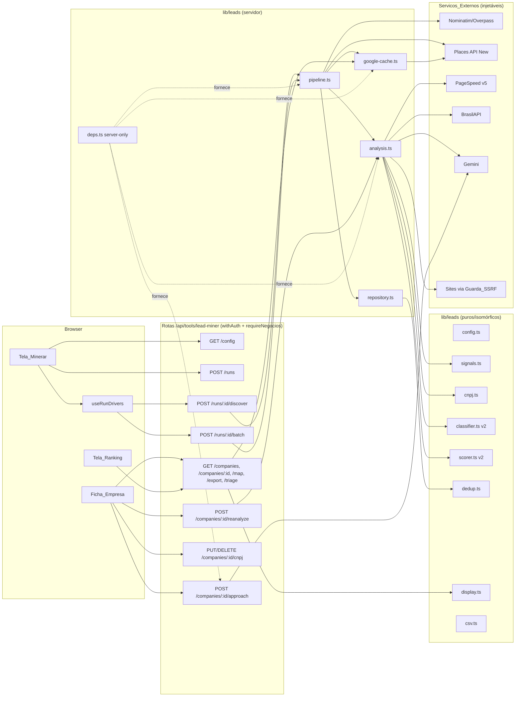
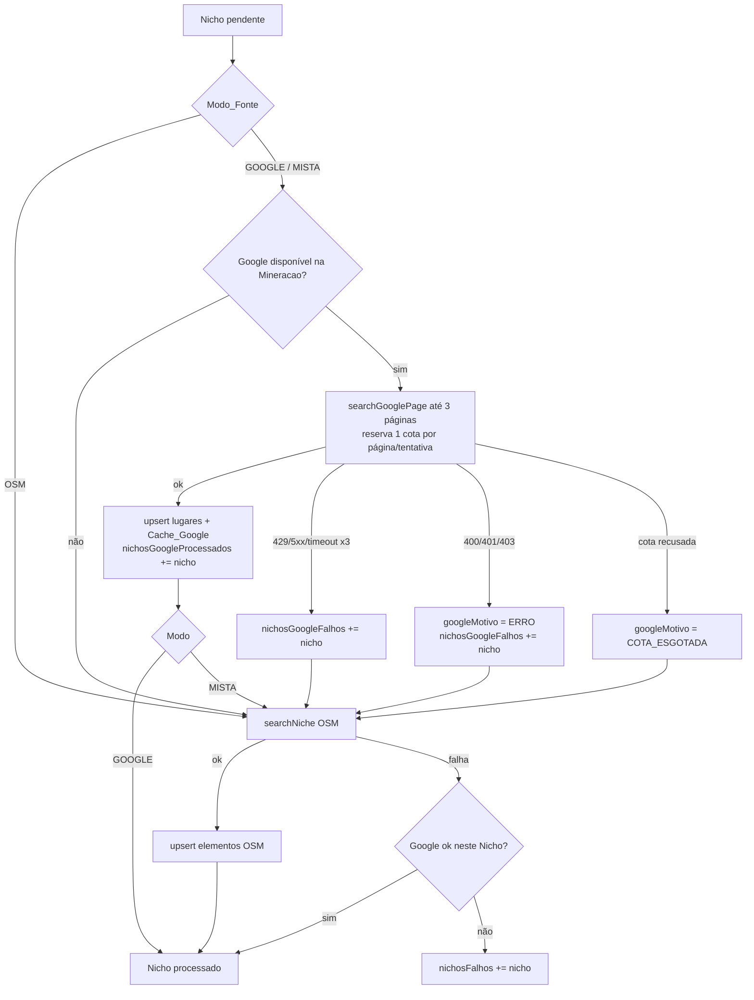
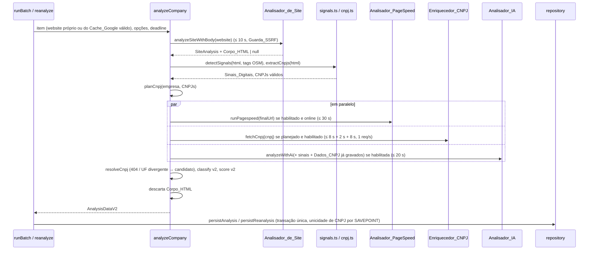

# Design Document — Melhorias do Minerador de Leads (Etapa 3)

## Overview

Esta etapa estende o Minerador da Etapa 1 (`lib/leads/**`, `.kiro/specs/lead-miner/design.md`) sem trocar a sua arquitetura: a mineração continua sendo dirigida pelo navegador em passos curtos (`createRun` → `discoverStep`* → `runBatch`*), toda I/O externa continua atrás de `PipelineDeps` e todas as regras de negócio continuam em módulos puros testáveis sem rede.

O que muda, em resumo:

| Área | Mudança | Requisitos |
|---|---|---|
| Fontes | Nova `sources/google-places.ts` (Text Search + Place Details, New). Descoberta por Nicho e por fonte, com Modo_Fonte `OSM`/`GOOGLE`/`MISTA`, fallback por Nicho e cursor de paginação retomável | 3, 4 |
| Cotas | `UsageGate` passa a aceitar `places` e `pagespeed` e ganha `count()` para a Tela_Minerar | 2, 19.3 |
| Termos do Google | Tabela `GooglePlaceCache` (30 dias) separada de `Company`; só `googlePlaceId` e aliases `GOOGLE` são permanentes; purga oportunista reutilizável; `display.ts` resolve Nome_Exibicao e campos de exibição ignorando cache expirado | 5, 6 |
| Site | `http-transport.ts` passa a devolver o corpo (até 1 MiB) e o `Content-Type`; `site-analyzer.ts` ganha `analyzeSiteWithBody` (o `analyzeSite` atual vira um invólucro, preservando a Etapa 1) | 7 |
| Sinais | Novos módulos puros `signals.ts` (Instagram, WhatsApp, tecnologias) e `cnpj.ts` (validador alfanumérico mod 11, formatação, extração do HTML) | 8, 9, 11 |
| Serviços | `pagespeed.ts` (PageSpeed v5), `brasilapi.ts` (Enriquecedor_CNPJ, 1 req/s por processo), `approach.ts` (Mensagem_Abordagem com Gemini + modelo fixo) | 10, 12, 15 |
| Análise | Novo `analysis.ts` com `analyzeCompany` compartilhado entre o Lote e a Reanalise; PageSpeed, CNPJ e IA em paralelo | 10.8, 14, 16 |
| Score | `classifier.ts`/`scorer.ts` ganham entrada opcional `pagespeed`; sem ela o resultado é idêntico ao da Etapa 1 (Versao_Score 2 ≡ 1) | 13 |
| Rotas | `POST companies/[id]/reanalyze`, `PUT/DELETE companies/[id]/cnpj`, `POST companies/[id]/approach`, `GET config` estendido com estado/uso dos serviços | 2.6, 11, 15, 16, 20 |
| UI | Tela_Minerar (Fonte, PageSpeed, CNPJ, estado dos serviços), Tela_Mineracoes (Modo/Fonte), Tela_Ranking (filtros novos, Atribuicao_Google, aviso do mapa), Ficha (Presença digital, PageSpeed, CNPJ, Mensagem, Reanalisar) | 4, 6, 15–18 |

### Decisões de design principais

1. **Cache_Google em tabela própria (`GooglePlaceCache`)**, 1:1 com `Company`, com `obtidoEm` e `expiraEm`. A `Company` guarda do Google apenas `googlePlaceId` (e aliases `GOOGLE` em `CompanyAlias`). Uma Empresa só do Google tem `nome = ''`, `nomeNormalizado = ''` e sem coordenadas próprias. Toda leitura para exibição passa por `display.ts`, que trata o cache como ausente quando `expiraEm <= agora` — por isso conteúdo expirado nunca aparece, mesmo antes da purga (Req. 6.3).
2. **`Company.nomeExibicao` denormalizado para ordenação** (Req. 18.2). Prisma não ordena por `COALESCE` entre tabelas; a coluna é gravada e recalculada **na mesma transação** que grava ou apaga o Cache_Google ou os Dados_CNPJ, e portanto faz parte do ciclo de vida do cache (é apagada/recalculada pela purga). A busca textual não usa essa coluna: usa `OR` entre `nome`, `cnpjNomeFantasia` e `googleCache.nome` com `expiraEm > agora` (sempre `mode: 'insensitive'`), o que garante que um nome expirado nunca casa.
3. **Descoberta por fonte e por Nicho, retomável.** O estado de cada Nicho passa a ter duas partes (`nichosGoogleProcessados`/`nichosGoogleFalhos` + as listas da Etapa 1) e um `googleCursor` com o `nextPageToken` corrente, de modo que um passo pode parar entre páginas do Google e o próximo continua (Req. 4.10).
4. **Deduplicação entre fontes pelo mesmo `matchCompany`**, estendido com aliases por fonte e com a "chave efetiva" das candidatas (valores próprios ou, na falta, os do Cache_Google válido). Assim um elemento OSM processado num passo posterior ainda casa com a Empresa criada pelo Google no passo anterior.
5. **Rede no Google por poda no fim da descoberta.** A heurística "≥ 3 lugares com o mesmo Nome_Normalizado na mesma Mineracao" precisa enxergar todos os Nichos; em vez de guardar nomes do Google na Mineracao, `pruneGoogleChains` roda antes de `finalizeDiscovery`, usando os nomes do Cache_Google recém-obtido, e remove os vínculos `origem = GOOGLE` desses lugares.
6. **`analyzeCompany` único** para Lote e Reanalise: site + corpo → sinais e CNPJs do HTML → em paralelo PageSpeed, Enriquecedor_CNPJ e IA → classificação/pontuação v2. Cada chamada externa recebe `min(timeout próprio, tempo restante − margem)`; o Lote só inicia uma Empresa se houver margem para o pior caso dos serviços habilitados (`perCompanyMarginMs`).
7. **Reanalise com guarda no banco**: um `UPDATE ... RETURNING` atômico em `Company.reanaliseAte` (lease de 90 s) com `NOT EXISTS` de Analise nos últimos 10 minutos. Duas requisições simultâneas: só uma recebe a linha; a outra recebe 409.
8. **Chaves só em `deps.ts`** (com `server-only`), enviadas em cabeçalho (`X-Goog-Api-Key`), nunca em URL; os clientes reais recebem `fetch` injetado e só produzem mensagens de erro genéricas (`HTTP 403`, `timeout`). O `.env.example` documenta as novas variáveis, com padrão e efeito de deixá-las vazias (Req. 2.9).

### Referências de pesquisa

- [Text Search (New)](https://developers.google.com/maps/documentation/places/web-service/text-search) — `POST https://places.googleapis.com/v1/places:searchText`; cabeçalhos `X-Goog-Api-Key` e `X-Goog-FieldMask` obrigatórios; `textQuery`, `includedType`, `languageCode`, `regionCode`, `locationRestriction.rectangle` (`low`/`high`), `pageSize` (máx. 20) e `pageToken`; `nextPageToken` na resposta; no máximo 60 resultados no total.
- [Place Details (New)](https://developers.google.com/maps/documentation/places/web-service/place-details) — `GET https://places.googleapis.com/v1/places/{placeId}`; a máscara não leva o prefixo `places.`; lugar inexistente responde 404 (`NOT_FOUND`).
- [Policies and attributions for Places API](https://developers.google.com/maps/documentation/places/web-service/policies) — só o Place_ID pode ser guardado indefinidamente; atribuição "Google Maps" junto do conteúdo; resultados em mapa só em Google Map. [Service Specific Terms](https://cloud.google.com/maps-platform/terms/maps-service-terms) — cache temporário de até 30 dias.
- [Places API Usage and Billing](https://developers.google.com/maps/documentation/places/web-service/usage-and-billing) — `websiteUri`/`nationalPhoneNumber` colocam a requisição no SKU Enterprise.
- [PageSpeed Insights API v5](https://developers.google.com/speed/docs/insights/v5/get-started) — `GET https://www.googleapis.com/pagespeedonline/v5/runPagespeed?url=…&strategy=mobile&category=…`; funciona sem chave com cota reduzida; notas em `lighthouseResult.categories.*.score` (0–1) e métricas em `lighthouseResult.audits['largest-contentful-paint' | 'cumulative-layout-shift' | 'total-blocking-time' | 'first-contentful-paint'].numericValue`. Como as demais APIs do Google Cloud, aceita a chave no cabeçalho `X-Goog-Api-Key`, o que mantém a chave fora das URLs.
- [BrasilAPI — CNPJ](https://brasilapi.com.br/docs#tag/CNPJ) — `GET https://brasilapi.com.br/api/cnpj/v1/{cnpj}`; campos usados: `razao_social`, `nome_fantasia`, `descricao_situacao_cadastral`, `data_situacao_cadastral`, `cnae_fiscal`, `cnae_fiscal_descricao`, `porte`, `natureza_juridica`, `opcao_pelo_mei`, `data_inicio_atividade`, `municipio`, `uf`; 404 para CNPJ inexistente. O parser é tolerante: campo ausente vira `null`.
- [CNPJ alfanumérico (Receita Federal)](https://www.gov.br/receitafederal/pt-br/acesso-a-informacao/acoes-e-programas/programas-e-atividades/cnpj-alfanumerico) — 12 posições alfanuméricas + 2 DV numéricos; valor de cada caractere = código ASCII − 48; pesos 2–9 da direita para a esquerda, módulo 11 (resto 0 ou 1 → DV 0).

*O conteúdo das fontes foi parafraseado por conformidade com restrições de licenciamento.*

## Architecture



Regras de dependência mantidas da Etapa 1: módulos puros não importam Node, Prisma nem `server-only`; só `deps.ts` lê variáveis de ambiente e instancia clientes reais; rotas não chamam serviços externos diretamente, sempre via funções que recebem `deps`.

### Descoberta de um Nicho por Modo_Fonte



Ao tratar todos os Nichos: `pruneGoogleChains` (se "excluir redes"), cálculo da Fonte_Efetiva pelos vínculos e `finalizeDiscovery` (Etapa 1). A purga do Cache_Google expirado roda no início de cada `discoverStep`.

### Sequência da análise de uma Empresa (Lote e Reanalise)



Pior caso por Empresa: 10 s (site) + 30 s (PageSpeed, o mais lento do bloco paralelo) + ~2 s (gravação) = 42 s; sem PageSpeed: 10 + 20 (IA) ou 18 (CNPJ) + 2 = 32 s, igual à Etapa 1. O Lote só inicia uma Empresa se `now + perCompanyMarginMs(run) <= deadline`, o que mantém o Lote abaixo de 60 s (Req. 10.8).

## Components and Interfaces

### Estrutura de arquivos

```
lib/leads/
  config.ts              (+ GOOGLE_QUERIES por Nicho, limites/timeouts novos, TECH_CATALOG, APPROACH_LIMITS)
  types.ts               (+ GooglePlace, SinaisDigitais, PageSpeedOutcome, CnpjData, ServiceStatus…)
  usage.ts               (UsageProvider = 'gemini' | 'places' | 'pagespeed'; + count())
  net/http-transport.ts  (+ contentType e body: Uint8Array | null na resposta)
  site-analyzer.ts       (+ analyzeSiteWithBody; analyzeSite = invólucro)
  html.ts           NOVO (decodificação por charset, texto visível + atributos) — puro
  signals.ts        NOVO Detector_Sinais — puro
  cnpj.ts           NOVO Validador_CNPJ + extração do HTML + planCnpj/resolveCnpj — puro
  display.ts        NOVO Nome_Exibicao, campos de exibição, link Google Maps — puro
  pagespeed.ts      NOVO Analisador_PageSpeed (cliente injetado)
  brasilapi.ts      NOVO Enriquecedor_CNPJ (cliente injetado + limitador 1 req/s)
  approach.ts       NOVO Gerador_Abordagem (Gemini injetado + modelos fixos)
  analysis.ts       NOVO analyzeCompany (compartilhado Lote/Reanalise)
  reanalysis.ts     NOVO reanalyzeCompany (guarda de 10 min + lease)
  google-cache.ts   NOVO purgeExpiredGoogleCache, refreshGoogleCache, writeGoogleCache
  services.ts       NOVO serviceStatus() para /config (disponibilidade + uso do mês)
  sources/google-places.ts NOVO Fonte_Google (Text Search + Place Details)
  sources/rate-limit.ts    (+ brasilApiLimiter global)
  sources/osm.ts     (+ bbox no SearchArea; contact:instagram/whatsapp no mapeamento)
  dedup.ts / repository.ts / pipeline.ts / filters.ts / csv.ts / triage.ts / ai.ts / classifier.ts / scorer.ts / deps.ts / client-api.ts (estendidos)
app/api/tools/lead-miner/
  config/route.ts                       (estendido)
  companies/[id]/reanalyze/route.ts     NOVO
  companies/[id]/cnpj/route.ts          NOVO (PUT, DELETE)
  companies/[id]/approach/route.ts      NOVO (POST)
components/lead-miner/
  ServiceStatusPanel.tsx, SourcePicker.tsx, GoogleAttribution.tsx, GoogleUnusedNote.tsx  NOVOS
  ficha/DigitalPresence.tsx, ficha/PageSpeedCard.tsx, ficha/CnpjSection.tsx,
  ficha/ApproachMessages.tsx, ficha/ReanalyzeButton.tsx, ficha/GoogleContent.tsx          NOVOS
  enrichment-helpers.ts NOVO (rótulos, faixas, formatação de WhatsApp/CNPJ — puro)
```

### `config.ts` (isomórfico — Req. 1.1–1.9)

```ts
export interface GoogleQuery { text: string; includedType?: string }
/** Um texto em português por Nicho (22 entradas), tipo da Places API quando há equivalente. */
export const GOOGLE_QUERIES: Readonly<Record<string, GoogleQuery>>;
// ex.: clinica_odontologica: { text: 'clínica odontológica', includedType: 'dentist' },
//      advocacia: { text: 'escritório de advocacia', includedType: 'lawyer' },
//      escola_idiomas: { text: 'escola de idiomas' } (sem includedType)

export const PLACES_MONTHLY_LIMIT_DEFAULT = 1_000;
export const PAGESPEED_MONTHLY_LIMIT_DEFAULT = 5_000;
/** Mesma regra de geminiMonthlyLimit (inteiro positivo; senão o padrão). */
export function monthlyLimit(env: string | undefined, fallback: number): number;
export const placesMonthlyLimit = (env?: string) => monthlyLimit(env, PLACES_MONTHLY_LIMIT_DEFAULT);
export const pagespeedMonthlyLimit = (env?: string) => monthlyLimit(env, PAGESPEED_MONTHLY_LIMIT_DEFAULT);
// geminiMonthlyLimit passa a delegar para monthlyLimit (comportamento idêntico).

export const PLACES_TIMEOUT_MS = 15_000;
export const PAGESPEED_TIMEOUT_MS = 30_000;
export const BRASILAPI_TIMEOUT_MS = 8_000;
export const BRASILAPI_RETRY_DELAY_MS = 2_000;
export const BRASILAPI_MIN_INTERVAL_MS = 1_000;
export const APPROACH_TIMEOUT_MS = 20_000;
export const GOOGLE_MAX_PAGES = 3;
export const GOOGLE_PAGE_SIZE = 20;
export const GOOGLE_CACHE_DAYS = 30;
export const CNPJ_DATA_DAYS = 90;
export const PAGESPEED_POOR_THRESHOLD = 50;           // Desempenho_Ruim: nota < 50
export const DIGITAL_POINTS_V2 = { ...DIGITAL_POINTS, desempenhoRuim: 7 } as const;
export const REANALYSIS_MIN_GAP_MS = 10 * 60_000;
export const REANALYSIS_LEASE_SECONDS = 90;
export const APPROACH_LIMITS = { whatsapp: 700, emailSubject: 120, emailBody: 2_000 } as const;
export const GOOGLE_ATTRIBUTION_TEXT = 'Google Maps';
export const GOOGLE_EXPIRED_NAME = 'Empresa do Google (dados expirados)';

export type TechGroup = 'CMS' | 'LOJA_VIRTUAL' | 'ANALYTICS' | 'MARKETING' | 'FRAMEWORK';
export const TECH_GROUP_ORDER: readonly TechGroup[] = ['CMS', 'LOJA_VIRTUAL', 'ANALYTICS', 'MARKETING', 'FRAMEWORK'];
export const TECH_GROUP_LABEL: Record<TechGroup, string>;   // "CMS", "Loja virtual", "Analytics", "Marketing", "Framework"
export interface TechPattern {
  /** Onde procurar: generator, src/href de script/link, script inline, atributo/HTML bruto. */
  where: 'generator' | 'asset' | 'inline' | 'html';
  /** Fonte da RegExp (string, para manter o config serializável e isomórfico), sempre com flag i. */
  regex: string;
}
export interface TechEntry { id: string; label: string; group: TechGroup; patterns: TechPattern[] }
export const TECH_CATALOG: readonly TechEntry[];  // ≥ 15 entradas do Req. 1.7
```

Exemplos de padrões do `TECH_CATALOG` (todos testados por exemplo, Req. 21.5): WordPress `generator: ^WordPress`, `asset: /wp-content/|/wp-includes/`; Wix `generator: Wix\.com`, `asset: static\.wixstatic\.com|parastorage\.com`; Shopify `asset: cdn\.shopify\.com`, `inline: Shopify\.shop`; Nuvemshop `asset: (nuvemshop|tiendanube)\.com|d26lpennugtm8s\.cloudfront\.net`; Loja Integrada `asset: lojaintegrada\.com\.br`; Tray `asset: tray\.com\.br|traycdn`; Squarespace `asset: squarespace(-cdn)?\.com`, `generator: Squarespace`; Webflow `html: data-wf-page|data-wf-site`, `generator: Webflow`; Google Analytics `asset: google-analytics\.com/(analytics|ga)\.js|googletagmanager\.com/gtag/js`; Google Tag Manager `asset: googletagmanager\.com/gtm\.js`, `inline: GTM-[A-Z0-9]+`; Meta Pixel `asset: connect\.facebook\.net/[^"']*/fbevents\.js`, `inline: fbq\(['"]init`; jQuery `asset: jquery(\.min)?\.js|code\.jquery\.com`; React `html: data-reactroot|__REACT_DEVTOOLS`, `asset: react(-dom)?(\.production)?(\.min)?\.js`; Next.js `html: __NEXT_DATA__|/_next/static/`; Bootstrap `asset: bootstrap(\.bundle)?(\.min)?\.(css|js)`.

Invariantes verificados pelo teste do config (Req. 1.1, 1.7, 1.9): `GOOGLE_QUERIES` cobre exatamente os 22 ids de `NICHES` com `text.trim() !== ''`; ids do catálogo únicos, rótulos não vazios, grupo válido, ≥ 1 padrão e toda `regex` compila; o arquivo continua sem imports de Node/Prisma.

### `types.ts` (acréscimos)

```ts
export type ExternalProvider = 'places' | 'pagespeed' | 'gemini';
export type UnavailableReason = 'SEM_CHAVE' | 'COTA_ESGOTADA' | 'ERRO' | 'DESABILITADO_NA_MINERACAO';
export type SourceMode = 'OSM' | 'GOOGLE' | 'MISTA';

/** Lugar devolvido pela Fonte_Google (Conteudo_Google, exceto placeId). */
export interface GooglePlace {
  placeId: string;
  nome: string;
  nicho: string;
  endereco: string | null;
  bairro: string | null;
  cidade: string | null;
  uf: string | null;
  telefone: string | null;
  website: string | null;
  latitude: number | null;
  longitude: number | null;
  mapsUri: string | null;
  businessStatus: string | null;
  tipos: string[];
}

// FoundCompany (OSM) ganha: instagramOsm: string | null; whatsappOsm: string | null  (tags contact:*)

export type SignalOrigin = 'SITE' | 'OSM';
export interface TechHit { id: string; label: string; group: TechGroup }
export interface SinaisDigitais {
  instagram: string | null;  instagramOrigem: SignalOrigin | null;
  whatsapp: string | null;   whatsappOrigem: SignalOrigin | null;   // dígitos, 12–13, com 55
  tecnologias: TechHit[];    // ordenadas por grupo (TECH_GROUP_ORDER) e rótulo; origem sempre SITE
}

export interface PageSpeedResult {
  desempenho: number; acessibilidade: number | null; boasPraticas: number | null; seo: number | null;
  lcpMs: number | null; cls: number | null; tbtMs: number | null; fcpMs: number | null;
  urlAnalisada: string;
}
export type PageSpeedAbsence =
  | 'ERRO' | 'TIMEOUT' | 'RESPOSTA_INVALIDA' | 'COTA_ESGOTADA' | 'DESABILITADO_NA_MINERACAO' | 'SITE_OFFLINE' | 'SEM_SITE';
export type PageSpeedOutcome = { ok: true; result: PageSpeedResult } | { ok: false; reason: PageSpeedAbsence };

export type CnpjOrigin = 'SITE' | 'MANUAL';
export interface CnpjData {
  cnpj: string; razaoSocial: string | null; nomeFantasia: string | null;
  situacao: string | null; situacaoData: string | null;
  cnaeCodigo: string | null; cnaeDescricao: string | null;
  porte: string | null; naturezaJuridica: string | null; mei: boolean | null;
  inicioAtividade: string | null; municipio: string | null; uf: string | null;
  consultadoEm: string; // ISO
}
export type CandidateReason = 'MULTIPLOS' | 'CONFLITO' | 'UF_DIVERGENTE' | 'NAO_ENCONTRADO' | 'MANUAL_PRESERVADO' | 'CONSULTA_DESABILITADA';
export interface CnpjCandidate { cnpj: string; motivo: CandidateReason; conflitoCompanyId?: string }

// ClassificationResult: motivos passa a ter de 1 a 6 itens (Req. 13.2).
// ScoreBreakdown ganha versao?: 1 | 2 (ausente = 1 nas Analises antigas).
```

### `usage.ts` (Req. 2.4, 2.5, 19.3)

```ts
export type UsageProvider = 'gemini' | 'places' | 'pagespeed';
export interface UsageGate {
  reserve(provider: UsageProvider, month: string, limit: number): Promise<boolean>; // inalterado
  /** Chamadas reservadas no mês (0 se não há linha). Usado só para exibição. */
  count(provider: UsageProvider, month: string): Promise<number>;
}
```

O SQL do `reserve` não muda (`INSERT … ON CONFLICT (provider, month) DO UPDATE … WHERE count < limite RETURNING count`): a mesma tabela `ApiUsage` já é única por `(provider, month)`. `count` é um `findUnique` simples. Um `memoryUsageGate(limits)` em `tests/lead-miner-enrichment/support/fake-usage.ts` modela o mesmo contrato para os testes.

Toda chamada às Places/PageSpeed segue o padrão "reserva → envia": se `reserve` devolve `false`, o cliente não é chamado e o resultado é `COTA_ESGOTADA` (Req. 2.5). Cada retentativa e cada página reserva de novo (Req. 3.3, 3.7).

### `net/http-transport.ts` e `site-analyzer.ts` (Req. 7)

`TransportResponse` ganha dois campos; o resto do contrato não muda:

```ts
export interface TransportResponse {
  status: number; location: string | null; headersAt: number; bodyBytes: number;
  /** Valor bruto do cabeçalho Content-Type (ou null). */
  contentType: string | null;
  /** Bytes do corpo lidos (≤ maxBodyBytes) quando `captureBody` é true e a resposta não é redirect; senão null. */
  body: Uint8Array | null;
}
export interface TransportRequest { /* …campos atuais… */ captureBody?: boolean }
```

No `doRequest`, os `chunk`s passam a ser acumulados por `collectBody(maxBytes)` (função pura exportada: `push(chunk) → 'MORE' | 'FULL'`, `bytes()`, cortando o último chunk no limite) somente quando `captureBody` é verdadeiro e o status não é de redirecionamento. A contagem `bodyBytes`, o encerramento ao atingir `maxBodyBytes`, a conexão no IP validado, os cabeçalhos (`Host`, `User-Agent`, `Accept`) e o método `GET` ficam como estão (Req. 7.2).

```ts
export interface SiteFetch { analysis: SiteAnalysis; html: string | null }
/** Mesma lógica de analyzeSite; pede captureBody e devolve o Corpo_HTML decodificado. */
export async function analyzeSiteWithBody(website: string | null, deps: SiteAnalyzerDeps): Promise<SiteFetch>;
/** Etapa 1, inalterado para quem já usa: (await analyzeSiteWithBody(w, d)).analysis */
export async function analyzeSite(website: string | null, deps: SiteAnalyzerDeps): Promise<SiteAnalysis>;
```

`html` só é não nulo quando `analysis.online`, o `Content-Type` é `text/html` ou `application/xhtml+xml` e há corpo (Req. 7.3). A decodificação fica em `html.ts`:

```ts
/** charset do Content-Type; senão <meta charset> / http-equiv nos primeiros 2 KiB; senão utf-8. TextDecoder com fatal:false. */
export function decodeHtml(body: Uint8Array, contentType: string | null): string;
export function isHtmlContentType(ct: string | null): boolean;
/** Texto visível (sem <script>/<style>, entidades básicas decodificadas) + valores de atributos, para a busca de CNPJ. */
export function htmlSearchText(html: string): string;
/** Hrefs de <a>, srcs/hrefs de <script>/<link>, conteúdo de <meta name="generator">, scripts inline. Regex tolerantes, sem DOM. */
export function extractLinks(html: string): string[];
export function extractAssets(html: string): { generator: string[]; assets: string[]; inline: string[] };
```

Charset desconhecido para `TextDecoder` (exceção no construtor) cai para `utf-8` (Req. 7.4). O `analysis` produzido para a mesma resposta é idêntico ao da Etapa 1 — `responseResult` não lê os campos novos (Req. 7.6, Propriedade 18). O Corpo_HTML vive só dentro de `analyzeCompany` e não é incluído em `AnalysisDataV2` (Req. 7.5).

### `sources/google-places.ts` — Fonte_Google (Req. 3)

```ts
/** Cliente HTTP mínimo injetado; o real (deps.ts) usa fetch com a chave no cabeçalho. */
export interface PlacesHttp {
  /** Resolve com { status, json } para qualquer status HTTP; rejeita só em rede/timeout. */
  request(req: {
    method: 'GET' | 'POST';
    path: string;                 // '/v1/places:searchText' | `/v1/places/${encodeURIComponent(id)}`
    query?: Record<string, string>;
    fieldMask: string;
    body?: unknown;
    timeoutMs: number;
  }): Promise<{ status: number; json: unknown }>;
}
export interface GooglePlacesDeps {
  http: PlacesHttp | null;        // null = sem GOOGLE_PLACES_API_KEY
  usage: UsageGate;
  limit: number;
  now: () => Date;
  sleep: (ms: number) => Promise<void>;
}

export const PLACES_HOST = 'https://places.googleapis.com';
export const SEARCH_FIELD_MASK =
  'places.id,places.displayName,places.formattedAddress,places.addressComponents,places.location,' +
  'places.nationalPhoneNumber,places.websiteUri,places.googleMapsUri,places.businessStatus,places.types,nextPageToken';
export const DETAILS_FIELD_MASK = SEARCH_FIELD_MASK                       // mesmos campos, sem prefixo e sem nextPageToken
  .split(',').filter((f) => f !== 'nextPageToken').map((f) => f.replace(/^places\./, '')).join(',');

export interface Rect { low: { latitude: number; longitude: number }; high: { latitude: number; longitude: number } }
/** Corpo da Text Search (puro, testável). */
export function buildTextSearchBody(niche: Niche, run: { bairro: string; cidade: string; uf: string }, rect: Rect, pageToken?: string): object;
// → { textQuery: `${q.text} em ${bairro}, ${cidade} - ${uf}`, languageCode: 'pt-BR', regionCode: 'BR',
//     locationRestriction: { rectangle: rect }, pageSize: 20, includedType?, pageToken? }

/** Mapeia um lugar da resposta; null se CLOSED_PERMANENTLY ou nome vazio (Req. 3.4, 3.5). Puro. */
export function mapPlace(raw: unknown, nicheId: string): GooglePlace | null;

export type PageOutcome =
  | { ok: true; places: GooglePlace[]; nextPageToken: string | null }
  | { ok: false; kind: 'RETRYABLE_EXHAUSTED' | 'FATAL' | 'QUOTA' | 'UNAVAILABLE' };

/** Uma página com até 2 retentativas (2 s, 4 s); reserva 1 cota por tentativa (Req. 3.3, 3.7, 3.8, 2.4, 2.5). */
export async function searchGooglePage(niche: Niche, run: RunPlace, rect: Rect, pageToken: string | null, deps: GooglePlacesDeps): Promise<PageOutcome>;

export type DetailsOutcome =
  | { ok: true; place: Omit<GooglePlace, 'nicho'> }
  | { ok: false; kind: 'NOT_FOUND' | 'ERRO' | 'QUOTA' | 'UNAVAILABLE' };
/** Place Details (New) com DETAILS_FIELD_MASK, sem retentativa; reserva 1 cota (Req. 6.8, 6.10). */
export async function fetchPlaceDetails(placeId: string, deps: GooglePlacesDeps): Promise<DetailsOutcome>;

/** Remove placeIds repetidos entre Nichos; a 1ª ocorrência (1º Nicho) vence (Req. 3.6). Puro. */
export function mergeByPlaceId(perNiche: GooglePlace[][]): GooglePlace[];
/** placeIds cujo Nome_Normalizado aparece em ≥ 3 placeIds distintos (Req. 3.9). Puro. */
export function detectGoogleChains(entries: readonly { placeId: string; nomeNormalizado: string }[]): Set<string>;
/** "low/high" a partir de SearchArea com bbox; null se a área não tem bbox. */
export function rectFromArea(area: SearchArea): Rect | null;
```

Classificação do status em `searchGooglePage`: 2xx com JSON válido → ok; 429, 5xx, rejeição por timeout/rede ou JSON inválido → retentável; 400/401/403 → `FATAL` (sem retentativa); `reserve` recusado em qualquer tentativa → `QUOTA` (sem enviar); `http === null` → `UNAVAILABLE`. Mapeamento dos componentes de endereço: `sublocality_level_1`/`sublocality` → bairro; `administrative_area_level_2` → cidade; `administrative_area_level_1` (`shortText`) → UF; `location.latitude/longitude` só quando finitos.

`sources/osm.ts`: `areaFromNominatim` passa a sempre anexar o `boundingbox` (`{ kind: 'area', areaId, bbox }`), o que dá o retângulo da Text Search sem nova chamada ao Nominatim (Req. 3.1). `mapElement` lê `contact:instagram`/`instagram` e `contact:whatsapp`/`whatsapp` para `instagramOsm`/`whatsappOsm`. Mineracoes antigas cuja `area` não tem `bbox` tratam o Google como indisponível (`ERRO`) e seguem pelo OSM.

### `google-cache.ts` (Req. 6)

```ts
export const googleCacheExpiry = (obtidoEm: Date) => new Date(obtidoEm.getTime() + GOOGLE_CACHE_DAYS * 86_400_000);
/** Válido ⇔ agora < expiraEm (29 dias válido; 30 dias completos expirado). Puro. */
export function isCacheValid(c: { expiraEm: Date | string } | null | undefined, now: Date): boolean;

/** Upsert do Cache_Google + recálculo de Company.nomeExibicao na mesma transação. */
export async function writeGoogleCache(tx: Db, companyId: string, place: Omit<GooglePlace, 'nicho'>, now: Date): Promise<void>;
/** DELETE … WHERE "expiraEm" <= now() e recálculo de nomeExibicao das Empresas afetadas; devolve o nº apagado. Reutilizável na Etapa 4. */
export async function purgeExpiredGoogleCache(db: PrismaClient, now?: Date): Promise<number>;
export type RefreshOutcome = 'FRESH' | 'UPDATED' | 'UNAVAILABLE' | 'FAILED' | 'NOT_FOUND';
/** Ficha/Reanalise: se a Empresa tem Place_ID e o cache está ausente/expirado, chama Place Details (Req. 6.8–6.10). */
export async function refreshGoogleCache(db: PrismaClient, companyId: string, deps: GooglePlacesDeps): Promise<RefreshOutcome>;
```

A purga é um único `DELETE … RETURNING "companyId"` seguido de `UPDATE "Company" SET "nomeExibicao" = COALESCE(NULLIF("cnpjNomeFantasia", ''), NULLIF(nome, ''), $placeholder) WHERE id IN (…)`. Ela é chamada, com `catch` que só registra o erro (sem interromper a requisição), no início de `discoverStep`, de `GET /companies`, `GET /companies/map`, `POST /companies/export` e `GET /companies/[id]` (Req. 6.2). `NOT_FOUND` apaga o cache e mantém o Place_ID (Req. 6.10).

### `display.ts` — Nome_Exibicao e campos de exibição (puro, Req. 6.3, 6.11)

```ts
export interface DisplaySource {
  nome: string; endereco: string | null; bairro: string | null; cidade: string | null; uf: string | null;
  telefone: string | null; website: string | null; latitude: number | null; longitude: number | null;
  googlePlaceId: string | null; cnpjNomeFantasia: string | null;
  googleCache: (Omit<GooglePlace, 'placeId' | 'nicho'> & { obtidoEm: Date | string; expiraEm: Date | string }) | null;
}
export type NameOrigin = 'GOOGLE' | 'CNPJ' | 'PROPRIO' | 'EXPIRADO';
export interface DisplayCompany {
  nome: string; nomeOrigem: NameOrigin;
  endereco, bairro, cidade, uf, telefone, website: string | null;   // cache válido > próprio
  /** Fonte de cada campo exibido, para a Atribuicao_Google na UI. */
  googleFields: ReadonlyArray<'nome' | 'endereco' | 'bairro' | 'cidade' | 'uf' | 'telefone' | 'website' | 'coords'>;
  latitude: number | null; longitude: number | null; coordsFromGoogle: boolean;
  google: { placeId: string; mapsLink: string; cacheStatus: 'VALIDO' | 'AUSENTE' } | null;
}
export function displayCompany(c: DisplaySource, now: Date): DisplayCompany;
export function displayName(c: Pick<DisplaySource, 'nome' | 'cnpjNomeFantasia' | 'googleCache'>, now: Date): { nome: string; origem: NameOrigin };
/** https://www.google.com/maps/place/?q=place_id:{encodeURIComponent(placeId)} (Req. 6.6). */
export function googleMapsLink(placeId: string): string;
/** Nome para ordenação (= displayName com cache válido), gravado em Company.nomeExibicao. */
export function sortName(c: Pick<DisplaySource, 'nome' | 'cnpjNomeFantasia' | 'googleCache'>, now: Date): string;
/** Campos sem Conteudo_Google (CSV, triagem, Mapa): só valores próprios. */
export function ownFields(c: DisplaySource): Pick<DisplayCompany, 'endereco' | 'bairro' | 'cidade' | 'uf' | 'telefone' | 'website' | 'latitude' | 'longitude'> & { nome: string };
```

Regra do nome: cache válido → nome do Google; senão `cnpjNomeFantasia` não vazio; senão `nome` próprio não vazio; senão `GOOGLE_EXPIRED_NAME` (Req. 6.11). Para CSV/triagem o nome sem Google é `cnpjNomeFantasia ?? nome ?? GOOGLE_EXPIRED_NAME`, exceto `companyName` da triagem, que usa o Nome_Exibicao (Req. 6.7, decisão 4).

Todas as rotas que devolvem Empresas passam pelo `displayCompany`: `GET /companies` e `/companies/[id]` devolvem `nome` = Nome_Exibicao, `nomeOrigem`, `googleFields`, `google`; `/companies/map` filtra `coordsFromGoogle` e só usa coordenadas próprias (Req. 6.5). Nenhuma rota devolve o objeto `googleCache` cru.

### `dedup.ts` e `repository.ts` (Req. 5)

`CompanyKey` passa a separar aliases por fonte e aceita a chave efetiva:

```ts
export interface CompanyKey {
  id?: string;
  googlePlaceId: string | null; osmId: string | null; cnpj: string | null;
  nomeNormalizado: string; latitude: number | null; longitude: number | null;
  aliases?: string[];        // OSM (nome mantido por compatibilidade)
  googleAliases?: string[];  // NOVO: Place_IDs fundidos
}
export function toGoogleKey(p: GooglePlace): CompanyKey;  // googlePlaceId, nome/coords do lugar (da própria Mineracao)
/** Chave de uma existente: valores próprios; na falta de nome/coords, os do Cache_Google válido. */
export function effectiveKey(c: CompanyKey & { googleCache?: { nome: string; latitude: number | null; longitude: number | null; expiraEm: Date | string } | null }, now: Date): CompanyKey;
```

`hasIdentifier` passa a casar `googlePlaceId` também em `googleAliases`. A ordem de `matchCompany` (Place_ID > osmId > CNPJ > nome + ≤ 100 m) não muda (Req. 5.1).

`ingestInMemory` é generalizado para `ingestSourcesInMemory(base, items: Array<{ kind: 'OSM', found: FoundCompany } | { kind: 'GOOGLE', place: GooglePlace }>, runId, now)`, espelhando o repositório, e é o modelo das Propriedades 14 e 15:

- **GOOGLE casou com existente sem Place_ID** → grava `googlePlaceId` (Req. 5.2); **com outro Place_ID** → alias `GOOGLE` (Req. 5.3); em ambos grava/renova só o Cache_Google, sem patch cadastral (Req. 5.5).
- **GOOGLE sem correspondente** → cria Empresa com `nome = ''`, `nomeNormalizado = ''`, sem endereço/telefone/website/coordenadas próprios, `fonte = GOOGLE` e Cache_Google.
- **OSM casou com Empresa só do Google** (por chave efetiva) → patch cadastral da Etapa 1 (preenche os campos próprios), preenche `osmId`, `nomeNormalizado` recalculado.
- **fonte** = `MISTA` se a Empresa tem (próprio ou alias) Place_ID e osmId; `GOOGLE` só com Place_ID; `OSM` só com osmId (Req. 5.4) — função pura `companySource(c)`.
- Vínculo único `(runId, companyId)`; o campo novo `MiningRunCompany.origem` acumula `GOOGLE`/`OSM`/`MISTA` conforme as fontes que trouxeram a Empresa nesta Mineracao.

No repositório, `upsertGooglePlace(db, runId, place, now)` espelha `upsertFoundCompany`: busca candidatas por `googlePlaceId`, alias `GOOGLE`, e por nome normalizado na caixa de ±0,0015° comparando com o nome/coords próprios **ou** do `googleCache` válido; cria/atualiza com `withSavepoint` (unicidade de `googlePlaceId` e de `(source, externalId)`); grava o Cache_Google com `writeGoogleCache` na mesma transação; o vínculo usa `INSERT … ON CONFLICT ("runId","companyId") DO UPDATE SET origem = CASE WHEN "MiningRunCompany".origem = EXCLUDED.origem THEN EXCLUDED.origem ELSE 'MISTA' END`. `upsertFoundCompany` (OSM) ganha a mesma atualização de `origem` e de `fonte`, e passa a considerar a chave efetiva das candidatas.

`claimBatch` passa a devolver também `googlePlaceId`, `instagramOsm`, `whatsappOsm`, `uf`, `cnpj`, `cnpjOrigem`, `cnpjCandidatos`, `cnpjDadosCnpj`, `cnpjConsultadoEm`, os campos de Dados_CNPJ permitidos à IA e `cacheWebsite` (website do Cache_Google somente se `expiraEm > now()`), via `LEFT JOIN "GooglePlaceCache"`.

### `pipeline.ts` (Req. 2, 3, 4, 10.8)

```ts
export interface PipelineDeps {
  db: PrismaClient;
  osm: OsmDeps;
  google: GooglePlacesDeps;      // NOVO
  site: SiteAnalyzerDeps;
  ai: AiDeps;
  pagespeed: PageSpeedDeps;      // NOVO
  cnpj: BrasilApiDeps;           // NOVO
  now: () => number;
  newToken: () => string;
}

export interface RunProgress {
  /* …campos da Etapa 1… */
  fonteSolicitada: SourceMode;
  fonte: SourceMode;                         // Fonte_Efetiva (provisória até o fim da descoberta)
  googleMotivo: UnavailableReason | null;    // SEM_CHAVE | COTA_ESGOTADA | ERRO
  googleNichosAfetados: string[];
  pagespeedEnabled: boolean; pagespeedMotivo: UnavailableReason | null;
  cnpjEnabled: boolean;
}
```

**`createRun`** — `validateRunInput` aceita `fonte` (`OSM`|`GOOGLE`|`MISTA`, padrão `MISTA`), `pagespeedEnabled` (padrão `true`) e `cnpjEnabled` (padrão `true`); valores inválidos → 400 `{ error, fields }` sem efeito (Req. 20.5). Disponibilidade é decidida por `serviceStatus(deps)` (abaixo): se o Google não está disponível e a fonte pedida é `GOOGLE`/`MISTA`, grava `fonteSolicitada` = pedida, `fonte = 'OSM'`, `googleMotivo` = motivo (Req. 4.3). PageSpeed pedido com cota esgotada → `pagespeedEnabled = false`, `pagespeedMotivo = 'COTA_ESGOTADA'`. `buildRunParamsKey` **não** inclui as opções novas (a regra de duplicidade da Etapa 1 continua por bairro/cidade/UF/nichos).

**Modo efetivo na descoberta** — `modeFor(run) = run.googleMotivo ? 'OSM' : run.fonteSolicitada` para Nichos ainda não iniciados. Função pura `nichePlan(mode, state)` decide o próximo passo de um Nicho (`GOOGLE_PAGE`, `OSM`, `DONE`, `FAILED`) a partir de `nichosGoogleProcessados`, `nichosGoogleFalhos`, `googleCursor` e do resultado da última consulta; ela é o modelo das Propriedades 10 e 11.

**`discoverStep`** (mudanças):

1. `purgeExpiredGoogleCache` (melhor esforço) e lease como na Etapa 1.
2. Geocodificação como antes; a `area` gravada passa a incluir `bbox`.
3. Para cada Nicho pendente, enquanto `now < deadline`:
   - Google: enquanto `nichePlan` pedir `GOOGLE_PAGE` e restarem ≥ `GOOGLE_PAGE_MARGIN_MS` (20 s), chama `searchGooglePage` com o `googleCursor.pageToken`; cada página ok é ingerida (`upsertGooglePlace` por lugar, excluindo Place_IDs já vinculados nesta Mineracao — Req. 3.6) e o cursor é gravado (`{ nicheId, page, pageToken }`), ou limpo ao fim das páginas/limite de 3 (Req. 3.3, 1.4). Sem tempo entre páginas: grava o cursor e encerra o passo (retomável, Req. 4.10).
   - `QUOTA` → `googleMotivo = 'COTA_ESGOTADA'`; `FATAL` → `googleMotivo = 'ERRO'`; em ambos o Nicho entra em `nichosGoogleFalhos` e os seguintes deixam de consultar o Google (Req. 3.8, 4.6); `RETRYABLE_EXHAUSTED` → só o Nicho entra em `nichosGoogleFalhos` (Req. 3.7). Todo Nicho que o Google não atendeu entra em `googleNichosAfetados`.
   - OSM: executado conforme `nichePlan` (sempre em `OSM`; sempre em `MISTA`; em `GOOGLE` só se o Google falhou/não foi consultado — Req. 4.4, 4.5). Falha do OSM com Google ok não falha o Nicho; falha nas duas → `nichosFalhos` (Req. 4.8).
4. Fim: se `excluirRedes`, `pruneGoogleChains(tx, runId)` usa `detectGoogleChains` sobre os vínculos com `origem = 'GOOGLE'` e o nome normalizado do Cache_Google, apaga esses vínculos (e as Empresas criadas por esta Mineracao sem outros vínculos nem Analises) antes de contar o total (Req. 3.9). Depois `effectiveSource(origens)` (puro: `GOOGLE` se só há `GOOGLE`, `OSM` se só há `OSM`, senão `MISTA`; sem vínculos → `OSM` se o Google não foi usado) grava `fonte` (Req. 4.7) e `finalizeDiscovery` decide o status como na Etapa 1.

`DISCOVERY_BUDGET_MS` (50 s) e o lease de 70 s não mudam.

**`runBatch`** (mudanças): `processItem` chama `analyzeCompany` e `persistAnalysis` v2; a condição de início passa a ser `deps.now() + perCompanyMarginMs(run) <= deadline`, com

```ts
/** 10 s do site + o maior timeout dos serviços habilitados no bloco paralelo + 2 s de gravação. Puro. */
export function perCompanyMarginMs(run: { iaEnabled: boolean; pagespeedEnabled: boolean; cnpjEnabled: boolean }): number;
// pagespeed: 30 s; cnpj: 8 + 2 + 8 = 18 s; ia: 20 s  → máx. 42 s; sem nenhum: 12 s; Etapa 1 (só IA): 32 s
```

`BATCH_CONCURRENCY` continua 3. Com PageSpeed habilitado cada Lote processa em geral 3 Empresas (uma por worker), o que é aceito: a UI já repete os Lotes até concluir.

### `signals.ts` — Detector_Sinais (puro, Req. 8, 9)

```ts
export const INSTAGRAM_RESERVED = ['p', 'reel', 'reels', 'explore', 'accounts', 'stories', 'tv', 'share'] as const;
/** `@handle`, `instagram.com/handle`, URL completa → handle minúsculo válido ([a-z0-9._], 1–30) ou null. */
export function normalizeInstagram(v: string | null | undefined): string | null;
/** Só dígitos; 10–11 dígitos → prefixa 55; aceita 12–13; senão null (Req. 8.2, 8.3). */
export function normalizeWhatsapp(v: string | null | undefined): string | null;
/** Todas as ocorrências, na ordem do documento, dos links do Req. 8.1/8.2. */
export function findInstagramHandles(html: string): string[];
export function findWhatsappNumbers(html: string): string[];
/** Mais frequente; empate → primeira ocorrência (Req. 8.4). */
export function pickMostFrequent(values: readonly string[]): string | null;
export function detectTechnologies(html: string, catalog?: readonly TechEntry[]): TechHit[];
export function detectSignals(html: string | null, osm: { instagram: string | null; whatsapp: string | null }, catalog?: readonly TechEntry[]): SinaisDigitais;
/** Geradores usados nos testes de round-trip (exportados para o teste, Req. 8.7). */
export function instagramLink(handle: string, variant: 'www' | 'bare'): string;
export function whatsappLink(number: string, variant: 'wa.me' | 'api' | 'web' | 'scheme'): string;
```

Regras: links do Instagram reconhecidos por `https?://(www\.)?instagram\.com/{seg}` em qualquer atributo `href`, com o primeiro segmento do caminho como handle, ignorando query/fragmento e os caminhos reservados (Req. 8.1); WhatsApp por `wa.me/{n}`, `api.whatsapp.com/send?phone={n}`, `web.whatsapp.com/send?phone={n}`, `whatsapp://send?phone={n}` (o número aceita `+`, espaços e `%20`, depois só dígitos). Sinal do site vence; na falta, a tag OSM normalizada com origem `OSM` (Req. 8.5). Tecnologias: cada entrada do catálogo é testada contra o "onde" de cada padrão (`generator` → conteúdos de `<meta name="generator">`; `asset` → srcs/hrefs de `<script>`/`<link>`; `inline` → corpo de `<script>` sem `src`; `html` → documento inteiro); resultado sem repetição, ordenado por `TECH_GROUP_ORDER` e rótulo com `localeCompare('pt-BR')` (Req. 9.1–9.3). Sem `html`: tecnologias `[]`. Nenhum estado global, relógio ou aleatoriedade (Req. 8.6).

### `cnpj.ts` — Validador_CNPJ e regras de aplicação (puro, Req. 11, 12.3, 12.4)

```ts
/** Remove . / - e espaços, maiúsculas. Não valida. */
export function normalizeCnpj(raw: string): string;
/** Req. 11.1: 14 chars, [0-9A-Z]{12}[0-9]{2}, não todos iguais, DVs mod 11 com valor = ASCII − 48. */
export function isValidCnpj(raw: string): boolean;
export function cnpjCheckDigits(base12: string): string;  // pesos 5,4,3,2,9,8,7,6,5,4,3,2 e 6,5,4,3,2,9,…; resto < 2 → 0, senão 11 − resto
/** AA.AAA.AAA/AAAA-DD; lança se inválido. */
export function formatCnpj(valid: string): string;
/** CNPJs válidos distintos no texto visível + atributos (formatados ou contínuos), na ordem do documento (Req. 11.3). */
export function extractCnpjs(html: string): string[];

export type CnpjPlan =
  | { kind: 'NONE' }                                        // nada encontrado ou nada a fazer
  | { kind: 'APPLY_SITE'; cnpj: string }                    // exatamente 1 e a Empresa sem CNPJ (Req. 11.4)
  | { kind: 'CANDIDATES'; candidates: CnpjCandidate[] };    // ≥ 2 (MULTIPLOS), MANUAL preservado, consulta desabilitada
export function planCnpj(company: { cnpj: string | null; cnpjOrigem: CnpjOrigin | null; cnpjCandidatos: CnpjCandidate[] }, found: readonly string[], opts: { enrich: boolean }): CnpjPlan;

/** Depois da BrasilAPI: 404 → desfaz e vira candidato NAO_ENCONTRADO; UF divergente (origem SITE) → UF_DIVERGENTE (Req. 12.3, 12.4). */
export function resolveSiteCnpj(plan: { cnpj: string }, companyUf: string | null, lookup: CnpjLookupOutcome): { apply: boolean; data: CnpjData | null; candidate: CnpjCandidate | null; status: string | null };
/** Junta candidatos sem repetir CNPJ; nunca inclui o CNPJ aplicado. */
export function mergeCandidates(a: readonly CnpjCandidate[], b: readonly CnpjCandidate[], applied: string | null): CnpjCandidate[];
```

Busca no HTML: `htmlSearchText` e depois as regex `\b[0-9A-Z]{2}\.?[0-9A-Z]{3}\.?[0-9A-Z]{3}\/?[0-9A-Z]{4}-?[0-9]{2}\b` (com `i`), normalizando e validando cada ocorrência; ocorrências não válidas são ignoradas. Com `cnpjEnabled = false` o plano nunca é `APPLY_SITE`: os CNPJs vão para candidatos `CONSULTA_DESABILITADA` (Req. 12.7). Com CNPJ `MANUAL` existente, qualquer outro encontrado vira `MANUAL_PRESERVADO` (Req. 11.9). CNPJ de outra Empresa vira `CONFLITO` com `conflitoCompanyId` (decidido no repositório, Req. 11.8).

### `brasilapi.ts` — Enriquecedor_CNPJ (Req. 12)

```ts
export interface BrasilApiHttp { getCnpj(cnpj: string, timeoutMs: number): Promise<{ status: number; json: unknown }> }
export interface BrasilApiDeps { http: BrasilApiHttp; limiter: RateLimiter; sleep: (ms: number) => Promise<void>; now: () => Date }
export const BRASILAPI_HOST = 'https://brasilapi.com.br';
export type CnpjLookupOutcome =
  | { ok: true; data: CnpjData }
  | { ok: false; reason: 'NAO_ENCONTRADO' | 'INDISPONIVEL' };
/** Só os campos de CnpjData; descarta QSA, e-mail, telefone etc. (Req. 12.2). Puro. */
export function parseBrasilApi(json: unknown, cnpj: string, now: Date): CnpjData | null;
/** 404 → NAO_ENCONTRADO; 429/5xx/timeout → 1 retentativa após 2 s → INDISPONIVEL; cada tentativa passa pelo limitador (Req. 2.3, 12.5). */
export async function lookupCnpj(cnpj: string, deps: BrasilApiDeps, opts?: { deadline?: number }): Promise<CnpjLookupOutcome>;
/** Precisa consultar? ausente, de outro CNPJ ou consultado há mais de 90 dias (Req. 12.1). Puro. */
export function needsLookup(c: { cnpjDadosCnpj: string | null; cnpjConsultadoEm: Date | string | null }, cnpj: string, now: Date): boolean;
```

O path é `/api/cnpj/v1/${encodeURIComponent(cnpj)}` sobre o host fixo (Req. 20.4). `sources/rate-limit.ts` exporta `brasilApiLimiter = intervalLimiter(1000)` guardado em `globalThis` como o do Nominatim (1 req/s por processo, Req. 2.3). Se o início agendado ultrapassar o `deadline` da Empresa, a consulta não é enviada e o resultado é `INDISPONIVEL` ("Consulta à Receita indisponível"), mantendo o CNPJ aplicado sem Dados_CNPJ (Req. 12.5).

### `pagespeed.ts` — Analisador_PageSpeed (Req. 10)

```ts
export interface PageSpeedHttp { run(query: URLSearchParams, timeoutMs: number): Promise<{ status: number; json: unknown }> }
export interface PageSpeedDeps { http: PageSpeedHttp; usage: UsageGate; limit: number; now: () => Date; hasKey: boolean }
export const PAGESPEED_ENDPOINT = 'https://www.googleapis.com/pagespeedonline/v5/runPagespeed';
/** url, strategy=mobile, category=PERFORMANCE|ACCESSIBILITY|BEST_PRACTICES|SEO. Puro. */
export function buildPageSpeedQuery(finalUrl: string): URLSearchParams;
/** Notas round(score*100) limitadas a 0–100; LCP/TBT/FCP em ms inteiros; CLS com 3 casas. Sem desempenho → null. Puro. */
export function parsePageSpeed(json: unknown, finalUrl: string): PageSpeedResult | null;
/** Reserva 1 cota; 429 → COTA_ESGOTADA sem retentativa; erro → ERRO; timeout → TIMEOUT; sem nota → RESPOSTA_INVALIDA. */
export async function runPageSpeed(finalUrl: string, deps: PageSpeedDeps, opts?: { timeoutMs?: number }): Promise<PageSpeedOutcome>;
```

Só é chamado com `site.online && site.finalUrl` — a URL final já passou pela Guarda_SSRF no Analisador_de_Site (Req. 10.3); nenhuma outra URL chega ao módulo. A chave, quando existe, vai no cabeçalho `X-Goog-Api-Key` (Req. 2.2).

### `classifier.ts` e `scorer.ts` — Versao_Score 2 (Req. 13)

As funções da Etapa 1 continuam com a mesma assinatura; a entrada ganha um campo opcional:

```ts
export function classify(a: SiteAnalysis, extra?: { pagespeed?: PageSpeedResult | null }): ClassificationResult;
export interface ScoreInput { analysis: SiteAnalysis; tier: NicheTier; iaEnabled: boolean; ai: AiOutcome | null; pagespeed?: PageSpeedResult | null }
export const SCORE_VERSION = 2;
export const isPoorPerformance = (p: PageSpeedResult | null | undefined) => p != null && p.desempenho < PAGESPEED_POOR_THRESHOLD;
```

- `classify`: depois das condições (a)–(e), a condição (f) `isPoorPerformance(pagespeed)` acrescenta o motivo `Desempenho ruim no PageSpeed (nota N)`. As regras 1 e 2 (sem site; análise incompleta) e a regra BI continuam antes/depois exatamente como estão, então (f) só pode transformar BI em "Otimização / Segurança" ou acrescentar um 6º motivo (Req. 13.2).
- `digitalComponent`: depois de `lento`, o critério `{ id: 'desempenhoRuim', label: 'Desempenho ruim no PageSpeed (nota N)', points: 7 }`, ainda com `clamp(…, 0, 40)` (Req. 13.3). ICP, IA, fórmulas, reescala e prioridade não mudam (Req. 13.6).
- O `ScoreBreakdown` gravado ganha `versao: 2`. Sinais_Digitais e Dados_CNPJ não são entradas de `classify`/`score` — a independência é estrutural (Req. 13.8).
- Analises antigas são exibidas a partir de `detalhamento`/`motivos` gravados; `ficha-helpers.toDisplayBreakdown` não recalcula nada e mostra "regras da Etapa 1" quando `versaoScore === 1` (Req. 13.7, 17.4).

### `ai.ts` — novos dados (Req. 14)

`AiInput` ganha `sinais?: SinaisDigitais | null` e `cnpj?: CnpjAiFields | null`, com

```ts
export type CnpjAiFields = Pick<CnpjData, 'nomeFantasia' | 'cnaeCodigo' | 'cnaeDescricao' | 'porte' | 'situacao' | 'inicioAtividade'>;
export function cnpjAiFields(d: CnpjData | null): CnpjAiFields | null;   // nunca inclui razaoSocial (Req. 12.8)
```

`promptData` acrescenta `presencaDigital: { instagram: boolean, whatsapp: boolean, tecnologias: string[] }` (só presença e rótulos, sem o número) e `cnpj` quando há dados já gravados. Validação, timeout, reserva de cota e fallback não mudam (Req. 14.2). O PageSpeed não entra na IA da análise porque roda em paralelo (decisão 7).

### `approach.ts` — Gerador_Abordagem (Req. 15)

```ts
export type ApproachChannel = 'WHATSAPP' | 'EMAIL';
export type ApproachFallbackReason = 'IA_SEM_CHAVE' | 'IA_COTA_ESGOTADA' | 'IA_ERRO' | 'IA_TIMEOUT' | 'IA_RESPOSTA_INVALIDA';
export interface ApproachInput {
  nomeExibicao: string; nicho: string; bairro: string | null; cidade: string | null;
  categoria: CategoryCode; motivos: string[];
  pagespeed: PageSpeedResult | null; sinais: SinaisDigitais | null; cnpj: CnpjAiFields | null;
  oportunidadeIa: string | null;
  canal: ApproachChannel;
  /** Primeiro nome do usuário da sessão (split no 1º espaço do User.name). */
  remetente: string;
}
export interface ApproachMessage { canal: ApproachChannel; origem: 'IA' | 'MODELO'; assunto: string | null; texto: string; fallback: ApproachFallbackReason | null }
export interface ApproachDeps { client: GeminiClient | null; usage: UsageGate; limit: number; now: () => Date; timeoutMs?: number; setTimer?: SetTimer }

export function buildApproachPrompt(input: ApproachInput): string;     // JSON de dados + instruções; pede {"assunto"?, "texto"}
/** Req. 15.3: não vazio, limites por canal, sem "{{", "}}" nem /\[[A-ZÀ-Ý _]{2,}\]/. Puro. */
export function parseApproachResponse(raw: string, canal: ApproachChannel): { assunto: string | null; texto: string } | null;
/** Modelo fixo por Categoria × canal, preenchido só com dados da Empresa/Analise e truncado nos limites. Puro. */
export function templateMessage(input: ApproachInput): { assunto: string | null; texto: string };
/** Nunca lança; sempre devolve uma mensagem (IA ou MODELO). */
export async function generateApproach(input: ApproachInput, deps: ApproachDeps): Promise<ApproachMessage>;
```

`approachInputFrom(company, latestAnalysis, sessionUser)` (em `analysis.ts`) monta o `ApproachInput` a partir do banco — é o único ponto onde dados do usuário entram, e ele só lê `name` para extrair o primeiro nome; e-mail, ids de outros usuários e `razaoSocial` não fazem parte do tipo (Req. 15.10). Rótulos de fallback na UI: "IA indisponível: chave não configurada", "cota mensal esgotada", "a IA não respondeu", "a IA demorou mais de 20 s", "resposta da IA fora do formato".

### `analysis.ts` — `analyzeCompany` (Req. 7–14, 16.2)

```ts
export interface AnalyzeTarget {
  companyId: string; nicho: string; nome: string; bairro: string | null; cidade: string | null; uf: string | null;
  website: string | null;                // próprio ?? Cache_Google válido
  instagramOsm: string | null; whatsappOsm: string | null;
  cnpj: string | null; cnpjOrigem: CnpjOrigin | null; cnpjCandidatos: CnpjCandidate[];
  cnpjDadosCnpj: string | null; cnpjConsultadoEm: Date | null; cnpjAi: CnpjAiFields | null;
}
export interface AnalyzeOptions { iaEnabled: boolean; pagespeedEnabled: boolean; cnpjEnabled: boolean; deadline: number }
export interface AnalysisDataV2 extends AnalysisData {
  versaoScore: 2;
  sinais: SinaisDigitais;
  pagespeed: PageSpeedOutcome;           // inclui DESABILITADO_NA_MINERACAO / SITE_OFFLINE / SEM_SITE
  cnpj: { plan: CnpjPlan; apply: string | null; origem: 'SITE' | null; data: CnpjData | null; candidates: CnpjCandidate[]; status: string | null };
}
export async function analyzeCompany(t: AnalyzeTarget, o: AnalyzeOptions, deps: AnalysisDeps): Promise<AnalysisDataV2>;
```

Passos: `analyzeSiteWithBody` → `detectSignals(html, osm)` e `extractCnpjs(html)` → `planCnpj` → `Promise.all([pagespeed?, lookup?, ai?])` com timeouts `min(próprio, deadline − now − 2 s)` → `resolveSiteCnpj` → `classify`/`score` v2. O `html` sai de escopo ao retornar (Req. 7.5). Quando o CNPJ aplicado é `MANUAL` e `needsLookup`, a consulta também roda (renovação dos 90 dias).

`repository.persistAnalysis` grava, além dos campos atuais: `versaoScore = 2`, `sinais`, `tecnologias` (lista de ids), `pagespeed` (resultado ou `null`), `pagespeedMotivo`, `detalhamento` com `versao: 2`; e no snapshot da Empresa: `temInstagram`, `temWhatsapp`, `desempenhoRuim`, além de CNPJ/Dados_CNPJ/candidatos via `applyCnpjInTx` (SAVEPOINT; P2002 em `cnpj` → candidato `CONFLITO` com o id da outra Empresa). `persistReanalysis` é a mesma gravação sem claim/vínculo/progresso, com `runId = null`.

### `reanalysis.ts` (Req. 16)

```ts
export type ReanalysisResult =
  | { ok: true; analysisId: string; semWebsite: boolean; googleRefresh: RefreshOutcome | null }
  | { ok: false; status: 409; reason: 'RECENTE' | 'EM_CURSO' };
export async function reanalyzeCompany(companyId: string, deps: PipelineDeps, deadline: number): Promise<ReanalysisResult>;
```

1. Lease atômico:
```sql
UPDATE "Company" SET "reanaliseAte" = now() + interval '90 seconds'
WHERE id = $1 AND ("reanaliseAte" IS NULL OR "reanaliseAte" < now())
  AND NOT EXISTS (SELECT 1 FROM "CompanyAnalysis" a WHERE a."companyId" = $1 AND a."createdAt" > now() - interval '10 minutes')
RETURNING id
```
   0 linhas → consulta qual condição falhou para responder `RECENTE` ("Empresa analisada há menos de 10 minutos") ou `EM_CURSO` (Req. 16.4, 16.5); Empresa inexistente → 404 antes do lease.
2. `refreshGoogleCache` se há Place_ID e cache ausente/expirado; sem cache e sem website próprio → analisa como "sem website informado" e devolve `semWebsite: true` (Req. 16.3).
3. `analyzeCompany` com `iaEnabled = client != null`, `pagespeedEnabled = disponível`, `cnpjEnabled = true` e o `deadline` da rota (55 s).
4. `persistReanalysis` (nova Analise com `runId = null` e snapshot atualizado, resposta dentro de 60 s — Req. 16.2); em qualquer exceção nada é gravado (transação única) e o lease é liberado em `finally` (Req. 16.6).

### `services.ts` e `deps.ts` (Req. 2)

```ts
export interface ServiceState { available: boolean; motivo: 'SEM_CHAVE' | 'COTA_ESGOTADA' | null; usados: number; limite: number }
export interface ServicesStatus { places: ServiceState; pagespeed: ServiceState & { semChave: boolean }; gemini: ServiceState }
/** Disponível = chave (quando exigida) e count(mês) < limite. Puro sobre { hasKey, count, limit }. */
export function serviceState(input: { requiresKey: boolean; hasKey: boolean; count: number; limit: number }): ServiceState;
export async function serviceStatus(deps: { usage: UsageGate; now: () => Date; keys: { places: boolean; pagespeed: boolean; gemini: boolean }; limits: Record<ExternalProvider, number> }): Promise<ServicesStatus>;
```

`deps.ts` é o único leitor de `GOOGLE_PLACES_API_KEY`, `PLACES_MONTHLY_LIMIT`, `PAGESPEED_API_KEY`, `PAGESPEED_MONTHLY_LIMIT` (e das variáveis do Gemini). Novas fábricas: `createPlacesHttp(apiKey, fetchFn = fetch)`, `createPageSpeedHttp(apiKey | null, fetchFn)`, `createBrasilApiHttp(fetchFn)`, todas com host fixo, `cache: 'no-store'`, `AbortSignal.timeout`, chave **somente** no cabeçalho `X-Goog-Api-Key`, e erros genéricos (`HTTP {status}`, `timeout`) sem URL nem cabeçalhos (Req. 2.8, 20.4). `getPipelineDeps()` passa a montar `google`, `pagespeed` e `cnpj`; `getApproachDeps()` reutiliza o Gemini. Os `console.error` existentes registram só mensagens/ids; um utilitário `redactSecrets(text, secrets)` é aplicado às mensagens de erro de clientes externos antes de qualquer log, como defesa adicional.

### Rotas de API (Req. 2.6, 11, 15, 16, 20)

Todas: `runtime = 'nodejs'`, `dynamic = 'force-dynamic'`, `withAuth` (401 sem sessão) e `requireNegocios(actor)` como primeira instrução (403), antes de ler o banco, reservar cota ou chamar Servico_Externo (Req. 20.1, 20.2). Autor sempre `actor.id`; campos de usuário no corpo são ignorados (o schema zod usa `.strict()` só com os campos aceitos, Req. 20.3). Erros de validação → 400 `{ error, fields }` (Req. 20.5).

| Rota | Corpo / query | Resposta 2xx | Erros |
|---|---|---|---|
| `GET /config` | — | `{ iaAvailable, services: ServicesStatus }` | 401, 403 |
| `POST /runs` (estendida) | `CreateRunInput` + `fonte?: 'OSM'\|'GOOGLE'\|'MISTA'`, `pagespeedEnabled?: boolean`, `cnpjEnabled?: boolean` | `RunProgress` (com os campos novos) | 400 `{fields:{fonte\|pagespeedEnabled\|cnpjEnabled}}`, 409 `{runId}` |
| `GET /runs`, `/runs/[id]`, `/runs/active` | filtro `fonte` aplica-se à Fonte_Efetiva (`MiningRun.fonte`) | itens com `fonteSolicitada`, `fonte`, `googleMotivo`, `googleNichosAfetados` | — |
| `POST /companies/[id]/reanalyze` (`maxDuration = 60`) | — | `200 { analysisId, semWebsite, googleRefresh, company: CompanyDetail }` | 404, 409 `{ error: 'Empresa analisada há menos de 10 minutos', reason: 'RECENTE' }` ou `{ error: 'Reanálise já em andamento para esta empresa', reason: 'EM_CURSO' }`, 500 `{ error: 'A reanálise não foi concluída. Tente novamente.' }` |
| `PUT /companies/[id]/cnpj` (`maxDuration = 30`) | `{ cnpj: string }` | `200 { company: CompanyDetail, lookup: 'OK'\|'NAO_ENCONTRADO'\|'INDISPONIVEL'\|'EM_CACHE' }` | 400 `{ error: 'CNPJ inválido', fields: { cnpj } }`, 404, 409 `{ error: 'CNPJ já vinculado à empresa {Nome_Exibicao}', conflito: { id, nome } }` |
| `DELETE /companies/[id]/cnpj` | — | `200 { company: CompanyDetail }` | 404 |
| `POST /companies/[id]/approach` (`maxDuration = 30`) | `{ canal: 'WHATSAPP'\|'EMAIL' }` | `201 { message: ApproachMessageDto }` | 400 `{ fields: { canal } }`, 404, 409 `{ error: 'Empresa ainda não analisada' }` |
| `GET /companies/[id]` (estendida) | — | `CompanyDetail` v2 (abaixo); antes, purga + `refreshGoogleCache` quando aplicável | 404 |
| `GET /companies`, `/map`, `POST /export`, `POST /triage` | filtros novos | ver Req. 18 e 6 | — |

`PUT /cnpj`: valida com `isValidCnpj` → 400 sem efeito (Req. 11.7); transação: lê o anterior, `applyCnpjInTx` com origem `MANUAL` (P2002 → 409 de conflito, nada gravado além do candidato `CONFLITO`), remove o CNPJ da lista de candidatos, `audit(tx, { actorId, action: 'LEAD_COMPANY_CNPJ_SET', before: { companyId, cnpj, origem }, after: { companyId, cnpj, origem: 'MANUAL' } })` (Req. 11.6); depois da transação, se `needsLookup`, `lookupCnpj` e gravação dos Dados_CNPJ (origem `MANUAL` não é desfeita por 404 nem por UF, Req. 12.3, 12.4). `DELETE` apaga `cnpj`, `cnpjOrigem`, Dados_CNPJ e `situacaoCadastral`, recalcula `nomeExibicao` e audita `LEAD_COMPANY_CNPJ_REMOVED` (Req. 11.10). A `AuditLog` atual não tem coluna de Empresa: o `companyId` vai em `before`/`after`, sem mudança de schema.

`POST /approach`: carrega Empresa + Analise mais recente (409 se não há), `approachInputFrom` com o `actor.name` da sessão, `generateApproach`, grava `ApproachMessage` com `authorId = actor.id`. Contratos de resposta:

```ts
interface ApproachMessageDto {
  id: string; canal: ApproachChannel; origem: 'IA' | 'MODELO'; assunto: string | null; texto: string;
  fallback: ApproachFallbackReason | null; analysisId: string; author: UserRef; createdAt: string;
  whatsappLink: string | null;  // https://wa.me/{num}?text={encodeURIComponent(texto)} quando canal WHATSAPP e há número (Req. 15.7)
}
interface CompanyDetail /* v2 */ extends CompanyDetailV1 {
  nome: string; nomeOrigem: NameOrigin; googleFields: string[];
  google: { placeId: string; mapsLink: string; cacheStatus: 'VALIDO' | 'AUSENTE'; aviso: 'INDISPONIVEL' | 'NAO_ENCONTRADO' | null } | null;
  osmId: string | null;
  cnpj: { valor: string; formatado: string; origem: CnpjOrigin; dados: CnpjData | null; status: string | null } | null;
  cnpjCandidatos: Array<CnpjCandidate & { formatado: string; conflito: { id: string; nome: string } | null }>;
  temInstagram: boolean | null; temWhatsapp: boolean | null; situacaoCadastral: string | null;
  analyses: Array<CompanyAnalysisV1 & { versaoScore: 1 | 2; sinais: SinaisDigitais | null; pagespeed: PageSpeedResult | null; pagespeedMotivo: PageSpeedAbsence | null; tecnologias: string[] }>;
  mensagens: ApproachMessageDto[];   // createdAt desc (Req. 15.8)
}
```

`client-api.ts` ganha `reanalyze(id)`, `setCnpj(id, cnpj)`, `removeCnpj(id)`, `generateApproach(id, canal)` e os tipos acima; `CompanyRow` ganha `nomeOrigem`, `googleFields`, `googlePlaceId`, `temInstagram`, `temWhatsapp`, `cnpjFormatado`, `situacaoCadastral`, `desempenhoRuim`; `MapResponse` ganha `semCoordsProprias: number`.

### `filters.ts`, `csv.ts`, `triage.ts` (Req. 6.5–6.7, 18)

- `CompanyFilters` ganha `temInstagram?`, `temWhatsapp?`, `temCnpj?` (booleanos), `situacao?` (`ATIVA` | `NAO_ATIVA` | texto da situação), `desempenhoRuim?`; `buildCompanyWhere` combina com E lógico (`temCnpj` → `cnpj: { not: null }`; `situacao=NAO_ATIVA` → `situacaoCadastral: { not: 'ATIVA' }` e não nulo) (Req. 18.1). `q` busca em `nome`, `cnpjNomeFantasia` e `googleCache: { nome, expiraEm: { gt: now } }`, todos com `mode: 'insensitive'` (Req. 18.2). `buildCompanyWhere(f, now)` passa a receber o relógio.
- `RANKING_ORDER` = `scoreFinal desc nulls last`, `nomeExibicao asc`, `id asc`; `compareRanking`/`RankKey` usam `nomeExibicao` (Req. 18.2).
- Mapa: `VALID_COORDS` continua sobre `latitude/longitude` próprios; a rota conta à parte `semCoordsProprias` = Empresas filtradas sem coordenadas próprias com Cache_Google válido com coordenadas (Req. 6.5).
- `csv.ts`: `CSV_HEADER` recebe, ao final e nesta ordem, `CNPJ`, `Situação cadastral`, `Instagram`, `WhatsApp`, `Desempenho PageSpeed`, `Fonte`, `Link Google Maps` (Req. 18.4); `ExportRow` ganha os campos correspondentes; nome/endereço/telefone/website vêm de `ownFields` (sem Conteudo_Google, Req. 6.6). `parseCsv`/`buildCsv` não mudam, logo o round-trip vale para 20 colunas (Req. 18.5).
- `triage.ts`: `TriageSource` ganha `nomeExibicao`, `googlePlaceId`; `companyName = nomeExibicao`; `contactInfo` com telefone/website **próprios** e, se há Place_ID, o link do Google Maps (Req. 6.7).

### Telas e componentes (Req. 2.6, 2.7, 4, 6.4, 10.1, 12.6, 12.7, 15–18)

- **Tela_Minerar** (`MiningForm`): `ServiceStatusPanel` lista Google Places, PageSpeed Insights e IA (Gemini) com ícone `lucide-react` + texto "disponível" / "chave não configurada" / "cota mensal esgotada" e "N de M chamadas" (Req. 2.6). `SourcePicker` (radio group "Fonte": "OpenStreetMap", "Google Places", "Google + OpenStreetMap"; pré-seleção e desabilitação pelo `ServicesStatus`, com "Google Places indisponível: …" — Req. 4.1, 4.2). Checkboxes "Analisar desempenho (PageSpeed)" (aviso "Sem chave: cota reduzida do Google"; desabilitada com "PageSpeed indisponível: cota mensal esgotada" — Req. 2.7, 10.1) e "Consultar CNPJ (BrasilAPI)" marcada (Req. 12.7). `buildCreateRunInput` inclui os três campos.
- **Tela_Minerar/Tela_Mineracoes**: `GoogleUnusedNote` com os três textos do Req. 4.9; `RunsTable` mostra "Fonte: solicitada → efetiva" (Req. 18.3).
- **Tela_Ranking**: filtros novos em `RankingFilters` (selects Sim/Não/Todos e situação); `RankingTable` mostra Nome_Exibicao, badge de situação ≠ ATIVA ("CNPJ BAIXADA" — Req. 12.6) e, nas linhas com `googleFields`, `GoogleAttribution` na mesma célula (Req. 6.4); `CompanyMap` exibe o aviso "N empresas do Google Places não aparecem no mapa (termos do Google)" e o popup não usa Conteudo_Google (Req. 6.5).
- **Ficha_Empresa**: `CompanyHeader` com Nome_Exibicao, alerta de situação, link "Ver no Google Maps" e `GoogleContent` (caixa com borda/fundo próprios + "Google Maps" com `translate="no"`) envolvendo os campos vindos do cache; `OdblAttribution` quando há `osmId` (Req. 17.5, 6.4). Avisos "Dados do Google indisponíveis no momento" / "Lugar não encontrado no Google" (Req. 6.9, 6.10). Novas seções com `Section`: `DigitalPresence` (Req. 17.1), `PageSpeedCard` (notas com texto e faixa "Bom/Precisa melhorar/Ruim", métricas, motivo da ausência — Req. 17.2), `CnpjSection` (formatado, origem, Dados_CNPJ, data, candidatos com "Usar este CNPJ", "Informar CNPJ"/"Alterar"/"Remover" com diálogo acessível e mensagens "CNPJ inválido", conflito com link — Req. 17.3, 11.5–11.8, 12.4), `ApproachMessages` (visível quando há Analise, Req. 15.1; seletor de canal, "Gerar mensagem de abordagem" desabilitado durante a geração por `useRef` + estado (Req. 15.9), mensagem gravada exibida com "Copiar" (Req. 15.6), histórico com canal/origem/autor/data DD/MM/AAAA HH:mm, "Copiar" via `navigator.clipboard` com toast, "Abrir no WhatsApp" — Req. 15), `ReanalyzeButton` ("Reanalisar" com `Loader2` e `aria-busy`, toasts de 409 e erro — Req. 16.1, 16.7). `AnalysisHistory` mostra a Versao_Score e "regras da Etapa 1" (Req. 17.4).
- Estilo: `bg-slate-950`, cards `rounded-2xl border-slate-800`, destaques `from-purple-600 to-indigo-600`, toasts `sonner`, textos em português; faixas e notas sempre com texto além da cor; botões com rótulo acessível (Req. 17.6, 20.6). Funções de apresentação puras ficam em `enrichment-helpers.ts` (`pageSpeedBand`, `formatWhatsapp`, `situacaoAlert`, `fallbackLabel`, `unavailableLabel`, `sourceSummary`).

## Data Models

### Alterações em `prisma/schema.prisma` (Req. 19.1–19.3)

```prisma
enum CnpjOrigin {
  SITE
  MANUAL
}

enum ApproachChannel {
  WHATSAPP
  EMAIL
}

enum ApproachOrigin {
  IA
  MODELO
}

model Company {
  // …campos da Etapa 1 (googlePlaceId e cnpj @unique já existem)…
  // nome: nome próprio (OSM/manual); '' para Empresa só do Google
  nomeExibicao       String       @default("")  // Nome_Exibicao para ordenação; mantido junto do cache/Dados_CNPJ
  instagramOsm       String?      // tag contact:instagram normalizada
  whatsappOsm        String?      // tag contact:whatsapp normalizada
  cnpjOrigem         CnpjOrigin?
  cnpjCandidatos     Json         @default("[]")  // CnpjCandidate[]
  cnpjStatus         String?      // "CNPJ não encontrado na Receita" | "Consulta à Receita indisponível" | "CNPJ do site é de outra UF…"
  cnpjDadosCnpj      String?      // CNPJ a que os Dados_CNPJ se referem
  cnpjConsultadoEm   DateTime?
  cnpjRazaoSocial    String?
  cnpjNomeFantasia   String?
  situacaoCadastral  String?      // snapshot (filtro e alerta)
  cnpjSituacaoData   String?
  cnpjCnaeCodigo     String?
  cnpjCnaeDescricao  String?
  cnpjPorte          String?
  cnpjNatureza       String?
  cnpjMei            Boolean?
  cnpjInicioAtividade String?
  cnpjMunicipio      String?
  cnpjUf             String?
  temInstagram       Boolean?     // snapshot
  temWhatsapp        Boolean?     // snapshot
  desempenhoRuim     Boolean?     // snapshot (filtro do ranking)
  reanaliseAte       DateTime?    // lease da Reanalise

  googleCache      GooglePlaceCache?
  approachMessages ApproachMessage[]

  @@index([scoreFinal(sort: Desc), nomeExibicao])
  @@index([situacaoCadastral])
}

/// Cache_Google: todo Conteudo_Google da Empresa, válido por 30 dias (Req. 6.1).
model GooglePlaceCache {
  companyId      String   @id
  company        Company  @relation(fields: [companyId], references: [id], onDelete: Cascade)
  placeId        String
  nome           String
  endereco       String?
  bairro         String?
  cidade         String?
  uf             String?
  telefone       String?
  website        String?
  latitude       Float?
  longitude      Float?
  mapsUri        String?
  businessStatus String?
  tipos          Json     @default("[]")
  obtidoEm       DateTime
  expiraEm       DateTime

  @@index([expiraEm])
}

model CompanyAnalysis {
  // …campos da Etapa 1 (pagespeed Json? e tecnologias Json? já existem)…
  versaoScore     Int     @default(2)
  sinais          Json?   // SinaisDigitais
  pagespeedMotivo String? // PageSpeedAbsence quando pagespeed é null
  cnpjEncontrados Json?   // string[] encontrados no HTML (diagnóstico; sem HTML)
  approachMessages ApproachMessage[]
}

model MiningRun {
  // …campos da Etapa 1… (fonte = Fonte_Efetiva)
  fonteSolicitada         MiningSource @default(OSM)
  pagespeedEnabled        Boolean      @default(false)
  pagespeedMotivo         String?      // COTA_ESGOTADA quando forçado a false
  cnpjEnabled             Boolean      @default(false)
  googleMotivo            String?      // SEM_CHAVE | COTA_ESGOTADA | ERRO
  googleNichosAfetados    Json         @default("[]")
  nichosGoogleProcessados Json         @default("[]")
  nichosGoogleFalhos      Json         @default("[]")
  googleCursor            Json?        // { nicheId, page, pageToken }
}

model MiningRunCompany {
  // …
  origem MiningSource @default(OSM)    // fonte(s) que trouxeram a Empresa nesta Mineracao
}

model ApproachMessage {
  id         String          @id @default(uuid())
  companyId  String
  company    Company         @relation(fields: [companyId], references: [id], onDelete: Cascade)
  analysisId String?
  analysis   CompanyAnalysis? @relation(fields: [analysisId], references: [id], onDelete: SetNull)
  canal      ApproachChannel
  origem     ApproachOrigin
  fallback   String?         // ApproachFallbackReason
  assunto    String?
  texto      String
  authorId   String
  author     User            @relation(fields: [authorId], references: [id], onDelete: Restrict)
  createdAt  DateTime        @default(now())

  @@index([companyId, createdAt(sort: Desc)])
}
// User ganha: approachMessages ApproachMessage[]
// ApiUsage.provider: comentário passa a "gemini" | "places" | "pagespeed" (sem mudança estrutural, Req. 19.3)
```

Decisões: os Dados_CNPJ ficam em colunas da `Company` (não em JSON) porque `situacaoCadastral` e `cnpjNomeFantasia` são filtrados/buscados; `CompanyAlias` já tem `source MiningSource`, então aliases `GOOGLE` não exigem mudança (Req. 5.3). Os defaults `false` de `pagespeedEnabled`/`cnpjEnabled` e `OSM` de `fonteSolicitada` fazem as Mineracoes antigas refletirem o comportamento da Etapa 1; as novas recebem os valores do `createRun`.

### Migração `prisma/migrations/20261015000000_lead_miner_enrichment/migration.sql`

Gerada com `prisma migrate diff --from-migrations prisma/migrations --to-schema-datamodel prisma/schema.prisma --script` e revisada à mão:

1. Remover do script qualquer `DROP INDEX` dos índices parciais criados por SQL nas migrações anteriores (`User_one_manager_per_department`, `SectorMember_one_manager_per_sector`, `MiningRun_one_active_per_author_params` e os da Etapa 2), como já feito nas etapas anteriores (Req. 19.2).
2. `ALTER TABLE "CompanyAnalysis" ADD COLUMN "versaoScore" INTEGER NOT NULL DEFAULT 2;` seguido de `UPDATE "CompanyAnalysis" SET "versaoScore" = 1;` — todas as linhas existentes ficam com 1, sem tocar outros campos; o default 2 vale para as novas (Req. 13.1).
3. `UPDATE "Company" SET "nomeExibicao" = nome;` (nenhuma Empresa antiga tem cache nem Dados_CNPJ).
4. Novas colunas nulas ou com default vazio; nenhuma coluna removida; `CREATE INDEX` dos índices novos (Req. 19.2).

O teste de integração da migração (Req. 21.9) aplica todas as migrações num banco vazio, insere dados no formato da Etapa 2, reaplica a migração desta etapa via `prisma migrate deploy` num segundo banco com dados semeados antes dela e confere contagens, `versaoScore = 1` e preservação dos índices parciais (`pg_indexes`).

### Formas JSON gravadas

| Campo | Tipo TS | Observação |
|---|---|---|
| `CompanyAnalysis.sinais` | `SinaisDigitais` | sem HTML |
| `CompanyAnalysis.tecnologias` | `string[]` (ids do catálogo) | coluna já existente |
| `CompanyAnalysis.pagespeed` | `PageSpeedResult \| null` | coluna já existente |
| `CompanyAnalysis.detalhamento` | `ScoreBreakdown & { versao: 2 }` | v1 sem `versao` |
| `Company.cnpjCandidatos` | `CnpjCandidate[]` | sem o CNPJ aplicado |
| `MiningRun.googleCursor` | `{ nicheId: string; page: 1 \| 2; pageToken: string } \| null` | token opaco, apagado ao concluir o Nicho |

Leitura defensiva: `parseSinais`, `parseCandidates`, `parsePageSpeedJson` (em `display.ts`/`cnpj.ts`) aceitam `unknown` e descartam valores fora da forma, como `jsonStringArray` da Etapa 1. `serializeSinais`/`parseSinais` e `serializeCandidates`/`parseCandidates` formam os round-trips da Propriedade 22.

## Correctness Properties

*A property is a characteristic or behavior that should hold true across all valid executions of a system-essentially, a formal statement about what the system should do. Properties serve as the bridge between human-readable specifications and machine-verifiable correctness guarantees.*

Cada propriedade abaixo vira um único teste com `fast-check` (≥ 100 execuções) em `tests/lead-miner-enrichment/{modulo}.p{N}.property.test.ts`. As propriedades 13, 15, 17, 43 e 44 estendem, respectivamente, as Propriedades 22 (deduplicação), 24 (idempotência), 29/30 (triagem/CSV), 20/21/27 (filtros, busca e ordenação) e 30 (CSV) da Etapa 1, cujos testes continuam passando sem alteração de expectativa, exceto a troca de `nome` por `nomeExibicao` na ordenação e das 13 para 20 colunas do CSV.

### Property 1: Limites mensais lidos do ambiente

*For any* string (ou ausência) em `PLACES_MONTHLY_LIMIT` ou `PAGESPEED_MONTHLY_LIMIT`, `placesMonthlyLimit`/`pagespeedMonthlyLimit` devolvem o inteiro representado quando ele é um inteiro positivo seguro (após `trim`) e, caso contrário, 1.000 e 5.000 respectivamente; `geminiMonthlyLimit` continua devolvendo o mesmo que na Etapa 1 para toda entrada.

**Validates: Requirements 1.2**

### Property 2: Disponibilidade dos serviços

*For any* combinação de chave configurada (sim/não), contagem do mês `c ≥ 0` e limite `L ≥ 1`, `serviceState` marca Google Places disponível ⇔ há chave ∧ `c < L`; PageSpeed disponível ⇔ `c < L` (com `semChave` refletindo a ausência de chave); o motivo é `SEM_CHAVE` quando falta chave exigida, senão `COTA_ESGOTADA` quando `c ≥ L`, senão `null`; e `usados`/`limite` repetem `c`/`L`.

**Validates: Requirements 2.1, 2.2, 2.6**

### Property 3: O Portão_Uso nunca excede o limite

*For any* limite `L` por provedor e qualquer sequência intercalada de chamadas da Fonte_Google (páginas, retentativas, Place Details), do Analisador_PageSpeed e do Gerador_Abordagem contra clientes falsos que respondem com sucesso, 429, 5xx ou timeout, o número de requisições efetivamente enviadas a cada provedor é igual ao número de reservas aceitas desse provedor e nunca maior que `L`; toda chamada cuja reserva foi recusada termina com motivo `COTA_ESGOTADA` sem tocar o cliente; e os contadores de provedores diferentes são independentes.

**Validates: Requirements 2.4, 2.5, 3.3, 3.7, 15.2, 19.3**

### Property 4: Chaves de API nunca vazam

*For any* chave gerada (string não vazia aleatória) usada para construir os clientes reais de Places, PageSpeed e Gemini sobre um `fetch` falso que devolve status arbitrário, lança erro ou expira, nenhum dos seguintes contém a chave: as URLs requisitadas, as mensagens de erro produzidas, os desfechos devolvidos (`PageOutcome`, `PageSpeedOutcome`, `ApproachMessage`, `RunProgress`, `ServicesStatus`), os dados que seriam gravados e as linhas registradas em `console.*` durante o teste; e a chave aparece somente no cabeçalho `X-Goog-Api-Key`.

**Validates: Requirements 2.8**

### Property 5: Espaçamento da BrasilAPI

*For any* conjunto de consultas de CNPJ disparadas concorrentemente por várias Mineracoes e Reanalises sobre o mesmo limitador global (relógio falso), com respostas de sucesso ou falha, os instantes de início de quaisquer duas requisições consecutivas à BrasilAPI diferem em pelo menos 1.000 ms, e cada consulta é executada exatamente uma vez por tentativa.

**Validates: Requirements 2.3**

### Property 6: Requisições externas bem formadas e com host fixo

*For any* Nicho, bairro, cidade, UF e retângulo válidos, `buildTextSearchBody` produz `textQuery` contendo o texto do Nicho, o bairro, a cidade e a UF, `locationRestriction.rectangle` igual ao retângulo, `languageCode = 'pt-BR'`, `regionCode = 'BR'`, `includedType` exatamente quando o Nicho define um, e a requisição carrega a máscara `SEARCH_FIELD_MASK`; *for any* Place_ID, CNPJ e URL (incluindo `/`, `?`, `#`, `%`, `..` e espaços), as URLs de Place Details, BrasilAPI e PageSpeed têm origem exatamente `https://places.googleapis.com`, `https://brasilapi.com.br` e `https://www.googleapis.com`, e o valor aparece só como segmento ou parâmetro codificado (decodificar devolve o valor original); a consulta do PageSpeed tem `strategy=mobile` e as quatro categorias.

**Validates: Requirements 3.1, 3.2, 10.2, 20.4**

### Property 7: Paginação e retentativas da Fonte_Google

*For any* roteiro de respostas da Text Search por tentativa (sucesso com ou sem `nextPageToken`, 429, 5xx, timeout, 400, 401, 403), a Fonte_Google solicita no máximo 3 páginas por Nicho, segue o token somente enquanto ele existe e o limite não foi atingido, repete uma página no máximo 2 vezes após 429/5xx/timeout com esperas de exatamente 2.000 e 4.000 ms, não repete após 400/401/403, e o desfecho do Nicho (ok com os lugares das páginas obtidas, `RETRYABLE_EXHAUSTED` ou `FATAL`) coincide com o de um modelo de referência sequencial.

**Validates: Requirements 1.4, 3.3, 3.7, 3.8**

### Property 8: Mapeamento e descarte de lugares

*For any* objeto de lugar gerado (campos presentes ou ausentes, `businessStatus` arbitrário, nomes com espaços), `mapPlace` devolve `null` exatamente quando o status é `CLOSED_PERMANENTLY` ou o nome é vazio após `trim`; nos demais casos devolve Place_ID, nome sem espaços nas pontas, nicho, endereço, bairro, cidade, UF, telefone, website, coordenadas finitas e link do Google Maps iguais aos campos da resposta, com `null` para cada campo ausente ou inválido.

**Validates: Requirements 3.4, 3.5**

### Property 9: Pré-processamento dos lugares do Google

*For any* lista de resultados por Nicho, `mergeByPlaceId` contém cada Place_ID uma única vez, associado ao primeiro Nicho que o retornou e na ordem da primeira ocorrência; e *for any* multiconjunto de pares (Place_ID, Nome_Normalizado), `detectGoogleChains` devolve exatamente os Place_IDs cujo Nome_Normalizado não vazio aparece em 3 ou mais Place_IDs distintos.

**Validates: Requirements 3.6, 3.9**

### Property 10: Decisão de fontes por Mineracao e por Nicho

*For any* Modo_Fonte pedido e estado de disponibilidade do Google, `resolveRunSources` grava `fonteSolicitada` = pedido, `fonte` inicial `OSM` e o motivo quando o pedido é `GOOGLE`/`MISTA` e o Google está indisponível, e o pedido sem motivo caso contrário; *for any* Modo_Fonte efetivo e qualquer desfecho do Google e do OSM num Nicho, `nichePlan` consulta o OSM sempre em `OSM` e `MISTA` e, em `GOOGLE`, somente quando o Google falhou ou não foi consultado; e o Nicho é marcado falho exatamente quando nenhuma das fontes consultadas teve sucesso.

**Validates: Requirements 4.3, 4.4, 4.5, 4.8**

### Property 11: Descoberta retomável com fallback

*For any* lista de Nichos, Modo_Fonte, roteiro de desfechos por fonte (incluindo cota esgotada ou erro fatal do Google no meio da lista) e qualquer divisão da execução em passos com deadlines arbitrários (inclusive entre páginas do Google), executar a máquina de estados da descoberta passo a passo produz os mesmos Nichos processados, falhos, `googleNichosAfetados`, `googleMotivo` e o mesmo número de chamadas por fonte que uma execução contínua; e depois que o Google fica indisponível nenhum Nicho seguinte consulta o Google.

**Validates: Requirements 4.6, 4.10**

### Property 12: Fonte derivada das origens e identificadores

*For any* conjunto de origens de vínculos de uma Mineracao, `effectiveSource` devolve `GOOGLE` se todas são `GOOGLE`, `OSM` se todas são `OSM` e `MISTA` caso contrário (com conjunto vazio resolvido para `OSM`); e *for any* Empresa, `companySource` devolve `MISTA` ⇔ ela tem Place_ID (próprio ou alias) e osmId (próprio ou alias), `GOOGLE` ⇔ só Place_ID, `OSM` ⇔ só osmId.

**Validates: Requirements 4.7, 5.4**

### Property 13: Deduplicação entre fontes segue o modelo de referência

*For any* base de Empresas (com Place_IDs, aliases `GOOGLE` e `OSM`, CNPJs, nomes e coordenadas próprias ou só no Cache_Google válido) e qualquer lugar do Google ou elemento do OSM, `matchCompany` aplicado às chaves efetivas devolve a mesma Empresa que um modelo de referência que testa, nesta ordem, Place_ID (incluindo aliases), osmId (incluindo aliases), CNPJ e Nome_Normalizado com distância ≤ 100 m (menor distância; empate na primeira).

**Validates: Requirements 5.1, 5.3**

### Property 14: Ingestão do Google só toca Place_ID e cache

*For any* base e lugar do Google que casa com uma Empresa existente, após a ingestão os campos cadastrais próprios da Empresa (nome, endereço, bairro, cidade, UF, telefone, website, coordenadas, marca) são idênticos aos anteriores; o Place_ID foi gravado se a Empresa não tinha nenhum ou registrado como alias `GOOGLE` se tinha outro; e todo valor do lugar diferente do Place_ID está somente no Cache_Google, com `expiraEm = obtidoEm + 30 dias`.

**Validates: Requirements 5.2, 5.3, 5.5, 6.1**

### Property 15: Idempotência da ingestão combinada

*For any* base inicial e qualquer lista intercalada de lugares do Google e elementos do OSM de uma Mineracao, ingerir a lista duas vezes produz o mesmo conjunto de Empresas (identificadores, campos próprios e fonte), aliases e Vinculos_Mineracao (com `isNew` e `origem`) que ingeri-la uma vez.

**Validates: Requirements 5.6**

### Property 16: Conteúdo do Google expirado nunca é exibido

*For any* Empresa com ou sem Cache_Google e qualquer instante `now`, se `now ≥ expiraEm` (ou o cache não existe) `displayCompany` não contém nenhum valor exclusivo do cache, `googleFields` é vazio e `nome` segue a ordem nome fantasia → nome próprio → "Empresa do Google (dados expirados)"; se `now < expiraEm` (incluindo 29 dias e 23 h após a obtenção), cada campo exibido é o do cache quando presente, senão o próprio, e `googleFields` lista exatamente os campos vindos do cache.

**Validates: Requirements 6.3, 6.4, 6.11**

### Property 17: Mapa, CSV e triagem sem Conteudo_Google

*For any* conjunto de Empresas com Cache_Google válido cujos valores são marcados com um sufixo único, nenhum ponto do Mapa usa coordenadas do cache e o aviso conta exatamente as Empresas filtradas sem coordenadas próprias que só têm coordenadas do Google; nenhuma célula do CSV contém valores do cache, e a coluna "Link Google Maps" é `https://www.google.com/maps/place/?q=place_id:{Place_ID}` para quem tem Place_ID e vazia para os demais; e o Lead_de_Triagem tem `companyName` = Nome_Exibicao e `contactInfo` só com telefone/website próprios seguidos do link.

**Validates: Requirements 6.5, 6.6, 6.7**

### Property 18: Captura do Corpo_HTML preserva a análise da Etapa 1

*For any* website e roteiro de respostas do transporte falso (status, redirecionamentos, `Content-Type`, corpo de até 2 MiB, falhas de DNS/TLS/timeout e endereços bloqueados), `analyzeSiteWithBody` faz exatamente as mesmas chamadas ao resolver e ao transporte (mesmos IPs validados, método `GET`, `maxBodyBytes = 1.048.576`) que o `analyzeSite` da Etapa 1, devolve `analysis` idêntico ao dele, e `html` é não nulo exatamente quando a resposta final está online com `Content-Type` HTML, tendo no máximo 1.048.576 bytes de origem.

**Validates: Requirements 7.1, 7.2, 7.3, 7.6**

### Property 19: Decodificação por charset

*For any* texto com caracteres latinos acentuados codificado em UTF-8 ou windows-1252 e declarado no `Content-Type` ou numa `<meta charset>`, `decodeHtml` devolve o texto original; *for any* charset desconhecido ou bytes inválidos, `decodeHtml` não lança e devolve a decodificação UTF-8 com caractere de substituição.

**Validates: Requirements 7.4**

### Property 20: Round-trip de Instagram e WhatsApp

*For any* handle válido do Instagram (fora dos caminhos reservados, com maiúsculas e query opcionais) inserido num HTML arbitrário como link em qualquer variante (`instagram.com`/`www.instagram.com`), o Detector_Sinais devolve o handle em minúsculas; *for any* número com 10 a 13 dígitos inserido como link em qualquer formato do Req. 8.2 (com `+`, espaços ou `%20` opcionais), devolve o número em dígitos com 55 prefixado quando tinha 10 ou 11 dígitos; e `normalizeWhatsapp` devolve `null` exatamente quando o resultado normalizado não tem 12 ou 13 dígitos.

**Validates: Requirements 8.1, 8.2, 8.3, 8.7**

### Property 21: Escolha do sinal, fallback OSM e determinismo

*For any* HTML com várias ocorrências de handles e números válidos e quaisquer tags OSM, o Detector_Sinais escolhe o valor mais frequente (empate: o primeiro na ordem do documento) com origem `SITE`; quando o HTML não fornece o sinal, usa a tag OSM normalizada com origem `OSM` (ou `null` se a tag é inválida); e chamar `detectSignals` duas vezes com as mesmas entradas devolve resultados profundamente iguais.

**Validates: Requirements 8.4, 8.5, 8.6**

### Property 22: Round-trip da gravação de sinais, tecnologias e candidatos

*For any* `SinaisDigitais` e lista de `CnpjCandidate` válidos, `parseSinais(serializeSinais(s))` e `parseCandidates(serializeCandidates(c))` devolvem valores profundamente iguais aos originais; e *for any* valor JSON arbitrário, os parsers devolvem `null`/lista vazia ou um valor válido, sem lançar.

**Validates: Requirements 8.8, 9.5, 11.5**

### Property 23: Lista de tecnologias normalizada

*For any* HTML gerado a partir de trechos do catálogo e ruído, a lista de tecnologias não tem identificadores repetidos e está ordenada por grupo (`CMS`, `LOJA_VIRTUAL`, `ANALYTICS`, `MARKETING`, `FRAMEWORK`) e, dentro do grupo, por rótulo; e *for any* HTML gerado só com ruído que não casa nenhum padrão, a lista é vazia.

**Validates: Requirements 9.2, 9.3**

### Property 24: Monotonicidade das tecnologias

*For any* HTML e qualquer tecnologia do Catalogo_Tecnologias, acrescentar ao documento um trecho que corresponde a um padrão dessa tecnologia produz uma lista que contém todas as tecnologias da lista original e mais essa tecnologia.

**Validates: Requirements 9.1, 9.4**

### Property 25: Resultado do PageSpeed

*For any* resposta JSON gerada da PageSpeed (notas entre 0 e 1 ou ausentes, métricas numéricas ou ausentes) e qualquer desfecho do cliente falso (2xx, 429, outro erro, timeout), `runPageSpeed` nunca lança e devolve: `ok` com notas inteiras em 0–100 (`round(score × 100)`), LCP/TBT/FCP em ms inteiros e CLS com no máximo 3 casas, quando há nota de desempenho; `RESPOSTA_INVALIDA` quando falta a nota; `COTA_ESGOTADA` para 429 com uma única requisição; `TIMEOUT` e `ERRO` nos demais casos.

**Validates: Requirements 10.4, 10.5, 10.6, 10.7**

### Property 26: PageSpeed só recebe URLs finais validadas

*For any* Empresa e roteiro do transporte/resolver falsos, quando `analyzeCompany` chama o Analisador_PageSpeed a URL enviada é exatamente `site.finalUrl` de uma análise com `online = true` (portanto aceita pela Guarda_SSRF); com site offline, bloqueado, sem site ou PageSpeed desabilitado o cliente não é chamado e o motivo gravado é `SITE_OFFLINE`, `SEM_SITE` ou `DESABILITADO_NA_MINERACAO`.

**Validates: Requirements 10.2, 10.3, 10.7**

### Property 27: Cada Empresa cabe no Lote

*For any* combinação de IA, PageSpeed e CNPJ habilitados, `perCompanyMarginMs` é maior ou igual a 10 s + o maior timeout de pior caso dos serviços habilitados + 2 s e, somada a `BATCH_BUDGET_MS − perCompanyMarginMs`, nunca ultrapassa 60 s; e *for any* roteiro de latências dos fakes com timers falsos, `analyzeCompany` conclui dentro de `perCompanyMarginMs` mesmo com PageSpeed, CNPJ e IA esgotando seus timeouts.

**Validates: Requirements 10.8**

### Property 28: Validador_CNPJ segue o modelo de referência

*For any* string (incluindo CNPJs numéricos e alfanuméricos com DV correto, DV alterado, caracteres fora de `0–9A–Z`, tamanho diferente de 14, todos iguais, com pontuação e espaços), `isValidCnpj` coincide com um modelo de referência independente do módulo 11 (valor = código ASCII − 48); todo CNPJ gerado como 12 caracteres alfanuméricos + DVs calculados é aceito, e trocar qualquer um dos 2 DVs por outro dígito o torna inválido.

**Validates: Requirements 11.1**

### Property 29: Round-trip de formatação do CNPJ

*For any* CNPJ válido `c`, `normalizeCnpj(formatCnpj(c)) === c` e `formatCnpj(normalizeCnpj(c))` casa com `^[0-9A-Z]{2}\.[0-9A-Z]{3}\.[0-9A-Z]{3}\/[0-9A-Z]{4}-[0-9]{2}$`, inclusive quando `c` é dado em minúsculas ou com espaços.

**Validates: Requirements 11.2**

### Property 30: Extração de CNPJs do HTML

*For any* HTML de ruído com CNPJs válidos e inválidos inseridos no texto visível ou em atributos, nas formas formatada ou contínua, `extractCnpjs` devolve exatamente o conjunto dos CNPJs válidos inseridos, sem repetição e na ordem da primeira ocorrência.

**Validates: Requirements 11.3**

### Property 31: Plano e resolução do CNPJ

*For any* estado de Empresa (sem CNPJ, CNPJ `SITE`, CNPJ `MANUAL`), lista de CNPJs encontrados, opção de consulta e desfecho da BrasilAPI (ok com UF igual ou diferente, 404, indisponível), o resultado de `planCnpj` + `resolveSiteCnpj` coincide com o modelo: exatamente um encontrado e sem CNPJ → aplicado com origem `SITE` salvo 404 (candidato `NAO_ENCONTRADO`) ou UF divergente (candidato `UF_DIVERGENTE`); indisponível → aplicado sem Dados_CNPJ; dois ou mais → todos candidatos `MULTIPLOS`; CNPJ `MANUAL` existente → mantido e os demais candidatos `MANUAL_PRESERVADO`; consulta desabilitada → nenhum aplicado nem consultado; e o CNPJ aplicado nunca aparece entre os candidatos.

**Validates: Requirements 11.4, 11.5, 11.9, 12.3, 12.4, 12.7**

### Property 32: Consulta e minimização dos Dados_CNPJ

*For any* CNPJ e estado dos Dados_CNPJ (ausentes, de outro CNPJ, com idade entre 0 e 200 dias), `needsLookup` é verdadeiro exatamente quando os dados estão ausentes, pertencem a outro CNPJ ou têm mais de 90 dias; e *for any* JSON de resposta com campos extras (QSA, e-mail, telefone, campos aleatórios), `parseBrasilApi` devolve somente as chaves de `CnpjData`, com valores copiados dos campos correspondentes ou `null`.

**Validates: Requirements 12.1, 12.2**

### Property 33: Retentativa da BrasilAPI

*For any* sequência de desfechos por tentativa (200, 404, 429, 5xx, timeout), `lookupCnpj` faz uma tentativa e, somente após 429/5xx/timeout, uma segunda após exatamente 2.000 ms; devolve `NAO_ENCONTRADO` para 404 sem retentar, `ok` no primeiro sucesso e `INDISPONIVEL` após duas falhas retentáveis, sem lançar.

**Validates: Requirements 12.5**

### Property 34: Minimização dos dados enviados ao Gemini

*For any* Empresa, Analise, Dados_CNPJ (com razão social marcada por um texto único), Sinais_Digitais e usuário da sessão (com e-mail e nome completo únicos), o prompt do Analisador_IA e o do Gerador_Abordagem não contêm a razão social, o e-mail nem o sobrenome do usuário, nem dados de outros usuários; contêm o primeiro nome do usuário (só no Gerador_Abordagem), e contêm nome fantasia, CNAE, porte, situação e início de atividade quando presentes, além da presença de Instagram/WhatsApp e das tecnologias.

**Validates: Requirements 12.8, 14.1, 15.2, 15.10**

### Property 35: Desempenho_Ruim na classificação e no componente digital

*For any* `SiteAnalysis` e `PageSpeedResult`, `classify` com PageSpeed devolve os motivos da Etapa 1 seguidos de "Desempenho ruim no PageSpeed (nota N)" exatamente quando a nota é < 50 e a regra 3 se aplica (categoria passa a "Otimização / Segurança"), com 1 a 6 motivos; e o componente digital inclui o critério `desempenhoRuim` com 7 pontos exatamente nesse caso, mantendo `value = clamp(raw, 0, 40)`.

**Validates: Requirements 13.2, 13.3**

### Property 36: Versao_Score 2 sem PageSpeed equivale à Versao_Score 1

*For any* entrada da Etapa 1 (`SiteAnalysis`, Tier, IA habilitada e desfecho da IA) sem Resultado_PageSpeed ou com nota ≥ 50, `classify` e `score` da Versao_Score 2 devolvem a mesma Categoria, os mesmos motivos, o mesmo Score_Final, a mesma Prioridade e o mesmo detalhamento (ignorando apenas `versao`) que um modelo congelado das funções da Etapa 1.

**Validates: Requirements 13.4, 13.6**

### Property 37: Monotonicidade do Desempenho_Ruim

*For any* entrada do Pontuador, acrescentar um Resultado_PageSpeed com nota < 50 produz Score_Final maior ou igual ao da mesma entrada sem PageSpeed.

**Validates: Requirements 13.5**

### Property 38: Sinais e CNPJ não alteram Categoria nem score

*For any* roteiro fixo de site, PageSpeed e IA e quaisquer Sinais_Digitais, CNPJs no HTML e Dados_CNPJ, `analyzeCompany` produz a mesma Categoria, motivos, Score_Final e Prioridade.

**Validates: Requirements 13.8**

### Property 39: Validação da Mensagem_Abordagem

*For any* texto de resposta (JSON com `texto`/`assunto` arbitrários, com ou sem marcadores `{{`, `}}`, `[NOME]`, vazio, acima dos limites), `parseApproachResponse` aceita exatamente quando o texto (e o assunto, em `EMAIL`) é não vazio após `trim`, respeita 700 caracteres em `WHATSAPP` ou 120/2.000 em `EMAIL`, e não contém marcadores não substituídos.

**Validates: Requirements 15.3**

### Property 40: Fallback para o modelo fixo

*For any* Categoria, canal e dados de Empresa (incluindo nomes e bairros longos) e qualquer falha da IA (sem chave, cota recusada, erro, timeout, resposta inválida), `generateApproach` devolve origem `MODELO` com o motivo correspondente; e `templateMessage` sempre devolve texto não vazio, dentro dos limites do canal e sem marcadores não substituídos.

**Validates: Requirements 15.4, 15.5**

### Property 41: Link "Abrir no WhatsApp"

*For any* número válido e texto de mensagem (com acentos, emojis, `&`, `?`, `#` e quebras de linha), o link gerado é `https://wa.me/{número}?text=…` e decodificar o parâmetro `text` devolve exatamente o texto original.

**Validates: Requirements 15.7**

### Property 42: Faixas das notas do PageSpeed

*For any* nota inteira de 0 a 100, `pageSpeedBand` devolve "Bom" se ≥ 90, "Precisa melhorar" se entre 50 e 89 e "Ruim" se < 50, sempre com rótulo textual não vazio.

**Validates: Requirements 17.2**

### Property 43: Filtros novos e ordenação pelo Nome_Exibicao

*For any* base de Empresas e combinação dos filtros da Etapa 1 com "tem Instagram", "tem WhatsApp", "tem CNPJ", "situação cadastral" e "desempenho ruim", aplicar `buildCompanyWhere` (avaliado por um interpretador em memória) devolve exatamente as Empresas que satisfazem todos os filtros (E lógico); toda condição textual usa `mode: 'insensitive'`; a busca `q` casa nome próprio, nome fantasia ou nome do Cache_Google válido e nunca um nome de cache expirado; e `compareRanking` ordena por Score_Final decrescente (nulos por último), Nome_Exibicao e id.

**Validates: Requirements 18.1, 18.2**

### Property 44: CSV com as colunas novas

*For any* conjunto de Empresas com valores arbitrários (incluindo `;`, aspas, quebras de linha e prefixos de fórmula) nas colunas novas, cada linha tem as 13 colunas da Etapa 1 seguidas de CNPJ, Situação cadastral, Instagram, WhatsApp, Desempenho PageSpeed, Fonte e Link Google Maps, e `parseCsv(buildCsv(linhas))` devolve as células sanitizadas originais.

**Validates: Requirements 18.4, 18.5**

### Property 45: Rotas novas negam sem efeitos colaterais

*For any* ator sem sessão ou que não satisfaz `canUseNegociosTools` e qualquer corpo enviado às rotas de Reanalise, CNPJ, Mensagem_Abordagem e `/config`, a resposta é 401 ou 403 e nenhum cliente externo falso é chamado, nenhuma reserva é feita no Portao_Uso e nenhuma escrita é registrada no banco falso.

**Validates: Requirements 20.1, 20.2**

### Property 46: Validação dos parâmetros novos

*For any* corpo com `fonte` fora de `OSM`/`GOOGLE`/`MISTA`, `pagespeedEnabled`/`cnpjEnabled` não booleanos, `canal` fora de `WHATSAPP`/`EMAIL` ou `cnpj` que não passa no Validador_CNPJ, a validação correspondente rejeita com o campo inválido em `fields` (e "CNPJ inválido" para o CNPJ); e *for any* corpo válido, a validação aceita e preserva os valores.

**Validates: Requirements 11.7, 20.5**

## Error Handling

### Princípios

- **Serviço externo nunca derruba a Mineracao.** Places, PageSpeed, BrasilAPI e Gemini devolvem desfechos tipados (`PageOutcome`, `PageSpeedOutcome`, `CnpjLookupOutcome`, `AiOutcome`, `ApproachMessage`) e nunca lançam para o pipeline; o motivo vai para a Analise/Mineracao e para a UI.
- **Banco continua sendo a única falha irrecuperável**, como na Etapa 1: erro de gravação no Lote → Mineracao em `ERRO` mantendo o já gravado; na Reanalise → 500 sem alterar Analise/snapshot (transação única).
- **Mensagens genéricas para o cliente**, em português; detalhes técnicos só no log do servidor, sempre sem chaves, URLs com chave ou cabeçalhos.

### Tabela de falhas

| Situação | Comportamento | Req. |
|---|---|---|
| Sem `GOOGLE_PLACES_API_KEY` | `ServicesStatus.places.motivo = SEM_CHAVE`; opções Google desabilitadas; `createRun` rebaixa para `OSM` com `googleMotivo` | 2.1, 4.2, 4.3 |
| Cota de Places esgotada antes/durante | Sem requisição; `googleMotivo = COTA_ESGOTADA`; Nichos restantes pelo OSM; aviso na Mineracao | 2.5, 4.6, 4.9 |
| Places 429/5xx/timeout | 2 retentativas (2 s, 4 s), cada uma com reserva; depois Nicho falho no Google → OSM | 3.7 |
| Places 400/401/403 | Sem retentativa; `googleMotivo = ERRO`; Google desligado no restante da Mineracao | 3.8 |
| Mineracao antiga sem `bbox` na área | Google tratado como `ERRO`; segue OSM | 3.1 |
| Falha nas duas fontes num Nicho | Nicho em `nichosFalhos`; regras de desfecho da Etapa 1 | 4.8 |
| Purga do cache falha | `console.error` e a requisição segue; a exibição ignora conteúdo expirado de qualquer forma | 6.2, 6.3 |
| Place Details falha / indisponível na Ficha | Ficha sem dados do Google + "Dados do Google indisponíveis no momento" | 6.9 |
| Place Details 404 | Cache apagado, Place_ID mantido, "Lugar não encontrado no Google" | 6.10 |
| Resposta do site sem HTML / offline / bloqueada | `html = null`; sinais só das tags OSM; sem busca de CNPJ | 7.3 |
| Charset desconhecido | UTF-8 com substituição | 7.4 |
| PageSpeed erro/timeout/sem nota/429 | Analise sem PageSpeed com motivo; score como na Etapa 1 | 10.5, 10.6 |
| BrasilAPI 404 | "CNPJ não encontrado na Receita"; origem `SITE` → desfaz e vira candidato | 12.3 |
| BrasilAPI 429/5xx/timeout (2×) ou sem tempo no Lote | CNPJ mantido sem Dados_CNPJ; "Consulta à Receita indisponível" | 12.5 |
| UF dos Dados_CNPJ ≠ UF da Empresa (origem `SITE`) | Desfaz; candidato `UF_DIVERGENTE`; aviso na Ficha | 12.4 |
| CNPJ já usado por outra Empresa | P2002 capturado por SAVEPOINT → candidato `CONFLITO`; rota `PUT` → 409 com link | 11.8 |
| CNPJ digitado inválido | 400 "CNPJ inválido", nada gravado | 11.7 |
| Gemini indisponível/erro/timeout/inválido na mensagem | Modelo fixo, origem `MODELO`, motivo exibido | 15.4 |
| Reanalise < 10 min / em curso | 409 com `reason` e texto | 16.4, 16.5 |
| Reanalise falha (exceção/banco) | 500; nada gravado; lease liberado; toast de erro | 16.6 |
| Parâmetro inválido em rota nova | 400 `{ error, fields }`, sem efeitos | 20.5 |
| Sem sessão / sem permissão | 401 / 403 antes de qualquer leitura, reserva ou chamada externa | 20.2 |

### Segurança

- **SSRF**: nenhuma URL vinda de dados externos (website, `websiteUri` do Google, links do HTML) é acessada além do próprio site analisado pelo Analisador_de_Site com Guarda_SSRF. Os links de Instagram/WhatsApp e o link do Google Maps só são exibidos (`rel="noopener noreferrer"`, `target="_blank"`), nunca buscados. PageSpeed recebe apenas a URL final já validada; o servidor do Google é quem a acessa.
- **Hosts fixos** para Places, PageSpeed e BrasilAPI; valores externos sempre codificados (`encodeURIComponent`/`URLSearchParams`) (Req. 20.4).
- **Prompt injection**: os dados (incluindo nomes e textos do site) vão para o Gemini como JSON num bloco de dados, com a mesma instrução de "tratar como dados" da Etapa 1; a resposta é validada por tamanho e marcadores e sempre há fallback.
- **XSS**: textos do Google, da Receita, do HTML e da IA são renderizados como texto pelo React (sem `dangerouslySetInnerHTML`); `href`s externos são montados pelo servidor a partir de valores normalizados (handle `[a-z0-9._]`, número só com dígitos, link do Maps a partir do Place_ID).
- **LGPD**: QSA, e-mail e telefone da Receita não são gravados; a razão social é guardada e nunca enviada ao Gemini; o HTML não é gravado (Req. 7.5, 12.2, 12.8).
- **Auditoria** das alterações manuais de CNPJ em `AuditLog` com autor da sessão (Req. 11.6, 11.10).
- **Rotas novas** usam o mesmo `withAuth` + `requireNegocios` da Etapa 1; nenhuma rota pública nova é criada.

## Testing Strategy

### Abordagem

Testes de unidade/exemplo e de propriedade são complementares: as propriedades cobrem as regras puras e os desfechos com fakes sobre grandes espaços de entrada; os exemplos fixam textos da UI, cada tecnologia do catálogo, cada formato de link e os cenários listados no Req. 21; os testes de integração com Postgres verificam SQL atômico (cota, lease da Reanalise, unicidade de CNPJ) e a migração.

### Ferramentas e convenções

- **Vitest** (`vitest run`) + **fast-check** (já instalados na Etapa 1). Nenhuma dependência nova de produção; testes de componentes reutilizam `@testing-library/react` + `jsdom` já presentes, com `// @vitest-environment jsdom` no arquivo.
- Testes em `tests/lead-miner-enrichment/`; suporte em `tests/lead-miner-enrichment/support/` (um arquivo por área: `fake-places.ts`, `fake-pagespeed.ts`, `fake-brasilapi.ts`, `fake-gemini.ts`, `fake-usage.ts`, `fake-fetch.ts`, `fake-transport-body.ts`, `arb-places.ts`, `arb-html.ts`, `arb-cnpj.ts`, `arb-signals.ts`, `arb-pagespeed.ts`, `fake-db-enrichment.ts`), reutilizando `tests/lead-miner/support/*` (relógio, timers, rede, OSM, IA).
- Cada propriedade em arquivo próprio `{modulo}.p{N}.property.test.ts`, um único `fc.assert(..., { numRuns: 100 })` (ou mais) e o comentário de cabeçalho `// Feature: lead-miner-enrichment, Property {N}: {título}`.
- `tests/setup/no-network.ts` passa a remover também `GOOGLE_PLACES_API_KEY`, `PAGESPEED_API_KEY`, `PLACES_MONTHLY_LIMIT` e `PAGESPEED_MONTHLY_LIMIT`; `no-network.test.ts` ganha as asserções correspondentes. Qualquer acesso real à rede faz o teste falhar (Req. 21.1, 21.10).
- Todo cliente externo tem implementação falsa programável por roteiro (status/JSON/atraso/erro por chamada), que registra as chamadas (URL, cabeçalhos, corpo) para as asserções de host, máscara e chave.

### Mapa propriedades → arquivos

| Propriedades | Arquivo(s) |
|---|---|
| 1 | `config.p1.property.test.ts` |
| 2 | `services.p2.property.test.ts` |
| 3 | `usage.p3.property.test.ts` |
| 4 | `deps.p4.property.test.ts` |
| 5 | `brasilapi.p5.property.test.ts` |
| 6 | `requests.p6.property.test.ts` |
| 7, 8, 9 | `google-places.p7/p8/p9.property.test.ts` |
| 10, 11, 12 | `discovery.p10/p11/p12.property.test.ts` |
| 13, 14, 15 | `dedup.p13/p14/p15.property.test.ts` |
| 16 | `display.p16.property.test.ts` |
| 17 | `exposure.p17.property.test.ts` |
| 18 | `site-analyzer.p18.property.test.ts` |
| 19 | `html.p19.property.test.ts` |
| 20, 21, 22, 23, 24 | `signals.p20…p24.property.test.ts` |
| 25 | `pagespeed.p25.property.test.ts` |
| 26, 27, 38 | `analysis.p26/p27/p38.property.test.ts` |
| 28, 29, 30, 31 | `cnpj.p28…p31.property.test.ts` |
| 32, 33 | `brasilapi.p32/p33.property.test.ts` |
| 34 | `prompts.p34.property.test.ts` |
| 35, 36, 37 | `scorer.p35/p36/p37.property.test.ts` |
| 39, 40, 41 | `approach.p39/p40/p41.property.test.ts` |
| 42 | `enrichment-helpers.p42.property.test.ts` |
| 43 | `filters.p43.property.test.ts` |
| 44 | `csv.p44.property.test.ts` |
| 45 | `routes.p45.property.test.ts` |
| 46 | `validation.p46.property.test.ts` |

A Propriedade 36 usa um **modelo congelado** (`tests/lead-miner-enrichment/support/scorer-v1-model.ts`, cópia literal de `classify`/`score` da Etapa 1 no commit de `etapa-2-paineis`), para que mudanças futuras no código não "movam" a referência.

### Testes de exemplo e unidade (obrigatórios pelo Req. 21)

- **Fonte_Google + descoberta** (`pipeline-sources.test.ts`, com DB falso em memória do repositório ou fakes de `upsert*`): fallback por Nicho sem chave, com cota esgotada, 429/5xx esgotados e 401/403; Fonte_Efetiva `GOOGLE`, `OSM` e `MISTA`; paginação limitada a 3 páginas; descarte de `CLOSED_PERMANENTLY`; Rede por 3 nomes; reserva por requisição inclusive nas retentativas (Req. 21.2).
- **Cache_Google** (`google-cache.test.ts`): 29 dias válido, 30 dias completos expirado; omissão nas respostas de `/companies`, `/companies/[id]`, `/map`; purga; exclusão do Mapa e do CSV; atualização por Place Details (ok, falha, 404) (Req. 21.3).
- **CNPJ** (`cnpj.test.ts`, `brasilapi.test.ts`): CNPJs numéricos e alfanuméricos válidos conhecidos (incluindo o exemplo oficial da Receita), DV errado, caracteres inválidos, todos iguais; HTML com zero, um e vários CNPJs; conflito com outra Empresa; 404; UF divergente; falha da BrasilAPI (Req. 21.4).
- **Detector_Sinais** (`signals.test.ts`): cada formato de link do Instagram e do WhatsApp, cada caminho reservado, números com 9, 10, 11, 12, 13 e 14 dígitos, desempate, fallback OSM e **um exemplo por tecnologia do catálogo** (Req. 21.5).
- **PageSpeed e score v2** (`pagespeed.test.ts`, `scorer-v2.test.ts`): sucesso, erro, timeout, 429, resposta sem nota; nota 49 vs 50; limite de 40 no componente (Req. 21.6).
- **Gerador_Abordagem** (`approach.test.ts`): resposta válida da IA, cada motivo de fallback, limites por canal, marcadores, ausência de razão social e e-mail no prompt (Req. 21.7).
- **Captura do HTML** (`http-transport-body.test.ts`): como o setup bloqueia sockets, o transporte real não abre conexões nos testes; `collectBody` (função pura extraída do `doRequest` que acumula chunks até o limite) é testada com fluxos falsos, e `analyzeSiteWithBody` com o transporte falso confirma que a captura passa pelo resolver/Guarda_SSRF (Req. 21.8).
- **Rotas** (`routes-enrichment.test.ts`, padrão de `tests/lead-miner/route-helpers.test.ts`): 401/403 sem efeitos, 400 por parâmetro, autor da sessão ignorando `authorId`/`userId` do corpo, contratos JSON de `/config`, `/reanalyze`, `/cnpj`, `/approach`.
- **Config** (`config-enrichment.test.ts`): 22 textos de busca, catálogo completo e válido, isomorfia (sem imports de servidor), `.env.example` com as 4 variáveis novas.

### Testes de componentes (jsdom)

`service-status-panel.test.tsx` (estados e "N de M chamadas", aviso sem chave), `source-picker.test.tsx` (pré-seleção e desabilitação), `cnpj-section.test.tsx` ("CNPJ inválido", conflito com link, escolha de candidato), `approach-messages.test.tsx` (cliques repetidos criam uma requisição só, "Copiar", "Abrir no WhatsApp", indicação de modelo padrão), `reanalyze-button.test.tsx` (desabilitado durante o progresso, toasts de 409/erro), `google-attribution.test.tsx` ("Google Maps" com `translate="no"` no mesmo contêiner do conteúdo), `pagespeed-card.test.tsx` (faixas com texto e motivo de ausência).

### Integração com Postgres (`RUN_DB_TESTS=1`)

Em `tests/lead-miner-enrichment/integration/` (pulados sem a variável, padrão da Etapa 1): migração (preservação de dados e índices parciais, `versaoScore = 1` nas Analises antigas); `prismaUsageGate` com `places` e `pagespeed` sob 50 reservas concorrentes e limite 10 (exatamente 10 aceitas por provedor); unicidade de CNPJ em aplicações concorrentes (uma vence, a outra vira `CONFLITO`); duas Reanalises simultâneas (uma 200, outra 409) e Reanalise < 10 min (409); `upsertGooglePlace` + `upsertFoundCompany` no mesmo Nicho `MISTA` produzindo uma Empresa `MISTA` (Req. 21.9).

### Critério de entrega

`npm test` com zero falhas e sem acesso à rede, `npm run build` sem erros e, num banco descartável, `RUN_DB_TESTS=1 npm test` verde (Req. 21.9, 21.10). A entrega registra a Etapa 3 na seção 8 e na subseção 8.4 do plano mestre (Req. 21.11) e é feita na branch `etapa-3-melhorias`, criada de `etapa-2-paineis`, com push para o remoto e PR aberta manualmente pela URL impressa pelo `git push`, já que o `gh` não está instalado (Req. 21.12). Validação completa de WCAG das telas novas exige teste manual com tecnologias assistivas; o roteiro fica na descrição da PR.
