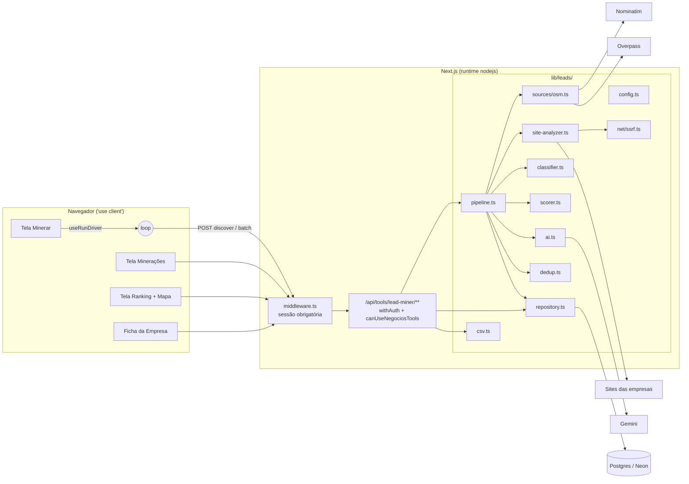
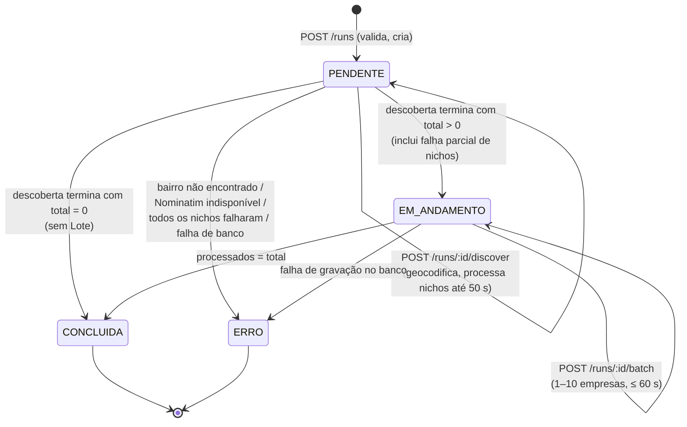
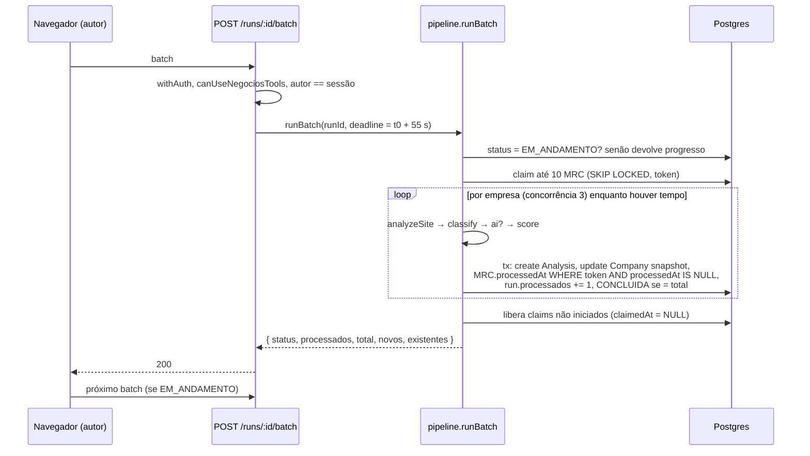

# Design Document — Minerador de Leads (Etapa 1)

## Overview

O Minerador porta para TypeScript, dentro do próprio Next.js, o fluxo do Projeto-Lead-Manager: geocodificar um bairro no Nominatim, buscar empresas por nicho no Overpass, auditar o site de cada uma, classificar a oportunidade, calcular o Lead Score e gravar tudo em uma base cumulativa no Postgres. A base alimenta a triagem que já existe (`ProspectLead` RAW → PENDING → card no funil).

Decisões centrais:

| Tema | Decisão | Motivo |
|---|---|---|
| Execução | Mineração dividida em **passos curtos disparados pelo navegador** (descoberta e lotes), cada um ≤ 60 s, com estado persistido em `MiningRun`/`MiningRunCompany` | Cloud Run não garante trabalho após a resposta; sem workers. Fechar a aba só pausa; reabrir retoma (Req. 8) |
| Concorrência de lotes | *Claim* atômico `UPDATE … WHERE id IN (SELECT … FOR UPDATE SKIP LOCKED)` com `claimToken` + `processedAt` conferido na mesma transação da gravação | Cada empresa processada exatamente uma vez, no máximo 1 análise por empresa por mineração; lotes simultâneos pulam as empresas reservadas pelo outro (Req. 8.7, 8.14) |
| Minerações simultâneas | Chave normalizada `paramsKey` (bairro, cidade, UF, nichos ordenados) + índice único parcial `(createdById, paramsKey)` para `PENDENTE`/`EM_ANDAMENTO` | 409 só para o mesmo autor com os mesmos parâmetros; parâmetros distintos rodam em paralelo (Req. 18.7, 18.12) |
| Lógica de negócio | Módulos **puros** (`classifier`, `scorer`, `dedup`, `csv`, `ssrf` de faixas de IP, `text`) separados dos adaptadores de I/O injetáveis | Permite testes unitários e PBT sem rede (Req. 20.6) |
| SSRF | Resolver DNS → validar **todos** os IPs → conectar via `node:http(s)` com `lookup` fixado no IP validado; SNI/Host com o hostname original; redirecionamentos manuais (máx. 3) revalidados | Evita DNS rebinding e acesso a metadata/rede interna (Req. 4) |
| Rate limit Nominatim | Fila global em memória do processo (`globalThis`), intervalo mínimo de 1.000 ms | Req. 2.2; uma instância no Cloud Run por enquanto (ver limitação em Error Handling) |
| Mapa | Leaflet 1.9.4 puro (sem react-leaflet) em componente carregado com `next/dynamic({ ssr: false })`, marcadores `circleMarker` | Sem assets de ícone, sem APIs de navegador no SSR (Req. 13.9) |
| Testes | Vitest + fast-check | Não há framework no repositório; ambos rodam em Node sem configuração pesada |

Fora de escopo (Etapa 3), mas previsto no modelo: `googlePlaceId`, `cnpj`, `pagespeed`, `tecnologias`, fontes `GOOGLE`/`MISTA`, `ApiUsage` para Places.

### Referências de pesquisa

- [Nominatim Usage Policy](https://operations.osmfoundation.org/policies/nominatim/): no máximo 1 requisição/s, User-Agent identificável, sem uso massivo. Motiva o limitador global e o cabeçalho de contato.
- [Overpass API — Language Guide](https://wiki.openstreetmap.org/wiki/Overpass_API/Language_Guide): `area(3600000000 + relationId)` para buscar dentro de um limite administrativo, `out center tags` para obter coordenadas de *ways*/*relations*.
- [OSM Copyright/ODbL](https://www.openstreetmap.org/copyright): atribuição "© Colaboradores do OpenStreetMap" com link.
- [Node.js `http.request` options](https://nodejs.org/api/http.html#httprequesturl-options-callback): a opção `lookup` permite fixar o endereço resolvido; em Node ≥ 20 ela pode ser chamada com `{ all: true }` e precisa devolver um array.
- [Postgres `SELECT … FOR UPDATE SKIP LOCKED`](https://www.postgresql.org/docs/current/sql-select.html#SQL-FOR-UPDATE-SHARE): padrão de fila concorrente sem bloqueio mútuo.
- [Prisma `createManyAndReturn` + `skipDuplicates`](https://www.prisma.io/docs/orm/reference/prisma-client-reference#createmanyandreturn) (Prisma ≥ 5.14, Postgres): envio em lote para triagem com `ON CONFLICT DO NOTHING`.
- [Gemini API — generateContent](https://ai.google.dev/api/generate-content) com `responseMimeType: "application/json"` para resposta estruturada.

Conteúdo das fontes foi resumido/parafraseado.

## Architecture



### Ciclo de vida de uma mineração



A descoberta também é fatiada: cada chamada a `discover` processa nichos pendentes até um orçamento de 50 s e grava quais nichos já foram concluídos ou falharam (`nichosProcessados`, `nichosFalhos`). A etapa exibida é "Buscando no OpenStreetMap" enquanto `PENDENTE` e "Analisando empresas" enquanto `EM_ANDAMENTO` (Req. 10.7). Um *lease* (`MiningRun.lockedUntil`) impede duas descobertas simultâneas da mesma mineração. Com `total = 0` a própria descoberta grava `CONCLUIDA` na mesma transação; uma passagem transitória por `EM_ANDAMENTO` é aceitável pelo Req. 8.13, mas a implementação não depende de nenhum Lote para finalizar. Falha em parte dos nichos não interrompe a mineração: os nichos falhos ficam em `nichosFalhos` e a mineração segue até `CONCLUIDA` com os resultados dos demais (Req. 2.13).

Um mesmo autor pode ter várias minerações ativas com parâmetros diferentes; cada uma tem seu próprio *driver* no navegador (ver `useRunDrivers`).

### Sequência de um lote



## Components and Interfaces

### Estrutura de arquivos

```
lib/leads/
  config.ts            # isomórfico: nichos, presets, UFs, thresholds, pontos, categorias, textos
  text.ts              # isomórfico: normalizeText, normalizeCompanyName
  geo.ts               # isomórfico: haversineMeters, isValidCoord
  classifier.ts        # puro
  scorer.ts            # puro
  dedup.ts             # puro: matchCompany, mergeCompanyFields
  csv.ts               # puro: buildCsv, parseCsv (usado nos testes), sanitizeCell
  filters.ts           # zod schemas dos filtros + buildCompanyWhere (puro)
  types.ts             # tipos compartilhados (SiteAnalysis, FoundCompany, ScoreBreakdown…)
  net/
    ssrf.ts            # validateUrlShape, isBlockedAddress, resolveAndValidate
    http-transport.ts  # transporte Node com lookup fixado (runtime nodejs)
  sources/
    osm.ts             # geocode + searchNiche (deps injetáveis)
    rate-limit.ts      # fila global 1 req/s
  site-analyzer.ts     # analyzeSite(website, deps)
  ai.ts                # analyzeWithAi(input, deps)
  usage.ts             # reserveApiCall (ApiUsage)
  repository.ts        # Prisma: upsert com dedup, claim, gravação de análise
  pipeline.ts          # createRun, discoverStep, runBatch
  deps.ts              # fábrica das dependências reais (produção)
  guards.ts            # já existe (parseLeadStatus)
```

### `config.ts` (isomórfico — Req. 1)

```ts
export type NicheTier = 1 | 2 | 3;
export type NicheKind = 'servico' | 'produto';
export interface OsmTag { key: string; value: string }
export interface Niche { id: string; label: string; tier: NicheTier; kind: NicheKind; tags: OsmTag[] }

export const NICHES: readonly Niche[];               // exatamente 22
export type PresetId = 'icp' | 'produto' | 'servico' | 'todos';
export const PRESETS: Record<PresetId, readonly string[]>;
//   icp = tier 1; produto = kind 'produto'; servico = kind 'servico'; todos = os 22

export const UFS: readonly string[];                 // 27 siglas
export const SITE_TIMEOUT_MS = 10_000;            // orçamento total da análise
export const HTTPS_ATTEMPT_TIMEOUT_MS = 6_000;    // sub-limite da tentativa https:// sem esquema (Req. 3.2, 3.9)
export const SLOW_THRESHOLD_MS = 2_500;              // lento se > 2500
export const HTTP_ERROR_MIN_STATUS = 400;            // erro se >= 400
export const MAX_REDIRECTS = 3;
export const MAX_BODY_BYTES = 1_048_576;
export const OVERPASS_TIMEOUT_MS = 60_000;
export const NOMINATIM_TIMEOUT_MS = 15_000;
export const RETRY_DELAYS_MS = [2_000, 4_000] as const;
export const GEMINI_TIMEOUT_MS = 20_000;
export const GEMINI_MONTHLY_LIMIT_DEFAULT = 1_000;
export function geminiMonthlyLimit(env?: string): number; // inteiro positivo ou default

export type CategoryCode = 'CRIAR_SITE' | 'OTIMIZACAO_SEGURANCA' | 'ANALISE_DADOS_BI';
export const CATEGORY_LABEL: Record<CategoryCode, string>; // "Criar Site do Zero", "Otimização / Segurança", "Análise de Dados / BI"
export const ACTION_PLAN_BY_CATEGORY: Record<CategoryCode, string>;
export const ACTION_PLAN_DEFAULT = 'Aguardando definição de abordagem comercial';

export const DIGITAL_POINTS: {
  semSite: number; offline: number; httpErro: number; semHttps: number; sslInvalido: number; lento: number;
};
export const DIGITAL_MAX = 40;
export const ICP_POINTS: Record<NicheTier, number>;  // { 1: 25, 2: 15, 3: 8 }
export const ICP_MAX = 25;
export const AI_MAX = 35;
export const OBJECTIVE_MAX = 65;

export type PriorityCode = 'ALTA' | 'MEDIA' | 'BAIXA';
export const PRIORITY_LABEL: Record<PriorityCode, string>; // "Alta" | "Média" | "Baixa"

export const BATCH_SIZE = 10;
export const BATCH_BUDGET_MS = 55_000;               // margem sob os 60 s do Req. 8.4
export const DISCOVERY_BUDGET_MS = 50_000;
export const BULK_MAX = 200;
export const EXPORT_MAX = 5_000;
export const MAP_MAX = 2_000;
export const RUNS_PAGE_SIZE = 20;
export const RANKING_PAGE_SIZE = 50;
export const OSM_USER_AGENT = 'SciTecJr-SistemaInterno/1.0 (contato@scitecjr.com)';
export const ODBL_TEXT = '© Colaboradores do OpenStreetMap';
export const ODBL_URL = 'https://www.openstreetmap.org/copyright';
```

Pontos iniciais do componente de presença digital (quanto maior, maior a oportunidade para a SciTec): `semSite 40`, `offline 20`, `httpErro 10`, `semHttps 10`, `sslInvalido 8`, `lento 7`; a soma é limitada a 40. Os valores ficam só aqui e podem ser ajustados.

Lista inicial de nichos (portar rótulos/tags exatos de `config/settings.py` do Lead-Manager na implementação; a estrutura não muda):

| Tier | Nichos (id → tag OSM principal) |
|---|---|
| 1 (ICP) | `clinica_odontologica` amenity=dentist · `clinica_medica` amenity=clinic / healthcare=clinic · `advocacia` office=lawyer · `contabilidade` office=accountant · `imobiliaria` office=estate_agent · `veterinaria` amenity=veterinary · `academia` leisure=fitness_centre · `escola_idiomas` amenity=language_school |
| 2 | `restaurante` amenity=restaurant · `cafeteria` amenity=cafe · `padaria` shop=bakery · `salao_beleza` shop=hairdresser · `estetica` shop=beauty · `otica` shop=optician · `farmacia` amenity=pharmacy · `pet_shop` shop=pet · `hotel` tourism=hotel |
| 3 | `oficina_mecanica` shop=car_repair · `loja_roupas` shop=clothes · `materiais_construcao` shop=hardware / shop=doityourself · `floricultura` shop=florist · `mercearia` shop=convenience |

### `text.ts` e `geo.ts`

```ts
export function normalizeText(s: string | null | undefined): string;
// trim, minúsculas, NFD sem diacríticos, espaços colapsados — usado em bairro/cidade/busca

export function normalizeCompanyName(s: string | null | undefined): string;
// normalizeText + remove pontuação + remove sufixos societários ao final
// (ltda, me, eireli, s/a, sa, epp — "s/a" tratado antes da remoção de pontuação)

export function haversineMeters(a: LatLng, b: LatLng): number;
export function isValidCoord(lat: unknown, lng: unknown): lat is number; // -90..90, -180..180, finitos
```

### `types.ts`

```ts
export interface FoundCompany {           // saída da Fonte_OSM
  osmId: string;                          // "node/123" | "way/…" | "relation/…"
  nome: string; nicho: string;
  endereco: string | null; bairro: string | null; cidade: string | null; uf: string | null;
  telefone: string | null; website: string | null;
  latitude: number | null; longitude: number | null; marcaRede: string | null;
}

export type FailureReason =
  | 'TIMEOUT' | 'DNS' | 'CONEXAO_RECUSADA' | 'CONEXAO_ENCERRADA' | 'URL_INVALIDA'
  | 'DESTINO_BLOQUEADO' | 'EXCESSO_REDIRECIONAMENTOS' | 'HTTP_ERRO' | 'SSL';

export type SslProblem = 'NAO_CONFIAVEL' | 'EXPIRADO' | 'DOMINIO_DIVERGENTE';

export interface SiteAnalysis {
  hasSite: boolean;
  online: boolean;
  statusCode: number | null;
  isHttps: boolean;             // esquema da URL final
  sslValid: boolean;            // true só se a URL final é https e o certificado foi validado
  sslProblem: SslProblem | null; // mantido mesmo após fallback http (Req. 3.4)
  responseTimeMs: number | null;
  slow: boolean;
  failure: FailureReason | null;
  failureDetail: string | null; // ex.: "HTTP 503", "destino bloqueado"
  finalUrl: string | null;
}

export interface ClassificationResult { category: CategoryCode; motivos: string[] } // 1..5

export interface AiResult { score: number; oportunidade: string; justificativa: string }
export type AiOutcome =
  | { ok: true; result: AiResult }
  | { ok: false; reason: 'IA desabilitada' | 'sem resposta' | 'resposta inválida' | 'cota esgotada' };

export interface ScoreCriterion { id: string; label: string; points: number }
export interface ScoreComponent { value: number; max: number; raw: number; criteria: ScoreCriterion[] }
export interface ScoreBreakdown {
  digital: ScoreComponent;             // max 40
  icp: ScoreComponent;                 // max 25
  ia: ScoreComponent | null;           // max 35, null quando não usada
  iaNaoUsadaMotivo: 'IA desabilitada' | 'sem resposta' | 'resposta inválida' | null;
  objetivo: number;                    // 0..65
  final: number;                       // 0..100
  prioridade: PriorityCode;
  formula: 'OBJETIVO_MAIS_IA' | 'OBJETIVO_REESCALADO';
}
```

`'cota esgotada'` é tratado pelo Pontuador como `'sem resposta'` no detalhamento (os três motivos do Req. 6.6).

### `classifier.ts` (puro — Req. 5)

```ts
export function classify(a: SiteAnalysis): ClassificationResult;
```

Regras, em ordem:
1. `!a.hasSite` → `CRIAR_SITE`, motivos `["Empresa não possui site"]`.
2. `a.online && (a.statusCode == null || a.responseTimeMs == null)` → `OTIMIZACAO_SEGURANCA`, `["Análise incompleta do site"]` (Req. 5.8).
3. Avalia, nesta ordem fixa, (a) `!online`, (b) `statusCode >= HTTP_ERROR_MIN_STATUS`, (c) `!isHttps`, (d) `!sslValid`, (e) `responseTimeMs > SLOW_THRESHOLD_MS`; um motivo por condição verdadeira → `OTIMIZACAO_SEGURANCA`.
4. Nenhuma verdadeira → `ANALISE_DADOS_BI`, `["Site online, seguro e dentro do limite de latência"]`.

### `scorer.ts` (puro — Req. 6)

```ts
export interface ScoreInput {
  analysis: SiteAnalysis;
  tier: NicheTier;
  iaEnabled: boolean;
  ai: AiOutcome | null;       // null quando IA não foi chamada
}
export function score(input: ScoreInput): ScoreBreakdown;
export function priorityOf(final: number): PriorityCode;   // >=70 ALTA, >=40 MEDIA, senão BAIXA
export function roundHalfUp(x: number): number;            // Math.floor(x + 0.5)
```

- Digital: critérios verdadeiros com seus pontos (`semSite` quando `!hasSite`; demais só com site) → `raw = soma`, `value = clamp(raw, 0, 40)`.
- ICP: `ICP_POINTS[tier]`.
- IA usada somente se `iaEnabled && ai?.ok && Number.isFinite(ai.result.score) && 0 ≤ score ≤ 35` → `final = objetivo + roundHalfUp(score)`.
- Caso contrário `final = roundHalfUp(objetivo * 100 / 65)`, com `iaNaoUsadaMotivo` derivado (`!iaEnabled` → "IA desabilitada"; `ai == null || reason ∈ {sem resposta, cota esgotada}` → "sem resposta"; demais → "resposta inválida").

### `ai.ts` (Req. 7)

```ts
export interface GeminiClient {
  generate(prompt: string, opts: { signal: AbortSignal }): Promise<string>; // texto JSON bruto
}
export interface UsageGate {
  /** Reserva 1 chamada no mês corrente se count < limite. Retorna false sem incrementar se esgotado. */
  reserve(provider: 'gemini', month: string, limit: number): Promise<boolean>;
}
export interface AiDeps { client: GeminiClient | null; usage: UsageGate; limit: number; now: () => Date }

export interface AiInput {
  nome: string; nicho: string; bairro: string | null; cidade: string | null; site: SiteAnalysis;
}
export function buildPrompt(input: AiInput): string;
export function parseAiResponse(raw: string): AiOutcome;   // puro: valida e normaliza (Req. 7.2)
export async function analyzeWithAi(input: AiInput, deps: AiDeps): Promise<AiOutcome>;
```

- `client == null` (sem `GEMINI_API_KEY`) → `{ ok:false, reason:'IA desabilitada' }`.
- `reserve` retorna false → `'cota esgotada'`, sem chamada.
- A reserva acontece **antes** do envio, então o contador sobe também em erro/timeout (Req. 7.4).
- `parseAiResponse`: exige `score` numérico finito, `oportunidade` não vazia ≤ 500, `justificativa` não vazia ≤ 1000; score é arredondado (half-up) e limitado a 0–35.
- Timeout de 20 s via `AbortController`.
- Cliente real (`deps.ts`): `fetch` para `https://generativelanguage.googleapis.com/v1beta/models/${GEMINI_MODEL}:generateContent` com chave no cabeçalho `x-goog-api-key` (não na URL, evitando vazamento em logs), `responseMimeType: 'application/json'`. `GEMINI_MODEL` com padrão `gemini-2.0-flash`.

### `usage.ts`

```ts
export function monthKey(d: Date): string; // "AAAA-MM" no fuso do servidor
export function prismaUsageGate(db: PrismaClient): UsageGate;
```

Implementação atômica em uma instrução:

```sql
INSERT INTO "ApiUsage" (id, provider, month, count) VALUES (gen_random_uuid(), $1, $2, 1)
ON CONFLICT (provider, month) DO UPDATE SET count = "ApiUsage".count + 1
  WHERE "ApiUsage".count < $3
RETURNING count;
```

Nenhuma linha retornada = cota esgotada. Com `$3 ≥ 1` a primeira inserção sempre cabe.

### `net/ssrf.ts` (Req. 4)

```ts
export type UrlShapeError = 'ESQUEMA' | 'PORTA' | 'CREDENCIAIS' | 'URL_INVALIDA';
export function validateUrlShape(u: URL): UrlShapeError | null;
// esquema ∈ {http:, https:}; port === '' ou '80'/'443'; username === '' && password === '' && sem '@' na authority original

export function isBlockedAddress(ip: string): boolean;
// usa ipaddr.js; bloqueia faixas: IPv4 unspecified, loopback 127/8, private 10/8 172.16/12 192.168/16,
// linkLocal 169.254/16 (inclui 169.254.169.254), carrierGradeNat 100.64/10, multicast 224/4,
// reserved 240/4, broadcast, 0/8, 192.0.0/24, 192.0.2/24, 198.18/15, 198.51.100/24, 203.0.113/24;
// IPv6 unspecified ::, loopback ::1, uniqueLocal fc00::/7, linkLocal fe80::/10, multicast ff00::/8,
// 64:ff9b::/96 e ::ffff:0:0/96 → converte para IPv4 e reavalia; 6to4/teredo → bloqueados.
// Regra geral: bloqueia tudo que ipaddr.range() != 'unicast'.

export const BLOCKED_HOSTNAMES: readonly string[]; // 'metadata.google.internal', 'metadata', 'localhost'

export interface Resolver { resolveAll(host: string): Promise<{ address: string; family: 4 | 6 }[]> }

export type GuardResult =
  | { ok: true; address: string; family: 4 | 6 }
  | { ok: false; reason: 'DESTINO_BLOQUEADO' | 'DNS' | 'URL_INVALIDA' };

export async function resolveAndValidate(u: URL, resolver: Resolver): Promise<GuardResult>;
// host IP literal → usa o próprio IP (o parser WHATWG já normaliza 0x7f.1, 2130706433, 0177.0.0.1 → 127.0.0.1;
// IPv6 vem entre colchetes e é desembrulhado). Senão resolveAll; lista vazia/erro → DNS;
// qualquer endereço bloqueado → DESTINO_BLOQUEADO; senão escolhe o primeiro endereço validado.
```

Resolver real: `dns.promises.lookup(host, { all: true, verbatim: true })`.

### `net/http-transport.ts`

```ts
export interface TransportRequest {
  url: URL; address: string; family: 4 | 6; method: 'GET' | 'HEAD';
  signal: AbortSignal; maxBodyBytes: number;
}
export interface TransportResponse { status: number; location: string | null; headersAt: number; bodyBytes: number }
export class TransportError extends Error {
  constructor(public kind: 'TIMEOUT' | 'DNS' | 'CONEXAO_RECUSADA' | 'CONEXAO_ENCERRADA' | 'SSL', public ssl?: SslProblem) {}
}
export interface Transport { request(r: TransportRequest): Promise<TransportResponse> }
export const nodeTransport: Transport;
```

`nodeTransport` usa `http.request`/`https.request` com:
- `lookup: (_h, opts, cb) => opts.all ? cb(null, [{ address, family }]) : cb(null, address, family)` — conexão só no IP validado, sem nova resolução;
- `servername: url.hostname` (SNI e verificação do certificado com o nome original), `headers: { Host, 'User-Agent', Accept }`, sem cookies/autorização; `rejectUnauthorized: true`; `agent: false`;
- leitura do corpo até `maxBodyBytes` e `req.destroy()` ao atingir o limite (Req. 4.6);
- mapeamento de erros: `CERT_HAS_EXPIRED` → SSL/EXPIRADO; `ERR_TLS_CERT_ALTNAME_INVALID` → DOMINIO_DIVERGENTE; `DEPTH_ZERO_SELF_SIGNED_CERT`, `SELF_SIGNED_CERT_IN_CHAIN`, `UNABLE_TO_VERIFY_LEAF_SIGNATURE`, `UNABLE_TO_GET_ISSUER_CERT*` → NAO_CONFIAVEL; `ECONNREFUSED` → CONEXAO_RECUSADA; `ECONNRESET`/`socket hang up` → CONEXAO_ENCERRADA; abort → TIMEOUT.

### `site-analyzer.ts` (Req. 3, 4)

```ts
export interface SiteAnalyzerDeps { resolver: Resolver; transport: Transport; now: () => number }
export async function analyzeSite(website: string | null, deps: SiteAnalyzerDeps): Promise<SiteAnalysis>;
```

Algoritmo:
1. Vazio/só espaços → `hasSite:false, isHttps:false, sslValid:false`, sem rede.
2. Sem esquema → candidatos `https://x`, depois `http://x`; com esquema → só ele. `new URL` falhando → offline "URL inválida".
3. Um `AbortController` único com timeout de 10 s (orçamento total) cobre todas as tentativas, resoluções e redirecionamentos (Req. 3.2, 4.7). A tentativa `https://` de um website sem esquema tem ainda um sub-limite próprio de `HTTPS_ATTEMPT_TIMEOUT_MS` (6 s, combinado via `AbortSignal.any`). Regra de fallback:
   - tentativa `https://` falha por DNS, conexão recusada/encerrada, SSL ou pelo **sub-limite** de 6 s, com orçamento total restante → tenta `http://` com o que sobra do orçamento;
   - o **orçamento total** de 10 s se esgota durante a tentativa `https://` → não tenta `http://`; o motivo final é o da tentativa `https://` (TIMEOUT) (Req. 3.9);
   - ambas falham → motivo da última tentativa (Req. 3.3).
4. Para cada salto: `validateUrlShape` → `resolveAndValidate` → `transport.request(GET)`; status 301/302/303/307/308 com `Location` → resolve relativo, contador ≤ 3; o 4º → offline `EXCESSO_REDIRECIONAMENTOS`.
5. Resposta final: `online = 100 ≤ status ≤ 399`; qualquer status fora desse intervalo (< 100 ou ≥ 400) → offline `HTTP_ERRO` "HTTP {status}" (Req. 3.10); tempo = `headersAt(final) - início`; `slow = tempo > 2500`.
6. `sslProblem` da tentativa https é preservado mesmo que o http funcione.

### `sources/osm.ts` e `sources/rate-limit.ts` (Req. 2)

```ts
export interface HttpJsonClient {
  getJson(url: string, init: { headers: Record<string, string>; timeoutMs: number; body?: string; method?: 'GET' | 'POST' }): Promise<unknown>;
}
export interface OsmDeps { http: HttpJsonClient; limiter: RateLimiter; sleep: (ms: number) => Promise<void> }

export type SearchArea =
  | { kind: 'area'; areaId: number }
  | { kind: 'bbox'; south: number; west: number; north: number; east: number };
export type GeocodeResult = { ok: true; area: SearchArea } | { ok: false; reason: 'NAO_ENCONTRADO' | 'INDISPONIVEL' };

export async function geocode(bairro: string, cidade: string, uf: string, deps: OsmDeps): Promise<GeocodeResult>;
export function buildOverpassQuery(niche: Niche, area: SearchArea): string;
export function mapElement(el: OverpassElement, nicheId: string): FoundCompany | null; // null se sem nome
export async function searchNiche(niche: Niche, area: SearchArea, deps: OsmDeps):
  Promise<{ ok: true; companies: FoundCompany[] } | { ok: false }>;
export function mergeByOsmId(perNiche: FoundCompany[][]): FoundCompany[]; // primeiro nicho vence (Req. 2.12)

export interface RateLimiter { schedule<T>(fn: () => Promise<T>): Promise<T> }
export function intervalLimiter(minIntervalMs: number, clock?: Clock): RateLimiter;
export const nominatimLimiter: RateLimiter; // singleton em globalThis.__nominatimLimiter
```

- Nominatim: `GET /search?format=jsonv2&limit=1&countrycodes=br&addressdetails=0&q={bairro}, {cidade}, {uf}`; todas as tentativas passam pelo limitador. Primeiro resultado: `osm_type` relation → `area 3600000000 + osm_id`; way → `2400000000 + osm_id`; node ou sem limite → `bbox` do `boundingbox`.
- Overpass: `POST https://overpass-api.de/api/interpreter`, `[out:json][timeout:55]; area(id:N)->.a; ( nwr["k"="v"](area.a); … ); out center tags;` (ou filtro bbox).
- `mapElement`: `name` trim; `addr:street` + `addr:housenumber` → endereço; `addr:suburb` → bairro; `addr:city`; `addr:state`; `phone` ou `contact:phone`; `website` ou `contact:website`; `lat/lon` ou `center`; `brand` → marcaRede; `osmId = ${type}/${id}`.
- Retentativas: até 2 com `sleep(2000)`, `sleep(4000)`; User-Agent em todas as requisições.

### `dedup.ts` (puro — Req. 9)

```ts
export interface CompanyKey {
  id?: string; googlePlaceId: string | null; osmId: string | null; cnpj: string | null;
  nomeNormalizado: string; latitude: number | null; longitude: number | null;
  aliases?: string[]; // osmIds fundidos (CompanyAlias, source OSM) — Req. 9.16
}
export function matchCompany(found: CompanyKey, existing: readonly CompanyKey[]): CompanyKey | null;
// 1) googlePlaceId, 2) osmId (da Empresa ou de seus aliases), 3) cnpj (ignora vazios; para no primeiro que coincidir)
// 2º critério: mesmo nomeNormalizado não vazio, ambos com coords válidas, distância ≤ 100 m, menor distância vence

export const CADASTRAL_FIELDS = ['nome','endereco','bairro','cidade','uf','telefone','website','latitude','longitude','marcaRede'] as const;
export function mergeCompanyFields<T extends Record<string, unknown>>(current: T, incoming: Partial<T>): Partial<T>;
// retorna só o patch: campo novo não vazio sobrescreve; vazio nunca apaga
export function ingestInMemory(base: InMemoryBase, found: readonly FoundCompany[], runId: string): InMemoryBase;
// espelho do repositório: casou por critério que não o próprio osmId → osmId vazio é preenchido;
// se a Empresa já tem outro osmId, o encontrado vai para `aliases` (Req. 9.16)
```

### `repository.ts` (Prisma)

```ts
type Db = PrismaClient | Prisma.TransactionClient;

export async function upsertFoundCompany(db: Db, runId: string, found: FoundCompany):
  Promise<{ companyId: string; isNew: boolean; linked: boolean }>;
// busca candidatos (identificadores, incluindo CompanyAlias { source: OSM, externalId: osmId };
// ou nomeNormalizado + caixa ±0,0015° em lat/lng), carregando os `aliases` de cada candidata;
// matchCompany; existe → update com mergeCompanyFields; não existe → create.
// Casou por critério que não o próprio osmId: osmId vazio → preenche; senão cria
// CompanyAlias (OSM, osmId) com ON CONFLICT (source, externalId) DO NOTHING (Req. 9.16).
// Corrida por identificador único (Req. 9.12, 9.14, 9.15): o create roda num SAVEPOINT;
// P2002 em osmId/googlePlaceId/cnpj → ROLLBACK TO SAVEPOINT, reconsulta a empresa vencedora pelo
// identificador conflitante, aplica mergeCompanyFields(vencedora, found) e trata como existente
// (isNew = false). A mineração não vai para ERRO.
// Vínculo: INSERT … ON CONFLICT (runId, companyId) DO NOTHING (mantém isNew da 1ª ocorrência).

export async function claimBatch(db: PrismaClient, runId: string, token: string, limit: number): Promise<ClaimedItem[]>;
export async function releaseClaims(db: PrismaClient, token: string, ids: string[]): Promise<void>;
export async function persistAnalysis(db: PrismaClient, item: ClaimedItem, token: string, data: AnalysisData): Promise<'OK' | 'LOST_CLAIM'>;
export async function persistFailure(db: PrismaClient, item: ClaimedItem, token: string, message: string): Promise<'OK' | 'LOST_CLAIM'>;
```

### `pipeline.ts`

```ts
export interface PipelineDeps {
  db: PrismaClient; osm: OsmDeps; site: SiteAnalyzerDeps; ai: AiDeps;
  now: () => number; newToken: () => string;
}
export interface RunInput { bairro: string; cidade: string; uf: string; nichos: string[]; excluirRedes: boolean; iaEnabled: boolean }
export interface RunProgress {
  id: string; status: MiningStatus; processados: number; total: number;
  novos: number; existentes: number; errorMessage: string | null;
  nichosFalhos: string[];                       // ids; a UI mostra os rótulos (Req. 2.14–2.17)
  iaDisabledReason: 'SEM_CHAVE' | null;         // Req. 7.9–7.11
}

export async function createRun(actorId: string, input: RunInput, deps: PipelineDeps): Promise<RunProgress>;
// iaEnabled && !deps.ai.client → grava iaEnabled=false e iaDisabledReason='SEM_CHAVE' (Req. 7.7, 7.9).
// Calcula paramsKey = buildRunParamsKey(input); se já existe run do mesmo autor com o mesmo paramsKey
// em PENDENTE/EM_ANDAMENTO → ApiError(409, …, { runId }). A checagem é otimista; o índice único
// parcial (createdById, paramsKey) fecha a corrida (P2002 → relê o run ativo e devolve o mesmo 409).
// Parâmetros diferentes criam nova mineração em paralelo (Req. 18.12).

export async function discoverStep(runId: string, deps: PipelineDeps, deadline: number): Promise<RunProgress>;
export async function runBatch(runId: string, deps: PipelineDeps, deadline: number): Promise<RunProgress>;
```

`discoverStep`:
1. Adquire lease: `UPDATE "MiningRun" SET "lockedUntil" = now() + interval '70 seconds' WHERE id=$1 AND status='PENDENTE' AND ("lockedUntil" IS NULL OR "lockedUntil" < now())`. 0 linhas → devolve progresso atual.
2. Sem `area` → `geocode`; `NAO_ENCONTRADO` → ERRO "Bairro não encontrado no OpenStreetMap"; `INDISPONIVEL` → ERRO "Serviço de geocodificação (Nominatim) indisponível. Tente novamente mais tarde."; ok → grava `area`.
3. Para cada nicho ainda não processado, enquanto `now() < deadline`: `searchNiche` → filtra `excluirRedes` → `upsertFoundCompany` para cada; grava `nichosProcessados` ou `nichosFalhos`. Duplicatas entre nichos: o vínculo único (runId, companyId) e `MRC.nicho` da 1ª ocorrência.
4. Todos os nichos tratados: decisão pela função pura `finalizeDiscovery(selecionados, nichosFalhos, total)` — todos falhos → ERRO "Nenhum nicho pôde ser consultado no OpenStreetMap"; senão `total = count(MRC)`; `total = 0` → CONCLUIDA direto, sem Lote (Req. 8.13); senão EM_ANDAMENTO. Falha parcial não muda o destino: a mineração segue até CONCLUIDA e `nichosFalhos` fica gravado para exibição (Req. 2.13).
5. Libera o lease. Erro de banco → ERRO "Falha ao gravar no banco de dados".

`runBatch`:
1. Lê a mineração; status ≠ EM_ANDAMENTO → devolve progresso sem alterações (Req. 8.11).
2. `claimBatch(runId, token, 10)`: pega só itens não processados e não reservados (ou com reserva expirada); itens reservados por outro lote em curso são pulados via `SKIP LOCKED` + filtro de `claimedAt` (Req. 8.14). Nenhum item livre → devolve o progresso atual.
3. Processa com concorrência 3; antes de iniciar cada empresa verifica `now() + 32_000 ≤ deadline` (pior caso 10 s site + 20 s IA + gravação). Por empresa: `analyzeSite` → `classify` → `analyzeWithAi` (se `iaEnabled`) → `score` → `persistAnalysis`. Exceção em qualquer etapa → `persistFailure` (Req. 8.9).
4. Libera claims não iniciados (`releaseClaims`).
5. Falha de banco fora das transações por empresa → ERRO "Falha ao gravar no banco de dados", mantendo o que já foi gravado.

### Rotas de API

Todas em `app/api/tools/lead-miner/**/route.ts`, com `export const runtime = 'nodejs'`, `export const dynamic = 'force-dynamic'`, envolvidas por `withAuth` e iniciando com `assert(canUseNegociosTools(actor), NO_ACCESS)`. Parâmetros validados com zod (`lib/leads/filters.ts` e `lib/validations.ts`). O autor vem sempre de `actor.id`. Erros HTTP usam `ApiError` (`status`, mensagem e `extra` opcional, serializado como `{ error, ...extra }`), definido em `lib/api-error.ts` (sem dependências de Next/auth, para que `lib/leads/pipeline.ts` possa lançá-lo em testes) e reexportado por `lib/api.ts`.

| Método e rota | Entrada | Saída (200/201) | Erros |
|---|---|---|---|
| `GET /config` | — | `{ iaAvailable: boolean }` | 401, 403 |
| `POST /runs` | `{ bairro, cidade, uf, nichos?: string[], preset?: PresetId, excluirRedes, iaEnabled }` (nichos ou preset) | 201 `RunProgress` | 400 `{ error, fields: Record<campo, msg> }`, 409 `{ error: 'Já existe uma mineração em andamento com esses parâmetros.', runId }` (mesmo autor + mesmo `paramsKey`) |
| `GET /runs` | `q, uf, status, fonte, from, to, page` | `{ items: RunListItem[], page, totalPages, total }` (cada item com `nichosFalhos`, `iaDisabledReason`, `processados`) | 400 |
| `GET /runs/active` | — | `{ runs: RunProgress[] }` (todas as `PENDENTE`/`EM_ANDAMENTO` do autor da sessão, mais recentes primeiro) | — |
| `GET /runs/lookup` | `bairro, cidade, uf` | `{ run: { id, createdAt, total, createdBy: { name } } \| null }` (última CONCLUIDA) | 400 |
| `GET /runs/[id]` | — | `RunProgress & { bairro, cidade, uf }` (usado também pelo cabeçalho da Tela_Ranking filtrada por `runId`) | 404 |
| `POST /runs/[id]/discover` | — | `RunProgress` | 403 (não autor), 404 |
| `POST /runs/[id]/batch` | — | `RunProgress` | 403 (não autor), 404 |
| `GET /companies` | `CompanyFilters & { page }` | `{ items: CompanyRow[], page, total, totalPages }` | 400 |
| `GET /companies/map` | `CompanyFilters` | `{ points: MapPoint[], shown, total }` | 400 |
| `POST /companies/export` | `{ ids?: string[] (1–200) } \| { filters: CompanyFilters }` | `text/csv; charset=utf-8`, `Content-Disposition`, cabeçalhos `X-Export-Total`, `X-Export-Truncated` | 400, 404 `{ error: 'Não há empresas para exportar.' }` |
| `POST /companies/triage` | `{ ids: string[] (1–200) }` | `{ created, ignored }` | 400 `{ error: 'Selecione de 1 a 200 empresas.' }` para 0 ou > 200 ids, sem criar nada (Req. 15.12); 500 (rollback) |
| `POST /companies/assign` | `{ ids: string[] (1–200), assigneeId }` | `{ updated, assignee: { id, name } }` | 400, 403 |
| `GET /companies/[id]` | — | `CompanyDetail` (dados, análises desc., minerações desc. com `nichosFalhos`, `status`, `processados`, lead vinculado) | 404 |
| `POST /companies/[id]/claim` | — | `{ assignedTo: { id, name } }` | 409 `{ error, assignedTo: { id, name } \| null }`, 403, 404 |
| `GET /assignees` | — | `{ id, name, title }[]` (array simples; ativos com `canBeLeadAssignee`, ordenados por nome) | 403 se não Atribuidor |

`CompanyFilters` (zod, todos opcionais): `q` (1–100 após trim), `cidade`, `bairro`, `uf` (∈ UFS), `nicho` (∈ NICHES), `categoria`, `prioridade` (incluindo `SEM`), `scoreMin`/`scoreMax` (int 0–100, min ≤ max), `hasSite`, `isHttps` (`'true'|'false'`), `fonte`, `assignedTo` (id ou `NONE`), `leadStatus` (status de `ProspectLead` ou `NONE`), `analyzedFrom`/`analyzedTo` (datas, from ≤ to), `runId`.

Faixa de Score_Final inválida (Req. 12.9–12.11 × 18.5/18.6): a validação estrita continua no servidor (400 se a API receber faixa inválida). A Tela_Ranking evita esse 400 validando localmente com a função pura `buildRankingQuery(uiState)`: quando a faixa é inválida, ela marca o campo (`aria-invalid` + mensagem "Faixa de score inválida (0 a 100, mínimo ≤ máximo)") e **omite só** `scoreMin`/`scoreMax` da query, mantendo os demais filtros e a busca; a lista e o mapa são atualizados normalmente.

`buildCompanyWhere(filters): Prisma.CompanyWhereInput` (puro): todo texto com `mode: 'insensitive'`; `q` → `OR [nome, endereco, telefone] contains`; `runId` → `runs: { some: { runId } }`; `leadStatus` → `prospectLead: { status }` ou `prospectLead: null`. Ordenação única exportada: `RANKING_ORDER = [{ scoreFinal: { sort: 'desc', nulls: 'last' } }, { nome: 'asc' }, { id: 'asc' }]` (usada por lista, mapa e CSV).

Detalhes por rota:
- **Busca do histórico ignorando acentos** (Req. 11.2): `MiningRun` guarda `bairroNorm` e `cidadeNorm`; o nome do autor é casado carregando `id, name` dos usuários (base pequena), normalizando em memória e filtrando por `createdById IN (…)`. O termo de busca também é normalizado. Evita depender da extensão `unaccent`.
- **Triagem** (Req. 15): em `prisma.$transaction`, lê empresas selecionadas, monta os leads (`status 'RAW'`, `companyName`, `contactInfo = [telefone, website].filter(Boolean).join(' | ')`, `segment = label do nicho`, `actionPlan`, `assignedTo = company.assignedTo`) e usa `prospectLead.createManyAndReturn({ data, skipDuplicates: true })` sobre o índice único de `companyId`; um `audit()` por lead criado (`action: 'LEAD_MINER_SENT_TO_TRIAGE'`, `after: { companyId, prospectLeadId }`). `ignored = ids.length - created.length`. Qualquer erro desfaz tudo.
- **Atribuição** (Req. 16.1, 16.2, 16.5, 16.7, 16.8): `assert(canAssignLeads(actor))`; destino precisa existir e satisfazer `canBeLeadAssignee`; todas as ids precisam existir; para cada empresa confere `canChangeLeadAssignee(actor, atual, destino)` antes da transação. Na transação, relê o responsável atual, atualiza `Company.assignedTo` e `ProspectLead.assignedTo` vinculado, e registra `audit` (`LEAD_MINER_ASSIGNED`, `before/after: { companyId, assignedTo }`). Empresas já com o mesmo responsável não geram audit.
- **Permissões antes de efeitos** (Req. 18.11): toda checagem (`canUseNegociosTools`, `canAssignLeads`, `canChangeLeadAssignee`, autoria do run) acontece antes de abrir transação; rejeição responde só com o erro (401/403), sem `audit()` e sem escrita. `audit()` é chamado apenas dentro da transação da operação bem-sucedida.
- **Assumir** (Req. 16.3, 16.4, 14.9, 14.10): `canChangeLeadAssignee(actor, null, actor.id)`; `company.updateMany({ where: { id, assignedTo: null }, data: { assignedTo: actor.id } })`; `count = 0` → 409 com o responsável atual. Na mesma transação atualiza o lead vinculado e registra `audit` (`LEAD_MINER_CLAIMED`).
- **Ficha**: `CompanyDetail` omite `latitude/longitude` só se inválidas; nunca retorna segredos.

Auditoria: `AuditLog` não tem coluna de empresa; o identificador vai em `before`/`after` (JSON), sem mudança de schema da Etapa 0. Ações novas: `LEAD_MINER_SENT_TO_TRIAGE`, `LEAD_MINER_ASSIGNED`, `LEAD_MINER_CLAIMED`.

### Telas e componentes

Páginas (`'use client'`), todas envoltas por `<LeadMinerGate>`: lê `useProfile().currentProfile`; enquanto carrega mostra skeleton; se `!canUseNegociosTools` renderiza "Acesso negado — o Minerador de Leads é exclusivo de Negócios e da Presidência." e **não monta** os filhos, portanto nenhuma requisição às APIs do minerador (Req. 19.4).

| Rota | Componentes |
|---|---|
| `/tools/lead-miner` (Minerar) | `MiningForm` (bairro, cidade, `<select>` UF, `PresetPicker`, `NicheChecklist` agrupado por tier, "excluir redes", "usar IA" desabilitado com aviso quando `iaAvailable=false`), `PreviousRunNotice` (debounce 400 ms em `/runs/lookup`; ações "Ver" e "Remineirar"), lista de `RunProgressCard` (uma por mineração ativa do autor: barra gradiente, `processados/total`, etapa, novos/existentes, `FailedNichesNote`, `NoAiNote`, erro, link condicionado por `canOpenRanking`) |
| `/tools/lead-miner/runs` (Minerações) | `RunsFilters` (busca com debounce 300 ms, UF, status, fonte, datas com validação), `RunsTable` (linha `<a>` → ranking `?runId=` só quando `canOpenRanking`; em `ERRO` com `processados = 0` a linha é texto sem link nem ação; coluna com `FailedNichesNote` e `NoAiNote`), `Pagination`, e uma `RunProgressCard` por mineração ativa do autor |
| `/tools/lead-miner/leads` (Ranking) | `RankingFilters` (faixa de score validada por `buildRankingQuery`), alternância Lista/Mapa, `RunFilterBanner` (quando há `runId`: bairro/cidade/UF da mineração + `FailedNichesNote`), `RankingTable` (checkbox por linha, `PriorityBadge` com texto), `BulkActionsBar` (Enviar para triagem, Atribuir só se `canAssignLeads`, Exportar CSV; contador 1–200), `AssignDialog`, `CompanyMap` (dinâmico), `OdblAttribution` |
| `/tools/lead-miner/leads/[id]` (Ficha) | `CompanyHeader`, `SiteDiagnosis`, `ScoreBreakdownCard`, `AiInsight`, `AnalysisHistory`, `CompanyRuns` (cada mineração com `FailedNichesNote`), `ClaimLeadButton`, `OdblAttribution` quando `fonte = OSM` |

Componentes auxiliares:
- `FailedNichesNote({ nichosFalhos })`: não renderiza nada com lista vazia; senão "Nichos não consultados: {rótulos}" (rótulos via `NICHES`) (Req. 2.14–2.17).
- `NoAiNote({ iaDisabledReason })`: com `'SEM_CHAVE'` mostra "Executada sem IA: chave não configurada" (Req. 7.10, 7.11).
- Link para ranking em qualquer tela usa a função pura `canOpenRanking({ status, processados })`: falso somente para `ERRO` com `processados = 0` (Req. 10.11, 10.12, 11.5, 11.9).
- `ClaimLeadButton` (Req. 14.9, 14.12, 14.13): desabilita ao clicar; timer de 2 s exibe "Está demorando mais que o esperado…" (`aria-live="polite"`) até a resposta; 200 → atualiza Responsável e oculta o botão; 409 → toast "Este lead já foi assumido por {nome}" e mostra o Responsável atual; outro erro → toast "O lead não foi assumido. Tente novamente." e reabilita o botão.

Hooks:
- `useRunDriver(runId)`: máquina de estados no cliente para **uma** mineração; enquanto `PENDENTE` chama `discover`, enquanto `EM_ANDAMENTO` chama `batch`, **uma requisição por vez** (`await` em laço, cancelado no unmount via `AbortController`); ao terminar dispara o toast de conclusão (Req. 10.8) ou exibe o erro (Req. 10.9). Em falha de rede espera 5 s e tenta de novo, sem mudar o status no servidor.
- `useRunDrivers(runIds)`: mantém um `useRunDriver` por mineração ativa (mapa `runId → driver`), garantindo no máximo uma requisição de Lote em curso por mineração e permitindo várias minerações em paralelo (Req. 8.15). Minerações novas criadas na tela entram no mapa; as que saem de `EM_ANDAMENTO`/`PENDENTE` são removidas.
- `useActiveRuns()`: `GET /runs/active` ao montar Minerar/Minerações; alimenta `useRunDrivers` para retomar automaticamente todas as minerações ativas do autor (Req. 8.6). Um 409 em `POST /runs` apenas adiciona o `runId` retornado ao mapa.
- Estado de filtros do Ranking sincronizado com a query string (`useSearchParams`/`router.replace`), para que "Ver"/links de minerações abram filtrado e mudanças voltem à página 1.

`CompanyMap` (`components/lead-miner/CompanyMap.tsx`, importado via `dynamic(() => import(...), { ssr: false })`): importa `leaflet` e `leaflet/dist/leaflet.css` dentro do módulo cliente; `L.tileLayer` com `attribution: '<a href="https://www.openstreetmap.org/copyright">© Colaboradores do OpenStreetMap</a>'`; `tileerror` acumulado → banner "Não foi possível carregar o mapa"; `circleMarker` com cores por prioridade (Alta `#22c55e`, Média `#f59e0b`, Baixa `#94a3b8`, Sem prioridade `#a855f7`) e legenda textual; `fitBounds` nos marcadores; popup com nome, categoria, score, prioridade (ou "—") e link para a Ficha.

Integração com Negócios (Req. 19.1–19.3, 19.8): em `app/tools/page.tsx` o item "Minerador de Leads B2B (em breve)" vira card ativo "Minerador de Leads" (link para `/tools/lead-miner`); em `app/setores/[dept]/page.tsx`, aba TOOLS, o placeholder "Enriquecedor de Dados B2B SciTec" é removido e o card "Minerador de Leads" é adicionado (posição livre), implementado como `<Link>` (foco e Enter nativos; Espaço tratado com `onKeyDown`). Nos dois lugares o card é renderizado se e somente se `canUseNegociosTools(currentProfile)`.

Acessibilidade (Req. 19.7): todos os campos com `<label htmlFor>`; checkboxes da tabela com `aria-label="Selecionar {nome}"`; foco visível `focus-visible:ring-2 ring-purple-500`; prioridade sempre em texto junto da cor; `aria-live="polite"` no progresso.

## Data Models

### Alterações em `prisma/schema.prisma`

```prisma
enum MiningSource { OSM GOOGLE MISTA }
enum MiningStatus { PENDENTE EM_ANDAMENTO CONCLUIDA ERRO }
enum CompanyCategory { CRIAR_SITE OTIMIZACAO_SEGURANCA ANALISE_DADOS_BI }
enum LeadPriority { ALTA MEDIA BAIXA }

model User {
  // … campos existentes …
  miningRuns        MiningRun[]
  assignedCompanies Company[]
}

model Company {
  id              String           @id @default(uuid())
  googlePlaceId   String?          @unique        // Etapa 3
  osmId           String?          @unique        // "node/123"
  cnpj            String?          @unique        // Etapa 3
  nome            String
  nomeNormalizado String
  nicho           String                          // id do nicho (config.ts)
  endereco        String?
  bairro          String?
  cidade          String?
  uf              String?
  telefone        String?
  website         String?
  latitude        Float?
  longitude       Float?
  marcaRede       String?
  fonte           MiningSource     @default(OSM)
  // snapshot da análise mais recente
  categoria       CompanyCategory?
  scoreFinal      Int?
  prioridade      LeadPriority?
  hasSite         Boolean?
  isHttps         Boolean?
  lastAnalyzedAt  DateTime?
  assignedTo      String?
  assignedUser    User?            @relation(fields: [assignedTo], references: [id], onDelete: SetNull)
  createdAt       DateTime         @default(now())
  updatedAt       DateTime         @updatedAt

  analyses     CompanyAnalysis[]
  runs         MiningRunCompany[]
  aliases      CompanyAlias[]
  prospectLead ProspectLead?

  @@index([scoreFinal(sort: Desc), nome])
  @@index([nomeNormalizado])
  @@index([uf, cidade, bairro])
  @@index([nicho])
  @@index([assignedTo])
  @@index([lastAnalyzedAt])
}

// osmIds (e futuros ids externos) fundidos numa Empresa; consultados na dedup para que
// reprocessar o mesmo resultado não crie Empresas novas (Req. 9.10, 9.16; Property 24)
model CompanyAlias {
  id         String       @id @default(uuid())
  companyId  String
  company    Company      @relation(fields: [companyId], references: [id], onDelete: Cascade)
  source     MiningSource
  externalId String
  createdAt  DateTime     @default(now())

  @@unique([source, externalId])
  @@index([companyId])
}

model CompanyAnalysis {
  id              String          @id @default(uuid())
  companyId       String
  company         Company         @relation(fields: [companyId], references: [id], onDelete: Cascade)
  runId           String?
  run             MiningRun?      @relation(fields: [runId], references: [id], onDelete: SetNull)
  hasSite         Boolean
  online          Boolean
  statusCode      Int?
  isHttps         Boolean
  sslValid        Boolean
  sslProblem      String?
  responseTime    Int?            // ms
  lento           Boolean         @default(false)
  motivoFalha     String?
  finalUrl        String?
  categoria       CompanyCategory
  motivos         Json            // string[]
  scoreDigital    Int
  scoreIcp        Int
  scoreObjetivo   Int
  scoreIa         Int?
  scoreFinal      Int
  prioridade      LeadPriority
  iaAplicada      Boolean         @default(false)
  iaMotivo        String?         // "IA desabilitada" | "sem resposta" | "resposta inválida"
  oportunidadeIa  String?
  justificativaIa String?
  detalhamento    Json            // ScoreBreakdown
  pagespeed       Json?           // Etapa 3
  tecnologias     Json?           // Etapa 3
  createdAt       DateTime        @default(now())

  runLink MiningRunCompany?

  @@index([companyId, createdAt(sort: Desc)])
}

model MiningRun {
  id                String       @id @default(uuid())
  bairro            String
  cidade            String
  uf                String
  bairroNorm        String
  cidadeNorm        String
  nichos            Json         // string[]
  excluirRedes      Boolean      @default(false)
  iaEnabled         Boolean      @default(false)
  iaDisabledReason  String?      // "SEM_CHAVE" quando iaEnabled foi forçado a false (Req. 7.9)
  paramsKey         String       // buildRunParamsKey(bairro, cidade, uf, nichos) (Req. 18.7)
  fonte             MiningSource @default(OSM)
  status            MiningStatus @default(PENDENTE)
  total             Int          @default(0)
  processados       Int          @default(0)
  area              Json?        // SearchArea obtida no Nominatim
  nichosProcessados Json         @default("[]")
  nichosFalhos      Json         @default("[]")  // string[] de ids; exibido nas telas (Req. 2.14–2.17)
  errorMessage      String?
  lockedUntil       DateTime?    // lease da descoberta
  createdById       String
  createdBy         User         @relation(fields: [createdById], references: [id], onDelete: Restrict)
  createdAt         DateTime     @default(now())
  updatedAt         DateTime     @updatedAt
  finishedAt        DateTime?

  companies MiningRunCompany[]
  analyses  CompanyAnalysis[]

  @@index([createdAt(sort: Desc)])
  @@index([bairroNorm, cidadeNorm, uf, status])
  @@index([createdById, status])
  @@index([createdById, paramsKey])
}

model MiningRunCompany {
  id           String           @id @default(uuid())
  runId        String
  run          MiningRun        @relation(fields: [runId], references: [id], onDelete: Cascade)
  companyId    String
  company      Company          @relation(fields: [companyId], references: [id], onDelete: Cascade)
  isNew        Boolean
  nicho        String           // nicho da 1ª ocorrência nesta mineração
  claimToken   String?
  claimedAt    DateTime?
  processedAt  DateTime?
  failed       Boolean          @default(false)
  errorMessage String?
  analysisId   String?          @unique
  analysis     CompanyAnalysis? @relation(fields: [analysisId], references: [id], onDelete: SetNull)
  createdAt    DateTime         @default(now())

  @@unique([runId, companyId])
  @@index([runId, processedAt])
}

model ApiUsage {
  id       String @id @default(uuid())
  provider String // "gemini" | "places"
  month    String // "AAAA-MM"
  count    Int    @default(0)

  @@unique([provider, month])
}

model ProspectLead {
  // … campos existentes …
  companyId String?  @unique
  company   Company? @relation(fields: [companyId], references: [id], onDelete: SetNull)
}
```

Observações:
- Unicidade de `googlePlaceId`, `osmId`, `cnpj` e `ProspectLead.companyId` com `@unique` comum: no Postgres, vários `NULL` não conflitam (Req. 9.11). O repositório converte strings vazias em `null` antes de gravar.
- `nomeNormalizado` é recalculado sempre que `nome` muda.
- Campos cadastrais de empresas do Google (Etapa 3) seguirão a regra de 30 dias do ToS do Places; para OSM a guarda é permitida com atribuição ODbL.

### Migração `prisma/migrations/20261001000000_lead_miner/migration.sql`

1. Gerada com `prisma migrate diff --from-migrations prisma/migrations --to-schema-datamodel prisma/schema.prisma --script`, revisada manualmente.
2. **Remover** do SQL gerado qualquer `DROP INDEX "User_one_manager_per_department"` ou `DROP INDEX "SectorMember_one_manager_per_sector"`.
3. Acrescentar ao final:

```sql
-- Uma mineração ativa por autor E por conjunto de parâmetros (Req. 18.7, 18.12):
-- corrida entre dois POST /runs idênticos vira P2002 → 409; parâmetros distintos coexistem.
CREATE UNIQUE INDEX "MiningRun_one_active_per_author_params"
  ON "MiningRun" ("createdById", "paramsKey") WHERE status IN ('PENDENTE', 'EM_ANDAMENTO');
```

4. Só adiciona tabelas/colunas; `ProspectLead.companyId` é nullable, então os registros existentes ficam com `NULL` (Req. 9.13). `MiningRun` é tabela nova, então `paramsKey` (obrigatório), `iaDisabledReason` e `nichosFalhos` não exigem *backfill*.
5. Atualizar o comentário do topo do `schema.prisma` listando também `"MiningRun_one_active_per_author_params"` entre os índices a preservar.

### SQL do claim e da gravação

```sql
-- claimBatch: reivindica até N itens livres ou com claim expirado (> 90 s)
UPDATE "MiningRunCompany" SET "claimToken" = $2, "claimedAt" = now()
WHERE id IN (
  SELECT id FROM "MiningRunCompany"
  WHERE "runId" = $1 AND "processedAt" IS NULL
    AND ("claimedAt" IS NULL OR "claimedAt" < now() - interval '90 seconds')
  ORDER BY "createdAt", id
  LIMIT $3
  FOR UPDATE SKIP LOCKED
)
RETURNING id, "companyId", nicho;
```

`persistAnalysis` (transação interativa Prisma, `ReadCommitted`):

```sql
UPDATE "MiningRunCompany" SET "processedAt" = now(), "analysisId" = $analysisId
WHERE id = $mrcId AND "claimToken" = $token AND "processedAt" IS NULL;   -- 0 linhas → LOST_CLAIM, rollback
-- depois: INSERT CompanyAnalysis (id pré-gerado), UPDATE Company snapshot,
UPDATE "MiningRun" SET processados = processados + 1,
  status = CASE WHEN processados + 1 >= total THEN 'CONCLUIDA' ELSE status END,
  "finishedAt" = CASE WHEN processados + 1 >= total THEN now() ELSE "finishedAt" END
WHERE id = $runId AND status = 'EM_ANDAMENTO' AND processados < total;
```

Por que funciona:
- `SKIP LOCKED` faz lotes simultâneos pegarem itens disjuntos sem esperar.
- Se um lote morreu (instância reciclada) o claim expira em 90 s (> 60 s de orçamento) e outro lote reivindica.
- Se o lote "morto" ainda estiver vivo e tentar gravar, o `WHERE claimToken = $token AND processedAt IS NULL` falha para quem perdeu e a transação inteira (análise + snapshot) é desfeita: no máximo 1 análise por empresa por mineração e `processados ≤ total` (Req. 8.7, 9.8).
- Análise e snapshot na mesma transação cumprem o Req. 9.8.

### Funções puras auxiliares (extraídas para teste)

Para que regras de rotas e telas possam ser testadas sem banco, estas funções ficam em módulos puros e são usadas pelas rotas:

```ts
// lib/leads/filters.ts
export const runInputSchema: z.ZodType<RunInput>;          // Req. 8.10, 18.5 (strip de campos desconhecidos)
export function validateRunInput(raw: unknown): { ok: true; value: RunInput } | { ok: false; fields: Record<string, string> };
export function buildRunParamsKey(i: Pick<RunInput, 'bairro' | 'cidade' | 'uf' | 'nichos'>): string;
// `${normalizeText(bairro)}|${normalizeText(cidade)}|${uf}|${[...new Set(nichos)].sort().join(',')}` (Req. 10.4, 18.7)
export function finalizeDiscovery(selecionados: string[], falhos: string[], total: number):
  { status: 'ERRO' | 'CONCLUIDA' | 'EM_ANDAMENTO'; errorMessage: string | null };
export function canOpenRanking(r: { status: MiningStatus; processados: number }): boolean;
export function buildRankingQuery(ui: RankingUiState): { query: URLSearchParams; invalid: ('score')[] };
export const companyFiltersSchema: z.ZodType<CompanyFilters>;
export const bulkIdsSchema: z.ZodType<string[]>;            // 1..200 uuids, sem repetição
export function buildCompanyWhere(f: CompanyFilters): Prisma.CompanyWhereInput;
export function matchesRunSearch(run: { bairro: string; cidade: string }, authorName: string, q: string): boolean;
export function compareRanking(a: RankKey, b: RankKey): number; // mesma regra de RANKING_ORDER
export function selectMapPoints<T extends RankKey & { latitude: number | null; longitude: number | null }>(
  rows: T[], max?: number): { points: T[]; total: number };

// lib/leads/triage.ts
export function buildTriageLead(c: TriageSource): Prisma.ProspectLeadCreateManyInput;

// lib/leads/csv.ts
export const CSV_HEADER: readonly string[];                 // 13 colunas em português
export function toCsvRow(c: ExportRow): string[];
export function sanitizeCell(v: string): string;            // prefixo "'" contra fórmulas
export function buildCsv(rows: string[][]): string;         // BOM + ; + CRLF + RFC 4180
export function parseCsv(text: string): string[][];         // parser RFC 4180 (testes)
export function limitExport<T>(rows: T[], max?: number): { rows: T[]; truncated: boolean; total: number };
```

## Correctness Properties

*A property is a characteristic or behavior that should hold true across all valid executions of a system-essentially, a formal statement about what the system should do. Properties serve as the bridge between human-readable specifications and machine-verifiable correctness guarantees.*

Todas as propriedades abaixo rodam sobre funções puras ou sobre adaptadores com dependências falsas (sem rede, sem banco). As garantias que dependem do Postgres (claim concorrente, unicidade, rollback) ficam nos testes de integração descritos em Testing Strategy.

### Property 1: Limite mensal do Gemini

*For any* string (ou ausência) em `GEMINI_MONTHLY_LIMIT`, `geminiMonthlyLimit` retorna o inteiro representado quando a string é um inteiro positivo e `GEMINI_MONTHLY_LIMIT_DEFAULT` em qualquer outro caso.

**Validates: Requirements 1.9**

### Property 2: Espaçamento do Nominatim

*For any* conjunto de chamadas agendadas concorrentemente no `intervalLimiter(1000)` com relógio falso (incluindo chamadas que falham e são reagendadas como retentativa), os instantes de início de quaisquer duas execuções consecutivas diferem em pelo menos 1.000 ms.

**Validates: Requirements 2.2**

### Property 3: Consultas Overpass, retentativas e User-Agent

*For any* seleção de nichos e *for any* padrão de falhas por nicho (0 a 3 falhas consecutivas, erro ou timeout), a busca faz exatamente `min(falhas + 1, 3)` requisições por nicho, aguarda `[2000, 4000]` na ordem antes das retentativas, marca o nicho como falho somente quando as 3 tentativas falham, continua com os demais nichos, e toda requisição (Nominatim e Overpass, inclusive retentativas) leva o User-Agent `OSM_USER_AGENT` e as tags OSM do nicho na consulta.

**Validates: Requirements 2.3, 2.4, 2.8**

### Property 4: Mapeamento de elementos OSM

*For any* elemento Overpass gerado com qualquer subconjunto das tags conhecidas, `mapElement` retorna `null` se e somente se o `name` está ausente ou vazio após `trim`; caso contrário, cada campo de `FoundCompany` é igual ao valor da tag correspondente (ou `null` se a tag não existe) e `osmId` é `"{type}/{id}"`.

**Validates: Requirements 2.5, 2.6**

### Property 5: Pré-processamento dos resultados da descoberta

*For any* coleção de listas de empresas por nicho, `mergeByOsmId` produz uma lista sem `osmId` repetido, cujo conjunto de `osmId` é a união das entradas e em que cada empresa carrega o nicho da primeira lista em que apareceu; e, com "excluir redes" marcado, o filtro remove exatamente as empresas com `marcaRede` não vazio.

**Validates: Requirements 2.9, 2.12**

### Property 6: Resultado da análise para uma resposta final

*For any* cadeia de respostas simulada que termina em uma resposta com status inteiro `s` (0–999), URL final com esquema `e` e latência `t` até os cabeçalhos, `analyzeSite` registra `hasSite = true`, `statusCode = s`, `isHttps = (e = https)`, `online = (100 ≤ s ≤ 399)`, `failure = 'HTTP_ERRO'` com motivo "HTTP s" se e somente se `s` está fora de 100–399, `responseTimeMs = t` e `slow = (t > 2500)`.

**Validates: Requirements 3.1, 3.6, 3.7, 3.10, 1.5, 1.6**

### Property 7: Fallback de esquema e falhas de conexão

*For any* website sem esquema, *for any* desfecho da tentativa `https://` (resposta, estouro do sub-limite de 6 s, DNS, conexão recusada, conexão encerrada, SSL) e *for any* instante de esgotamento do orçamento total de 10 s (relógio falso), a tentativa `http://` ocorre se e somente se o desfecho foi estouro do sub-limite, falha de conexão ou erro de SSL **e** o orçamento total ainda não se esgotou; se o orçamento se esgota durante a tentativa `https://`, o resultado é offline com o motivo da tentativa `https://` (TIMEOUT) e nenhuma requisição `http://` é feita; se ambas falham, o site fica offline, sem `statusCode`, com o motivo da última tentativa; e um `sslProblem` da tentativa https é preservado no resultado final.

**Validates: Requirements 3.2, 3.3, 3.4, 3.9**

### Property 8: Entradas que não geram tráfego

*For any* website `null`, vazio ou composto só de espaços, `analyzeSite` retorna `hasSite = false, isHttps = false, sslValid = false`; *for any* website não vazio que não forma URL válida, retorna `hasSite = true`, offline, motivo "URL inválida"; em ambos os casos o resolver e o transporte falsos registram zero chamadas.

**Validates: Requirements 3.5, 3.8**

### Property 9: Forma da URL na Guarda_SSRF

*For any* URL gerada com esquema, porta e *userinfo* arbitrários, `validateUrlShape` a aceita se e somente se o esquema é `http`/`https`, a porta é ausente, 80 ou 443, e não há credenciais embutidas (nem `@` com usuário/senha vazios); e para toda URL rejeitada o resolver não é chamado.

**Validates: Requirements 4.1, 4.2**

### Property 10: Bloqueio por endereço resolvido

*For any* lista não vazia de endereços IPv4/IPv6 composta de endereços públicos e de Endereco_Bloqueado, `resolveAndValidate` aceita o host se e somente se nenhum endereço é bloqueado; e *for any* IPv4 bloqueado escrito como literal em notação decimal pontuada, inteiro decimal, octal, hexadecimal ou IPv6 mapeado (`[::ffff:a.b.c.d]`), a URL é rejeitada com `DESTINO_BLOQUEADO`.

**Validates: Requirements 4.3, 4.8**

### Property 11: Cadeia de redirecionamentos segura

*For any* cadeia de redirecionamentos simulada (0 a 6 saltos, destinos relativos ou absolutos, alguns bloqueados por forma ou por endereço), o transporte nunca recebe uma requisição para um destino rejeitado pela Guarda_SSRF, recebe no máximo 4 requisições, cada uma com `address` pertencente ao conjunto validado naquele salto, o resolver é chamado no máximo uma vez por salto, todas usam `GET`/`HEAD` sem corpo e sem cabeçalhos `Cookie`/`Authorization`, e o resultado é offline com "destino bloqueado" quando algum destino foi rejeitado ou com excesso de redirecionamentos quando há um 4º redirecionamento.

**Validates: Requirements 4.4, 4.5, 4.8, 4.9, 4.10**

### Property 12: Classificação segue o modelo de referência

*For any* `SiteAnalysis`, `classify` retorna exatamente uma Categoria entre as três e uma lista de 1 a 5 motivos iguais aos de um modelo de referência: sem site → "Criar Site do Zero" com 1 motivo; site online sem status ou tempo → "Otimização / Segurança" com motivo de análise incompleta; alguma condição (a)–(e) verdadeira → "Otimização / Segurança" com um motivo por condição, na ordem (a)–(e); nenhuma → "Análise de Dados / BI" com 1 motivo.

**Validates: Requirements 5.1, 5.2, 5.3, 5.4, 5.6, 5.8**

### Property 13: Determinismo do Classificador e do Pontuador

*For any* entrada, chamar `classify` e `score` duas vezes (sobre a entrada original e sobre uma cópia profunda) produz resultados profundamente iguais, incluindo a ordem dos motivos e o detalhamento.

**Validates: Requirements 5.7, 6.10**

### Property 14: Invariantes dos componentes do score

*For any* `ScoreInput`, o componente digital tem `value = clamp(raw, 0, 40)` com `raw` igual à soma dos pontos dos critérios listados, o ICP é `ICP_POINTS[tier]` entre 0 e 25, `objetivo = digital.value + icp.value` entre 0 e 65, e `final` é inteiro entre 0 e 100.

**Validates: Requirements 6.1, 6.3, 6.7, 6.9**

### Property 15: Fórmula do Score_Final

*For any* `ScoreInput`, se a IA está habilitada e o resultado de IA é numérico finito em [0, 35], então `final = objetivo + roundHalfUp(scoreIa)` e `formula = 'OBJETIVO_MAIS_IA'`; caso contrário, `final = roundHalfUp(objetivo × 100 / 65)`, `ia = null` e `iaNaoUsadaMotivo` é "IA desabilitada", "sem resposta" ou "resposta inválida" conforme a causa.

**Validates: Requirements 6.4, 6.5, 6.6**

### Property 16: Faixas de Prioridade

*For any* inteiro `s` em [0, 100], `priorityOf(s)` é `ALTA` se `s ≥ 70`, `MEDIA` se `40 ≤ s < 70` e `BAIXA` se `s < 40`.

**Validates: Requirements 6.8**

### Property 17: Validação da resposta da IA

*For any* texto de resposta (JSON válido com campos arbitrários, JSON malformado ou texto livre), `parseAiResponse` retorna sucesso se e somente se há `score` numérico finito, `oportunidade` não vazia com até 500 caracteres e `justificativa` não vazia com até 1.000 caracteres; no sucesso, o score devolvido é `clamp(roundHalfUp(score), 0, 35)`.

**Validates: Requirements 7.2, 7.3**

### Property 18: Uso de cota do Gemini

*For any* contador inicial `c`, limite `L ≥ 1` e desfecho do cliente falso (sucesso, erro, timeout), se `c < L` então `analyzeWithAi` reserva exatamente 1 unidade antes de fazer exatamente 1 chamada, cujo prompt contém nome, nicho, bairro, cidade, status HTTP, HTTPS, SSL, latência e disponibilidade; se `c ≥ L`, o cliente não é chamado e o contador não muda; em nenhum caso a função lança exceção.

**Validates: Requirements 7.1, 7.4, 7.6**

### Property 19: Validação dos parâmetros de mineração

*For any* objeto de entrada, `validateRunInput` aceita se e somente se bairro e cidade têm 1–100 caracteres após `trim`, a UF está entre as 27, a lista de nichos (ou o preset expandido) tem 1–22 ids existentes sem repetição; quando rejeita, `fields` contém exatamente os campos inválidos; e o valor aceito nunca contém campos de autor ou ids de usuário vindos da entrada.

**Validates: Requirements 8.10, 10.3, 18.4, 18.5**

### Property 20: Validação de filtros e seleção em lote

*For any* conjunto de parâmetros de filtro e lista de ids, `companyFiltersSchema` aceita a faixa de score se e somente se mínimo e máximo são inteiros em [0, 100] com mínimo ≤ máximo, aceita o intervalo de datas se e somente se a data inicial ≤ final, e `bulkIdsSchema` aceita se e somente se há de 1 a 200 identificadores válidos distintos (logo, 0 ou mais de 200 ids sempre produzem 400 em triagem, atribuição e exportação por seleção).

**Validates: Requirements 11.7, 15.12, 16.7, 18.5, 18.6**

### Property 21: Busca textual sempre case-insensitive

*For any* `CompanyFilters` válido, todo nó de filtro textual (`contains`/`equals` sobre campos `String`) produzido por `buildCompanyWhere` tem `mode: 'insensitive'`.

**Validates: Requirements 18.9, 12.3**

### Property 22: Deduplicação segue o modelo de referência

*For any* empresa encontrada e base existente gerada (identificadores repetidos ou não, nomes com variações de caixa/acentos/sufixos, coordenadas próximas ou ausentes), `matchCompany` retorna a mesma empresa que um modelo de referência: primeiro identificador preenchido que coincide na ordem `googlePlaceId`, `osmId` (da existente ou de seus aliases), `cnpj`; senão, entre as candidatas com mesmo Nome_Normalizado não vazio e ambas com coordenadas, a de menor distância ≤ 100 m; senão `null`.

**Validates: Requirements 9.1, 9.2, 9.3, 9.16**

### Property 23: Mescla de campos cadastrais

*For any* empresa existente e dados recebidos, o patch de `mergeCompanyFields` contém apenas campos cadastrais, e para cada campo o valor resultante é o recebido quando ele não é vazio e o atual caso contrário; `assignedTo`, `createdAt` e identificadores já preenchidos nunca aparecem no patch.

**Validates: Requirements 9.4**

### Property 24: Idempotência da ingestão

*For any* base inicial e resultado de busca, aplicar a ingestão em memória (`matchCompany` + `mergeCompanyFields` + registro de aliases + vínculo único por par) duas vezes produz o mesmo conjunto de Empresas e de vínculos (com os mesmos `isNew`) que aplicá-la uma vez.

**Validates: Requirements 9.6, 9.10, 9.16**

### Property 25: Normalização de nomes e textos

*For any* string `s`, `normalizeText` e `normalizeCompanyName` são idempotentes (`f(f(s)) = f(s)`), invariantes a caixa, acentos e espaços nas extremidades, e `normalizeCompanyName(s + " " + sufixo)` é igual a `normalizeCompanyName(s)` para cada sufixo societário (ltda, me, eireli, s/a, sa, epp) quando `s` normalizado não termina em sufixo.

**Validates: Requirements 9.2, 10.4, 20.3**

### Property 26: Busca do histórico de minerações

*For any* bairro, cidade, nome de autor e termo `q` com 1–100 caracteres, `matchesRunSearch` é verdadeiro se e somente se `normalizeText(q)` é substring de `normalizeText` de ao menos um dos três campos; com `q` vazio após `trim`, é sempre verdadeiro.

**Validates: Requirements 11.2**

### Property 27: Ordenação do ranking

*For any* lista de empresas, ordenar com `compareRanking` produz Score_Final não crescente entre as analisadas, nome em ordem crescente entre empates de score, e todas as empresas sem análise depois de todas as analisadas.

**Validates: Requirements 12.1, 17.1**

### Property 28: Seleção de pontos do mapa

*For any* lista de empresas filtradas, `selectMapPoints(rows, 2000)` retorna exatamente as empresas com coordenadas válidas (sem repetição), limitadas às `min(n, 2000)` primeiras pela ordenação do ranking, e `total` é o número de empresas com coordenadas válidas.

**Validates: Requirements 13.1, 13.2**

### Property 29: Lead de triagem derivado da empresa

*For any* empresa, `buildTriageLead` produz `status = 'RAW'`, `companyId` e `companyName` iguais aos da empresa, `contactInfo` formado apenas pelos valores não vazios de telefone e website, `segment` igual ao rótulo do nicho, `actionPlan` igual ao texto da Categoria (ou o padrão quando não há Categoria) e `assignedTo` igual ao responsável da empresa (ou vazio).

**Validates: Requirements 15.1, 15.2, 15.6**

### Property 30: Round-trip e formato do CSV

*For any* lista de linhas com células arbitrárias (incluindo `"`, `;`, CR, LF, acentos e vazios), o texto de `buildCsv` começa com o BOM UTF-8, separa registros com CRLF, e `parseCsv` recupera o mesmo número de registros (cabeçalho + 1 por empresa, 13 colunas) e o mesmo valor em cada célula após remover o prefixo de proteção.

**Validates: Requirements 17.2, 17.3, 17.4, 17.6**

### Property 31: Neutralização de fórmulas no CSV

*For any* célula cujo primeiro caractere é `=`, `+`, `-`, `@`, TAB ou CR, `sanitizeCell` prefixa `'`; *for any* outra célula, o valor fica inalterado.

**Validates: Requirements 17.5**

### Property 32: Limite de exportação

*For any* lista de tamanho `n`, `limitExport(rows, 5000)` retorna as `min(n, 5000)` primeiras linhas na ordem original, `truncated = (n > 5000)` e `total = n`.

**Validates: Requirements 17.7**

### Property 33: Chave de parâmetros da mineração

*For any* par de entradas de mineração válidas, `buildRunParamsKey(a) = buildRunParamsKey(b)` se e somente se `normalizeText(bairro)`, `normalizeText(cidade)` e a UF são iguais e os conjuntos de nichos são iguais (independentemente de ordem e de caixa/acentos/espaços nas extremidades do bairro e da cidade).

**Validates: Requirements 18.7, 18.12, 10.4**

### Property 34: Desfecho da descoberta

*For any* conjunto não vazio de nichos selecionados, subconjunto de nichos falhos e `total ≥ 0`, `finalizeDiscovery` retorna `ERRO` com a mensagem de nenhum nicho consultado se e somente se todos os selecionados falharam; caso contrário retorna `CONCLUIDA` quando `total = 0` e `EM_ANDAMENTO` quando `total > 0`, com `errorMessage = null` — inclusive quando há falha parcial.

**Validates: Requirements 2.11, 2.13, 8.13**

### Property 35: Link para o ranking a partir de uma mineração

*For any* status de mineração e `processados ≥ 0`, `canOpenRanking` é falso se e somente se o status é `ERRO` e `processados = 0`.

**Validates: Requirements 10.11, 10.12, 11.5, 11.9**

### Property 36: Faixa de score inválida ignora só esse filtro

*For any* estado de filtros da Tela_Ranking, `buildRankingQuery` omite `scoreMin`/`scoreMax` e reporta `invalid = ['score']` se e somente se a faixa é inválida (fora de 0–100, não inteira ou mínimo > máximo); em todos os casos, todos os demais filtros preenchidos e a busca aparecem na query com os mesmos valores, e a query resultante é aceita por `companyFiltersSchema`.

**Validates: Requirements 12.9, 12.10, 12.11**

## Error Handling

### Princípios

- **Falha de uma empresa nunca derruba a mineração.** Erros de site, IA ou pontuação viram `MiningRunCompany.failed = true` com `errorMessage`, a empresa conta como processada e o lote continua (Req. 8.9).
- **ERRO só para falhas irrecuperáveis** da mineração inteira: geocodificação sem resultado ou indisponível, todos os nichos falharam, falha de gravação no banco (Req. 8.8). Dados já gravados permanecem.
- **Respostas de API padronizadas** via `errorResponse`: `{ error: string, ...extra }`; mensagens em português, sem stack trace, URLs com chave ou conteúdo de variáveis de ambiente.
- **Validação antes de efeitos**: todo parâmetro passa pelo zod antes de qualquer escrita; 400 não cria nada (Req. 18.6).

### Tabela de falhas

| Situação | Onde | Tratamento | Resposta/UI |
|---|---|---|---|
| Sem sessão | `withAuth` | — | 401 |
| Sem `canUseNegociosTools` | início de cada rota | `assert` antes de qualquer leitura/escrita; sem AuditLog (Req. 18.11) | 403 "As ferramentas de leads são exclusivas de Negócios e da Presidência." |
| Lote/descoberta por não autor | `/runs/[id]/batch|discover` | `assert(run.createdById === actor.id)` | 403, nada muda |
| Parâmetros inválidos | zod | `badRequest` com `fields` | 400; formulário mantém valores e marca campos |
| Mineração ativa do mesmo autor com o mesmo `paramsKey` | `createRun` (checagem + índice parcial, P2002) | `ApiError(409, …, { runId })` | 409; UI passa a acompanhar essa mineração. Parâmetros diferentes → 201, execução paralela |
| IA pedida sem `GEMINI_API_KEY` | `createRun` | `iaEnabled=false`, `iaDisabledReason='SEM_CHAVE'` | "Executada sem IA: chave não configurada" em Minerar e Minerações |
| Falha em parte dos nichos | `discoverStep` | `nichosFalhos` gravado; segue até CONCLUIDA | rótulos dos nichos falhos em Minerar, Minerações, Ranking filtrado e Ficha |
| Nominatim sem resultado | `discoverStep` | status ERRO, `errorMessage` | "Bairro não encontrado no OpenStreetMap" |
| Nominatim indisponível após 3 tentativas | `discoverStep` | ERRO | "Serviço de geocodificação (Nominatim) indisponível…" |
| Overpass falha em um nicho | `searchNiche` | nicho em `nichosFalhos`, segue | UI lista nichos falhos no fim |
| Todos os nichos falham | `discoverStep` | ERRO | "Nenhum nicho pôde ser consultado no OpenStreetMap" |
| P2002 ao criar Company (corrida) | `upsertFoundCompany` | relê e trata como existente | transparente |
| Site: timeout/DNS/recusa/encerrada/bloqueado/redirecionamentos/URL inválida/HTTP ≥ 400 | `analyzeSite` | resultado offline com motivo; nunca lança | Ficha mostra motivo |
| Exceção inesperada na análise de uma empresa | `runBatch` | `persistFailure` | contada como processada |
| Gemini: sem chave, cota, erro, timeout, resposta inválida | `analyzeWithAi` | `AiOutcome` `ok:false`; score sem IA | Ficha: "IA não aplicada" + motivo |
| Claim perdido (lote antigo expirado) | `persistAnalysis` | `LOST_CLAIM`, rollback, ignora | — |
| Falha de banco no lote/descoberta | pipeline | ERRO "Falha ao gravar no banco de dados" | toast + mensagem; link para ranking só se `processados > 0`, nenhum link com `processados = 0` (`canOpenRanking`) |
| Faixa de score inválida na Tela_Ranking | `buildRankingQuery` (cliente) | omite só a faixa da query | campo marcado como inválido; demais filtros e busca aplicados |
| Faixa de score inválida recebida pela API | zod | 400 | — (a tela não envia faixa inválida) |
| "Assumir lead" demora > 2 s | `ClaimLeadButton` | timer | "Está demorando mais que o esperado…" até a resposta |
| "Assumir lead" falha (≠ 409) | `ClaimLeadButton` | reabilita botão | toast "O lead não foi assumido. Tente novamente." |
| Lote em status não `EM_ANDAMENTO` | `runBatch` | no-op | 200 com progresso atual |
| Rede do navegador cai no meio do loop | `useRunDriver` | espera 5 s e tenta de novo; mantém estado | aviso discreto "Reconectando…" |
| Triagem/atribuição falha no meio | `$transaction` | rollback completo | 500 → toast "Nenhum lead foi enviado" / "Nenhuma atribuição foi aplicada"; seleção mantida |
| Assumir lead já assumido | `updateMany` count 0 | 409 `{ assignee }` | toast "Este lead já foi assumido por {nome}" e atualiza a Ficha |
| Destino de atribuição inválido | rota assign | 400 | "Usuário não pode ser responsável por leads." |
| Exportação vazia | rota export | 404 sem arquivo | "Não há empresas para exportar." |
| Exportação > 5.000 | rota export | trunca, `X-Export-Truncated: true`, `X-Export-Total` | aviso com total |
| Empresa inexistente | `/companies/[id]` | 404 | "Empresa não encontrada" |
| Tiles OSM falham | `CompanyMap` | evento `tileerror` | banner; lista segue visível |

### Segurança

- `GEMINI_API_KEY` só é lida em `lib/leads/deps.ts` (servidor, importa `server-only`); `/config` expõe apenas `iaAvailable`. Erros do cliente Gemini são registrados com `console.error` sem a chave (enviada por cabeçalho, não na URL).
- A Guarda_SSRF é a única porta de saída do Analisador_de_Site; o transporte não aceita URL sem `address` validado.
- Rotas do minerador usam `runtime = 'nodejs'`; `middleware.ts` continua exigindo sessão antes do handler.
- Limitação conhecida: o limitador do Nominatim é por processo. Com várias instâncias no Cloud Run o limite global pode ser excedido; na Etapa 4 configurar `max-instances=1` ou mover o limitador para o banco (tabela de lease). Registrado para o deploy.
- Nenhum endpoint novo fica sem autenticação.

## Testing Strategy

### Ferramentas

| Pacote | Versão fixa | Uso |
|---|---|---|
| `vitest` | `2.1.8` | runner (ambiente `node`) |
| `fast-check` | `3.23.2` | property-based testing |
| `ipaddr.js` | `2.2.0` | faixas de IP na Guarda_SSRF (dependência de produção) |
| `leaflet` | `1.9.4` | mapa (produção) |
| `@types/leaflet` | `1.9.14` | tipos |

Scripts em `package.json`: `"test": "vitest run"`, `"test:watch": "vitest"`. Config `vitest.config.ts` com alias `@/` e `setupFiles: ['tests/setup/no-network.ts']`, que substitui `net.Socket.prototype.connect`, `dns.lookup`, `dns.promises.lookup` e `globalThis.fetch` por funções que lançam `Error('Acesso à rede proibido em testes')` — qualquer tentativa real de rede falha o teste (Req. 20.6, 20.7). `GEMINI_API_KEY` é removida do `process.env` no setup. `tsconfig.json` continua excluindo `tests/` do type-check do build.

### Testes de propriedade

- Cada propriedade da seção Correctness Properties é implementada por **um único** teste `fc.assert(fc.property(...), { numRuns: 100 })` (mínimo 100 iterações).
- Cada teste leva um comentário no formato: `// Feature: lead-miner, Property {n}: {texto da propriedade}`.
- Arquivos: `tests/lead-miner/{config,osm,site-analyzer,ssrf,classifier,scorer,ai,filters,dedup,text,csv,triage,map,runs}.property.test.ts` (`runs` cobre as Properties 33–35; a 36 fica em `filters`).
- Geradores principais: `arbSiteAnalysis` (inclui fronteiras 399/400 e 2500/2501, nulos de status/tempo), `arbScoreInput`, `arbOverpassElement`, `arbIpv4Blocked`/`arbIpv4Public`/`arbIpv6Blocked` (cada faixa de Endereco_Bloqueado, com notações alternativas), `arbRedirectChain`, `arbCompanyKey` (nomes com acentos/sufixos, coords a 0–300 m), `arbCsvCell` (`fc.string` com `"`, `;`, `\r`, `\n`, `=`, `+`, `-`, `@`, `\t`).
- Dependências falsas: `fakeResolver(map)`, `fakeTransport(script)` que grava cada requisição, `fakeHttpJson(script)`, `fakeClock()` com `sleep` que avança o tempo, `memoryUsageGate(count)`, `fakeGemini(outcome)`.

### Testes unitários (exemplos e bordas)

Focados no que a PBT não cobre bem, sem duplicar propriedades:
- Config: 22 nichos, tiers 1–3 presentes, presets válidos e `todos` = 22, rótulos exatos das categorias, constantes de timeout/limites (Req. 1.1–1.8).
- Classificador (Req. 20.1): sem site; cada condição (a)–(e) isolada; latência exatamente 2.500 ms e status 399 → BI; duas execuções iguais.
- Pontuador (Req. 20.2): com e sem IA; entradas de pontuação mínima e máxima; Score_Final 39/40/69/70.
- Deduplicador (Req. 20.3): precedência `googlePlaceId` > `osmId` > `cnpj`; cada sufixo societário; 100 m = mesma, 100,5 m = distinta.
- SSRF (Req. 20.4): um endereço de cada faixa bloqueada (incl. `::ffff:127.0.0.1`, `169.254.169.254`, `metadata.google.internal`); host com um IP privado entre públicos; redirecionamento para `http://10.0.0.1/`; aceitação de `https://exemplo.com.br` resolvendo para IP público; erros de certificado (expirado, autoassinado, domínio divergente) mapeados.
- CSV (Req. 20.5): BOM e `;`; escape de aspas, `;` e quebras; prefixo para cada caractere perigoso; 5.001 linhas → 5.000 + truncado.
- OSM: Nominatim sem resultado → ERRO sem Overpass; relation → `area`; node → `bbox`.
- IA: timeout de 20 s com relógio falso; sem chave → "IA desabilitada"; `createRun` com `iaEnabled=true` e cliente nulo grava `iaEnabled=false` e `iaDisabledReason='SEM_CHAVE'`.
- Site: orçamento de 10 s esgotado durante `https://` → nenhuma requisição `http://`, motivo TIMEOUT; status 99 e 400 → offline "HTTP …".
- UI (com fake fetch/timers): `FailedNichesNote` com e sem nichos; `NoAiNote`; `ClaimLeadButton` mostra aviso após 2 s e reabilita em erro; `useRunDrivers` com duas minerações nunca tem duas requisições simultâneas para o mesmo `runId`.
- Pipeline com relógio falso: lote não inicia empresa quando o orçamento restante < 32 s e libera os claims.

### Testes de integração (Postgres)

Executados com `DATABASE_URL_TEST` apontando para um banco descartável (branch Neon ou Postgres local via Docker), habilitados por `RUN_DB_TESTS=1` e pulados caso contrário; aplicam `prisma migrate deploy` antes. Usam dependências falsas para toda I/O externa.
- Claim concorrente: 5 `runBatch` simultâneos numa mineração com 37 empresas → cada `MiningRunCompany` processado uma vez, 37 análises, `processados = total = 37`, status CONCLUIDA (Req. 8.3, 8.5, 8.7); com um lote segurando claims, um segundo lote recebe apenas itens não reservados (Req. 8.14).
- Minerações simultâneas: dois `POST /runs` idênticos e concorrentes do mesmo autor → um 201 e um 409 com o `runId` do primeiro; mesmo autor com nichos ou bairro diferentes → dois 201; outro autor com os mesmos parâmetros → 201 (Req. 18.7, 18.12).
- Corrida de criação: dois `upsertFoundCompany` concorrentes com o mesmo `osmId` em minerações distintas → 1 Company, campos mesclados, vínculo da perdedora com `isNew = false`, nenhuma mineração em ERRO (Req. 9.12, 9.14, 9.15).
- Falha parcial de nichos: um nicho falha, outro retorna empresas → mineração termina CONCLUIDA com `nichosFalhos` preenchido (Req. 2.13).
- Claim expirado: lote com claim antigo tentando gravar depois de outro concluir → `LOST_CLAIM` e nenhuma análise extra.
- Descoberta: vínculo único por par, `isNew` da 1ª ocorrência, P2002 simulado por inserção concorrente de mesmo `osmId` (Req. 9.5, 9.6, 9.12); `total = 0` → CONCLUIDA.
- Snapshot e histórico: nova análise atualiza snapshot; análises anteriores intactas; falha forçada na transação desfaz análise e snapshot (Req. 9.7–9.9).
- Triagem: criados + ignorados = selecionados; envio concorrente da mesma empresa cria 1 lead; audit por lead; erro forçado → rollback (Req. 15.3–15.5, 15.10, 15.11).
- Atribuição e assumir: 2 claims simultâneos → um 200 e um 409; lote com falha → rollback; audit gerado só no sucesso (Req. 16.1–16.4, 16.8, 18.8).
- Rotas: para cada rota do minerador, ator sem sessão → 401, ator de outro departamento → 403 sem efeitos e sem nenhuma linha nova em `AuditLog` (Req. 18.1–18.3, 18.11); triagem com 0 e 201 ids → 400 sem leads criados (Req. 15.12); mineração ativa → 409 (Req. 18.7); filtros do ranking combinados e busca insensitive (Req. 12.2, 12.3); histórico de minerações filtrado e paginado (Req. 11.1, 11.3, 11.4).
- Regressão do fluxo existente: lead com e sem `companyId` passa por RAW → PENDING → conversão em card (Req. 15.8).
- Migração: aplicada sobre o banco da Etapa 0 mantém `User_one_manager_per_department`, `SectorMember_one_manager_per_sector` e cria `MiningRun_one_active_per_author_params`; `ProspectLead` existentes com `companyId` nulo (Req. 9.11, 9.13).

### Interface

Não há PBT para UI. Verificação manual guiada (roteiro no PR) e, quando possível, testes de componentes com `@testing-library/react` para: `LeadMinerGate` não dispara fetch sem permissão (Req. 19.4); formulário desabilita "Iniciar" e mantém valores após erro (Req. 10.3, 10.10); `BulkActionsBar` oculta "Atribuir" para não Atribuidor (Req. 16.6). Acessibilidade (Tab/Shift+Tab, rótulos, foco visível, prioridade em texto) revisada manualmente; validação completa de WCAG exige teste com tecnologias assistivas.

### Critério de entrega

`npm run build` sem erros, `npm test` com zero falhas (sem acesso à rede), testes de integração executados com banco de teste e seção 8 do plano mestre (`docs/PLANO-INTEGRACAO.md`) atualizada com a Etapa 1 concluída (Req. 20.8, 20.9). As condições são cumulativas: sem o registro na seção 8 a etapa não está entregue, mesmo com build e testes verdes (Req. 20.10). A checagem é um item do checklist do PR.
